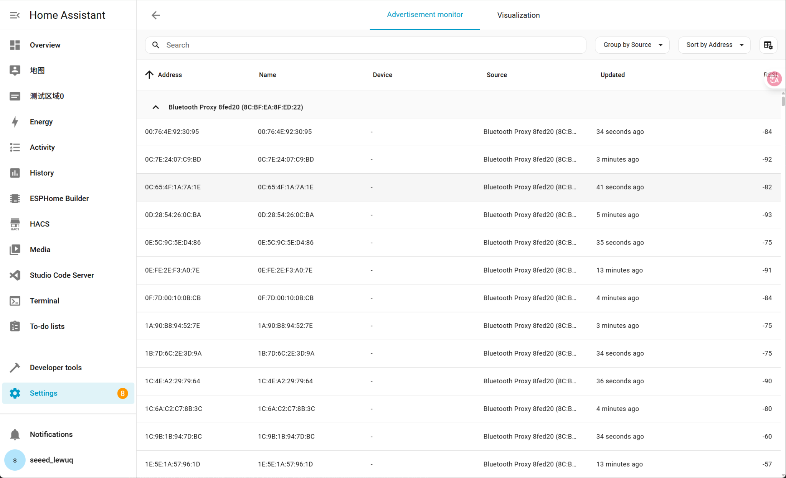

# 蓝牙代理随笔


# 蓝牙代理的作用


（在HA中设置蓝牙代理的作用）


蓝牙代理是智能家居中“最轻量级的分布式传感桥”。它让 Home Assistant 不再局限于主机的蓝牙范围，而是通过多个 ESP32 节点构建一个「全屋蓝牙感知网络」，从而稳定接入温湿度、门窗、灯具、植物传感器等各种设备

- 关键作用：让你的 Home Assistant 主机，不再依赖“主机蓝牙范围”，而是通过分布式 ESP32 代理节点实现全屋蓝牙覆盖。
- 如何工作的：
    - 你的 **ESP32-S3 + W5500 PoE 节点** 开启蓝牙扫描；
    - 它接收周围所有 BLE 广播（温湿度计、智能灯、手环、门锁等）；
    - 通过 **以太网 / Wi-Fi** 把蓝牙数据转发给 Home Assistant；
    - Home Assistant 把这些设备识别为“蓝牙实体”；
    - 你就可以在 HA 的界面上看到它们的温度、电量、信号强度等信息。




上图展示了通过 **Home Assistant 蓝牙代理（Bluetooth Proxy）** 扫描到的 BLE 广播信息。表格中的字段含义如下：


| 字段          | 含义                                                                                                                                         |
| ----------- | ------------------------------------------------------------------------------------------------------------------------------------------ |
| **Address** | 蓝牙设备的广播地址（MAC 地址形式）。请注意，这并非设备的真实物理 MAC 地址，而是蓝牙协议中为保护隐私而生成的随机地址（_Resolvable Private Address_ 或 _Non-Resolvable Private Address_）。该地址会周期性变化。 |
| **Name**    | 设备在 BLE 广播包中携带的名称字段。若设备支持广播其名称，可通过此项识别设备。                                                                                                  |
| **Device**  | 对应 Home Assistant 已识别或已配对的蓝牙设备实体。若尚未与 Home Assistant 关联，则此列为空。                                                                             |
| **Source**  | 表示扫描数据的来源节点，即当前蓝牙代理设备（例如 “Bluetooth Proxy 8fed20”）。当你部署了多个代理节点时，可用此字段区分数据来源。                                                               |
| **RSSI**    | 接收到的蓝牙信号强度（Received Signal Strength Indicator，单位：dBm），数值越接近 0 表示信号越强。                                                                      |


**说明：**


由于蓝牙低功耗（BLE）协议支持隐私地址机制，许多设备不会在广播中直接暴露真实 MAC 地址，而是使用随机化地址进行周期性更新。因此在 Home Assistant 的蓝牙扫描结果中，**同一设备可能在不同时间显示为不同的地址**。


若要确认设备身份，可通过 **Name（广播名称）** 或设备的 **广播特征（如服务 UUID、信号强度变化等）** 进行辨别。


---


### ✅ English Version (for bilingual documentation)


The figure above shows BLE advertisements detected by the **Home Assistant Bluetooth Proxy**. The meaning of each column is as follows:


| Field       | Description                                                                                                                                                                                                                         |
| ----------- | ----------------------------------------------------------------------------------------------------------------------------------------------------------------------------------------------------------------------------------- |
| **Address** | The Bluetooth device’s broadcast address (in MAC-like format). Note that this is **not the actual physical MAC address** — it is a _randomized private address_ generated by the BLE privacy mechanism, which changes periodically. |
| **Name**    | The advertised name of the Bluetooth device. If the device broadcasts its name, this field helps identify it.                                                                                                                       |
| **Device**  | The recognized Bluetooth entity in Home Assistant. If the device has not yet been paired or identified, this field remains empty.                                                                                                   |
| **Source**  | Indicates the scanning source, i.e., the specific Bluetooth Proxy node (e.g., “Bluetooth Proxy 8fed20”). This helps distinguish data from multiple proxy nodes.                                                                     |
| **RSSI**    | Received Signal Strength Indicator (in dBm). The closer the value is to 0, the stronger the signal.                                                                                                                                 |


**Note:**


Many BLE devices use **privacy addresses** for security, meaning that their broadcasted address is randomized and periodically updated. As a result, **the same physical device may appear with different addresses** in Home Assistant’s advertisement list.


To identify a device reliably, use its **advertised name** or other characteristics such as **service UUIDs** or **signal strength patterns**.


---


# 使用蓝牙代理的实际应用

- 询问AI

    如果我有一个在基于ESP32S3的POE模组，在HA上通过成功将它设置成了蓝牙代理，在此基础上，我想实现一个实际的应用，比如利用蓝牙代理实现下位机MCU（不只是ESP系列的芯片，也可以是其他MCU带蓝牙或者蓝牙模组）和HA进行通信，可以实现吗，如何实现？蓝牙代理是否是一个广播的功能，只能广播和接收信息，不能实现发送信息给下位机


    DS回答：


    ### 澄清：蓝牙代理不仅是广播，更是**双向通信的桥梁**


    蓝牙代理**绝对不是一个只能广播和接收的“单向”功能**。它是一个**双向的透明通道**。


    它的工作原理是：将您家庭网络中（通过Wi-Fi和以太网）的Home Assistant系统，与物理空间中的蓝牙世界连接起来。Home Assistant可以通过这个代理：

    1. **接收** 来自所有兼容蓝牙设备的**广播信息**（如iBeacon， Eddystone， 各类传感器的广播数据）。
    2. **主动连接** 到支持连接的蓝牙设备（如您的下位机MCU）。
    3. **向已连接的设备发送数据/指令**。
    4. **从已连接的设备接收数据**。

    所以，**您的目标——让HA通过蓝牙代理与下位机MCU通信——是完全可行的，并且可以实现双向通信。**


    ---


    ### 实现方案概览


    整个系统的数据流如下：
    `下位机MCU` **<-->** `蓝牙` **<-->** `ESP32-S3蓝牙代理` **<-->** `Wi-Fi/Ethernet (PoE)` **<-->** `Home Assistant`


    ### 具体实现步骤


    这里提供两种主流的实现方式，推荐使用第一种。


    ### 方式一：使用标准的`bluetooth_proxy` API（推荐，最规范）


    这是最直接、与HA集成度最高的方法。您需要在下位机MCU上实现一个特定的GATT（通用属性）配置文件，让HA能够识别并与之通信。


    **步骤：**

    1. **在Home Assistant中确认蓝牙代理正常工作**：在`设置` -> `设备与服务` -> `ESPHome` -> 您的设备中，应看到“蓝牙代理”服务是活跃的。
    2. **下位机MCU端设置**：
        - 您的MCU需要作为一个**蓝牙低功耗外设** 运行。
        - 您需要在MCU上创建一个GATT服务，这个服务需要包含至少两个特征：
            - **一个“写入”特征**：用于**接收来自HA的指令**。HA向这个特征写入数据，MCU监听并处理。
            - **一个“通知”或“读取”特征**：用于**向HA发送数据**。最佳实践是使用“通知”，这样HA可以监听，而无需不断轮询。MCU在有新数据时，主动通知HA。

        **示例GATT配置文件结构：**

        - **服务UUID**： `0x181A` （这是一个标准的“环境传感”服务UUID，您也可以自定义一个）
            - **特征1（TX -> MCU）**： `0x2A6B` （自定义UUID亦可），属性： `Write` 或 `Write without response`。
            - **特征2（RX -> HA）**： `0x2A6D` （自定义UUID亦可），属性： `Notify`。
    3. **Home Assistant端设置**：
        - 您需要使用**ESPHome的****`bluetooth_proxy`** **API**来与您的自定义设备交互。
        - 这通常通过编写一个**Python脚本**或**创建一个自定义集成**来实现。在脚本中，您可以：
            - 发现您的MCU设备。
            - 连接到它。
            - 订阅（监听）RX特征的通知。
            - 向TX特征写入指令。

        **一个简单的HA自动化/脚本示例概念：**


        ```yaml
        # 这是一个概念性示例，并非完整代码
        - alias： "Send command to MCU"
          trigger： ...
          action：
            - service： esphome.bluetooth_connect
              target：
                device_id： your_esp32s3_poe_device
              data：
                address： "AA：BB:CC:DD:EE:FF" # 您的MCU蓝牙地址
            - service： esphome.bluetooth_gatt_write
              target：
                device_id： your_esp32s3_poe_device
              data：
                address： "AA：BB:CC:DD:EE:FF"
                handle： 13 # 对应TX特征的句柄
                value： [0x01， 0x02， 0x03] # 要发送的字节数据
        ```


    ### 方式二：通过ESP32-S3“透传”（灵活性高）


    在这种方式下，ESP32-S3不仅仅是一个透明的代理，它还承担了一些逻辑处理的工作。


    **步骤：**

    1. **修改ESP32-S3的固件**：
        - 在您的ESPHome YAML配置文件中，除了`bluetooth_proxy`组件，您还需要添加：
            - `uart` 组件（如果MCU通过串口与ESP32-S3连接）。
            - 或者，直接使用`esp32_ble_tracker`和`ble_client`来让ESP32-S3主动连接并管理您的下位机MCU。
    2. **实现逻辑**：
        - ESP32-S3通过BLE连接到您的下位机MCU。
        - ESP32-S3作为一个**桥梁**，将来自HA的MQTT消息或Home Assistant API调用，转换为对MCU的BLE指令，并发送出去。
        - 同时，ESP32-S3也监听来自MCU的BLE通知，并将其转换为MQTT消息发布到HA，或者通过ESPHome的API直接更新HA中的传感器状态。
    3. **Home Assistant端设置**：
        - 这种方式下，与HA的交互可以变得更简单。您可以通过MQTT或者ESPHome内置的传感器和开关直接与ESP32-S3通信，由ESP32-S3来处理底层的蓝牙通信细节。

    ### 总结与建议

    - **对于追求标准化和未来兼容性的项目**，请选择**方式一**。它直接利用了HA蓝牙代理的核心功能，是官方推荐的方向。
    - **对于需要快速原型开发，或者通信逻辑较复杂的项目**，**方式二**可能更容易上手，因为您可以在ESP32-S3上编写更灵活的逻辑代码。
    - **蓝牙代理绝非单向广播**。它是一个功能完整的双向BLE主机，集成在您的家庭网络中，允许HA与任何支持BLE连接的设备进行丰富的交互。
