## 弊端！！！

1. 无法使用手机App查看HA，因为不在一个网段，除非下载完需要的东西切回去，或者开启远程访问（长期需付费）
2. 网速不会非常快，因为是 共享的，很大一部分取决于 电脑的性能

## 介绍


time: 2026.6.6


在部署的树莓派上的HAOS有网络限制


HA在使用的时候通过会因为网络阻碍而导致部分插件或者集成下载不成功，妨碍开发效率


下面介绍一种无需软路由的方法实现跨过网络的限制


一台电脑（你有自己的代理，基于 Windows），一个具有以太网接口的拓展坞或者以太网接口，一根网线


本质思想是将电脑当做一个路由器（固定网关为 192.168.137.1），DHCP进行ip分发，WLAN提供网络。


## 搭建过程

1. 开启代理软件的虚拟网卡模式

    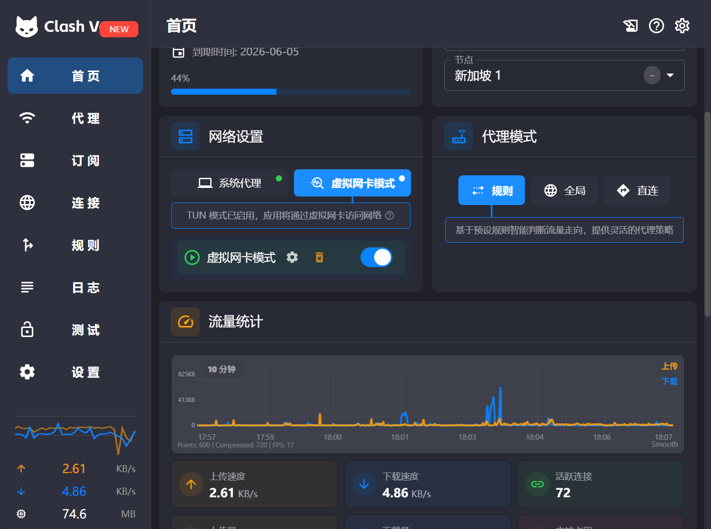

1. 开启网络共享

    win + R 然后输入 `ncpa.cpl`  打开网络连接 


    如下图 ，meta 是 代理软件的虚拟网卡，以太网6是通过网线接入到树莓派和电脑之前的接口


    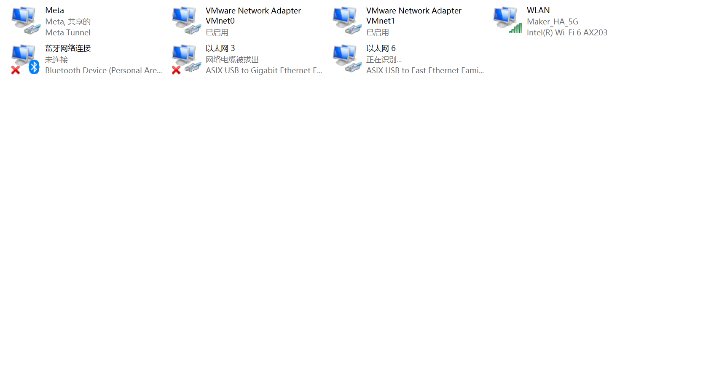


    选择虚拟网卡，鼠标右键点击属性，选择 共享，选择将网络共享到以太网6


    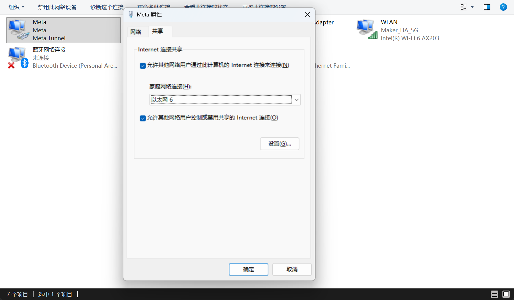


    输入HA的默认打开网址


    ```javascript
    http://homeassistant:8123/
    ```

1. 进行 ip 查看和尝试

    或者通过串口进行查看，其中的IP是 192.168.31.19/24


    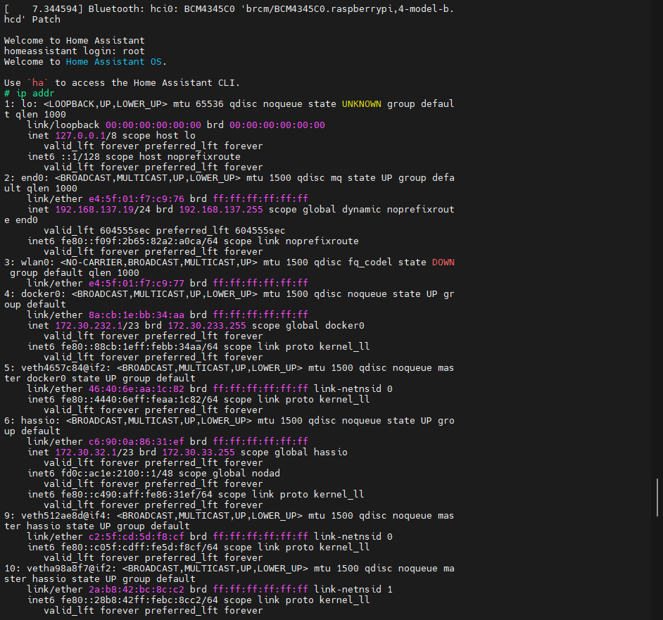


    查看 ip ， 192.168.137.197，


    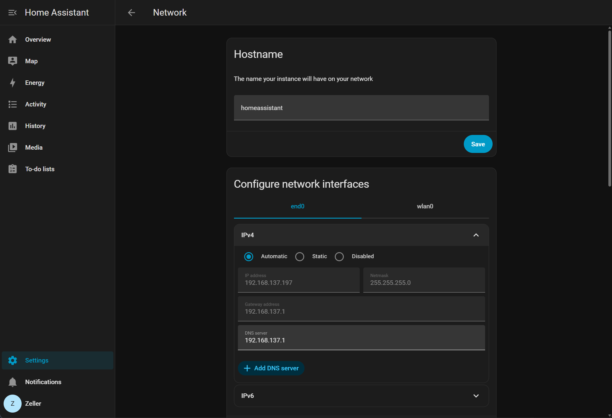

1. 通过串口查看是否成功

    ping外网，存在即成功！


    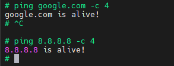


打开 应用 可以进行尝试 ，比如下载 OpenThread Border Router 进行尝试，可以下载成功


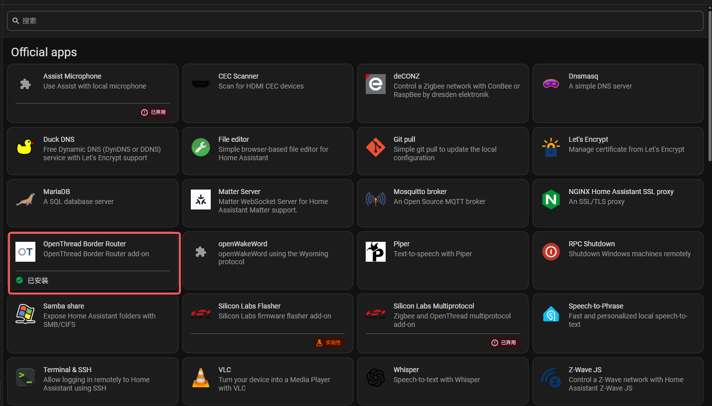


## 串口日志打印


HA默认是使用 HDMI 进行日志打印的，如果要使用 串口的日志打印，需要修改 启动盘的文件


通过 读卡器 插入你的 启动盘到电脑（从SD卡就插SD卡，从 硬盘就打开硬盘，22年后的树莓派uboot 引导都支持 usb 或者 sd 卡启动，会自动识别，所以无需修改启动方式）

1. 打开 config.txt 文件，将 #enable_uart=1  前的取消注释符号 #

    ```bash
    enable_uart=1
    ```

2. 打开 cmdline.txt ，添加内核 log 指定到串口并设置串口速率，`console=serial0,115200` ,或者复制下面的信息，黏贴为等号前面的内容

    ```bash
    dwc_otg.lpm_enable=0 console=serial0,115200 console=tty0 usb-storage.quirks=
    ```


## 换盘后启动效果


下面这个是通过网络共享的方式，然后通过固态硬盘启动HA的log，可以下载成功


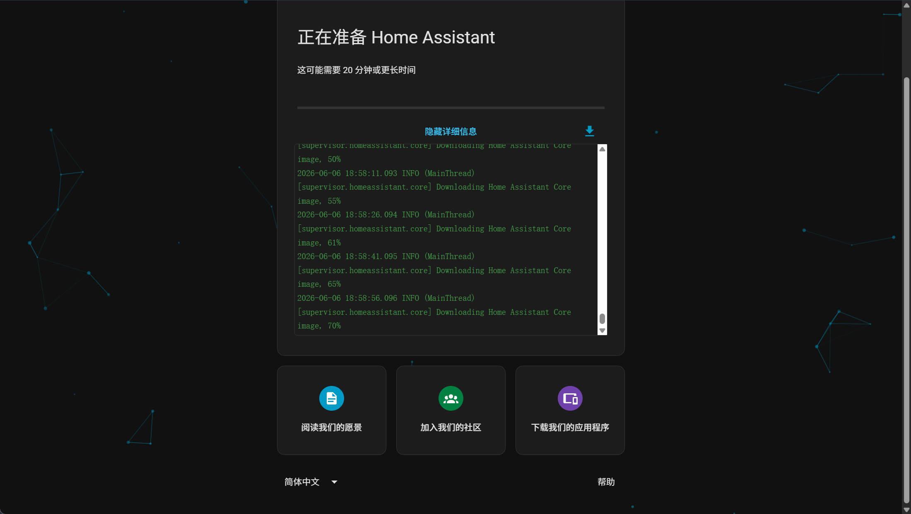


成功信息


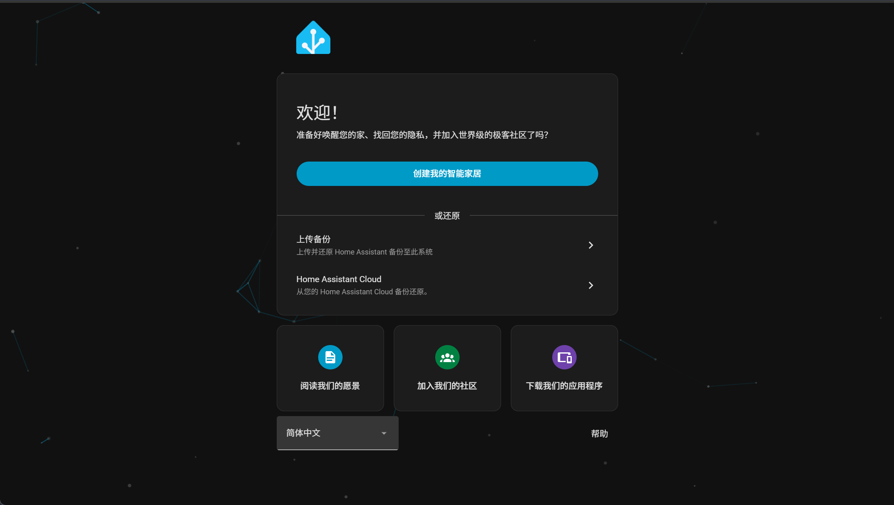


## 通过串口更改被污染的 DNS


如果 log 中启动不成功，可能是 IP 和 DNS 被污染了，走得还是国内的网络，所以需要通过串口进行修改走代理


测试命令


```bash
#1 挂载
mount -o remount,rw /

#2 写入强制的DNS
cat > /etc/resolv.conf << 'EOF'
nameserver 192.168.137.1
nameserver 223.5.5.5
nameserver 8.8.8.8
EOF

#3 测试 dns 是否正常
nslookup services.home-assistant.io
```


被污染信息log （Address 地址）


```bash
# ping google.com -c 4
google.com is alive!
# ^C
# ping 8.8.8.8 -c 4
8.8.8.8 is alive!
# mount -o remount,rw /
mount: (hint) your fstab has been modified, but systemd still uses
       the old version; use 'systemctl daemon-reload' to reload.
# cat > /etc/resolv.conf << 'EOF'
n> nameserver 192.168.137.1
> nameserver 223.5.5.5
> nameserver 8.8.8.8
> EOF
# nslookup services.home-assistant.io
Server:         192.168.137.1
Address:        192.168.137.1:53
** server can't find services.home-assistant.io: NXDOMAIN
Non-authoritative answer:
Name:   services.home-assistant.io
Address: 198.18.0.108
#
```


测试代理是否可到达 ，将 7890 换成你的代理的端口


```bash
curl -v --proxy http://192.168.137.1:7890 https://services.home-assistant.io
```


代理无问题，可到达打印的 log


```bash
# curl -v --proxy http://192.168.137.1:7897 https://services.home-assistant.io
> CONNECT services.home-assistant.io:443 HTTP/1.1
> Host: servon: Keep-Alive
>
< HTTP/1.1 200 Connection established

* TLSv1.3 (OUT), TLS handshake, Client hello (1):
* TLSv1.3 (IN), TLS handshake, Server hello (2):
* TLSv1.3 (IN), TLS change cipher, Change cipher spec (1):
* TLSv1.3 (IN), TLS handshake, Encrypted Extensions (8):
* TLSv1.3 (IN), TLS handshake, Certificate (11):
* TLSv1.3 (IN), TLS handshake, CERT verify (15):
* TLSv1.3 (IN), TLS handshake, Finished (20):
* TLSv1.3 (OUT), TLS change cipher, Change cipher spec (1):
* TLSv1.3 (OUT), TLS handshake, Finished (20):
> GET / HTTP/1.1
> Host: services.home-assistant.io
> User-Agent: curl/8.18.0
> Accept: */*
>
* TLSv1.3 (IN), TLS handshake, Newsession Ticket (4):
* TLSv1.3 (IN), TLS handshake, Newsession Ticket (4):
< HTTP/1.1 404 Not Found
< Date: Sat, 06 Jun 2026 09:54:33 GMT
< Content-Length: 0
< Connection: keep-alive
< Vary: accept-encoding
< Report-To: {"group":"cf-nel","max_age":604800,"endpoints":[{"url":"https://a.nel.cloudflare.com/report/v4?s=GK6zVlyA6oSn8xx%2B%2BBIKzP02zf8M9rJVZ1AY%2F%2B5eJXZnnOs3ooCanYE51tsq320CtosdTvgt27Vtwu87WOHUXVYx347HiuXWgjZSolB8KRqFjw%2BaZtMEC6PprewohlgfM%2FPalcp%2FHURX81Mq"}]}
< Nel: {"report_to":"cf-nel","success_fraction":0.0,"max_age":604800}
< Server: cloudflare
< CF-RAY: a076894d5b20b015-NRT
< alt-svc: h3=":443"; ma=86400

#
```


挂载临时代理文件，然后重启docker，记得改端口，我的是 7897


```bash
# 写入
mount -o remount,rw /
mkdir -p /etc/systemd/system/docker.service.d
cat > /etc/systemd/system/docker.service.d/proxy.conf << 'EOF'
[Service]
Environment="HTTP_PROXY=http://192.168.137.1:7897"
Environment="HTTPS_PROXY=http://192.168.137.1:7897"
Environment="NO_PROXY=localhost,127.0.0.1,172.30.0.0/16,172.17.0.0/16"
EOF
systemctl daemon-reload

# 重启
systemctl restart docker
```


### 创建信息


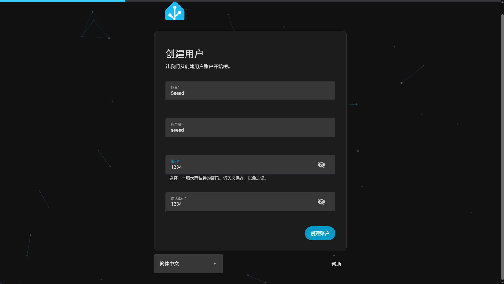


## 实在无法跨过网络的方式


国内有大佬实现了无需代理或者软路由的实现方式，但是也有几率失败


在 应用界面，右上角添加仓库链接，链接是 


[bookmark](https://gitee.com/hacs-china/)


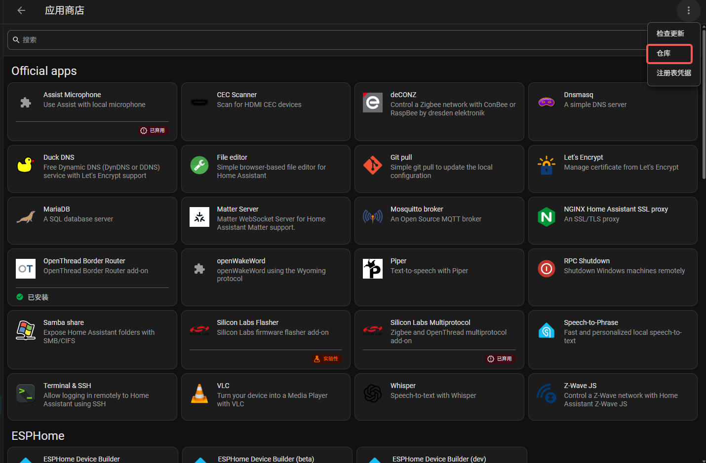

