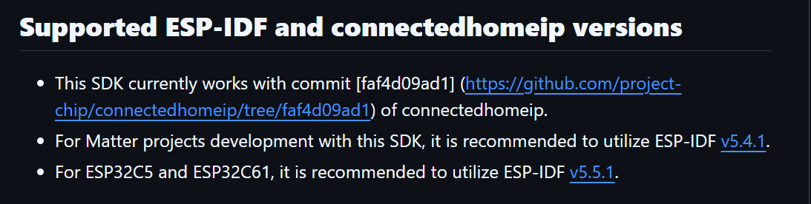

# ESP-Matter + ESP32-C5 编译排查记录


建议直接跳到最后一个目录查看，因为基本上就是环境问题 ！！！


[10 版本问题](https://app.notion.com/p/2c7a54e0fe3c80c89c8dff6e732fdd92#2c7a54e0fe3c80dbbad2f723e60e4d78) 


## 1. 概述


目标：基于 **esp-matter** 工程，在 **ESP32-C5（RISC-V 架构）** 上编译并运行 `examples/light` 示例。


在实际编译过程中，主要遇到了两类问题：

1. GN 生成的 `args.gn` 中存在非法 token，导致 `chip_gn` 配置阶段失败。
2. Matter 协议栈相关第三方库（`nlassert`、`nlio`）的源码缺失，导致 GN 报 `Source file not found`。

本记录对环境准备、正常编译流程以及上述问题的排查过程进行整理，以便后续复现或排障。


---


## 2. 环境准备


基本环境条件如下：

- 操作系统：Ubuntu（虚拟机或物理机均可）
- 工具链：
    - 已安装并配置好的 **ESP-IDF**（包含 `idf.py`、`cmake`、`ninja`、Python 依赖等）
    - `git` 可正常访问 esp-matter 及其子模块所对应的代码仓库（官方或内部镜像）
- 网络环境：能够访问 `connectedhomeip` 相关子模块所需仓库（或已由镜像/归档方式预先提供）

---


## 3. 仓库与子模块获取


### 3.1 推荐获取方式


为保证 esp-matter 及其依赖的 Matter 协议栈完整，推荐使用带子模块的方式获取仓库：


```bash
git clone --recursive <esp-matter-git-url> esp-matter
cd esp-matter

git submodule sync --recursive
git submodule update --init --recursive
```


若初次 clone 时未使用 `--recursive`，则可在现有仓库中补充初始化子模块：


```bash
cd esp-matter
git submodule sync --recursive
git submodule update --init --recursive
```


### 3.2 子模块句柄获取失败问题


在排查过程中，曾出现以下报错：


```bash
git submodule update --init --depth 1
fatal: could not get a repository handle for submodule 'connectedhomeip/connectedhomeip'

git submodule update --init --recursive connectedhomeip
fatal: could not get a repository handle for submodule 'connectedhomeip/connectedhomeip'
```


上述错误通常表示：

- 当前 esp-matter 仓库的 `.gitmodules` 或 `.git/modules` 中，对于 `connectedhomeip/connectedhomeip` 子模块的配置信息不完整或缺失；
- 该仓库可能为裁剪版或经过二次打包，未包含完整的子模块定义与元数据。

在此情况下，应优先确认：

- 仓库来源是否为官方完整版本；
- `.gitmodules` 是否包含 `connectedhomeip/connectedhomeip` 子模块；
- 若使用内部镜像或归档，需要确认上游是否同步了完整的子模块结构。

必要时，应从可靠来源重新获取一份包含完整子模块配置的 esp-matter 仓库。


---


## 4. 正常编译流程（预期路径）


在 esp-matter 仓库完整、子模块配置正确的前提下，ESP32-C5 目标的编译流程如下：


```bash
cd ~/esp/esp-matter/examples/light

# 设置目标芯片
idf.py set-target esp32c5

# 建议首次构建前进行清理
idf.py fullclean

# 编译
idf.py build
```


在理想情况下，`idf.py build` 会自动完成 `chip_gn` 配置并生成 Matter 相关目标，不应出现 GN 语法错误或源文件缺失错误。以下章节记录的是在实际环境中遇到的异常情况及其处理过程。


---


## 5. 问题一：GN 报错 `Invalid token @".../toolchain/cflags""`


### 5.1 报错现象


在执行 `idf.py build` 过程中，`chip_gn` 配置阶段失败，输出类似如下信息：


```plain text
[xx/xxx] Performing configure step for 'chip_gn'
FAILED: esp-idf/chip/chip_gn-prefix/src/chip_gn-stamp/chip_gn-configure ...

ERROR at build arg file (use "gn args <out_dir>" to edit):26:xxxxx: Invalid token.
target_cflags_c = [..., "@"/home/lewuq/esp/esp-matter/examples/light/build/toolchain/cflags"", ...]
                                                                                              ^
I have no idea what this is.
```


可见生成的 `args.gn` 中存在非法 token：形如 `@".../toolchain/cflags""`，属于字符串与响应文件写法拼接错误引入的语法问题。


与此同时，`build/toolchain/cflags` 文件内容本身是正常的，例如：


```plain text
-march=rv32imac_zicsr_zifencei_zaamo_zalrsc
-mtune=esp-base
```


问题来源于 `args.gn` 生成逻辑，对该文件路径的包装存在多余的引号与错误转义。


### 5.2 临时修复方法（手工修补 args.gn）


在当前版本尚未修复生成逻辑时，可通过对 `args.gn` 进行一次性修补来避免该语法错误。

1. 在首次 `idf.py build` 报错后，进入 GN 配置目录：

    ```bash
    cd ~/esp/esp-matter/examples/light/build/esp-idf/chip
    ```

2. 对 `args.gn` 执行以下替换操作：

    ```bash
    # 修正 @"\ 开头的错误模式 → @/
    sed -i 's/@"\//@\//g' args.gn
    
    # 修复结尾多余引号：cflags"" → cflags"
    sed -i 's/cflags""/cflags"/g' args.gn
    
    # 同理修复 C++ 编译选项中的错误：cxxflags"" → cxxflags"
    sed -i 's/cxxflags""/cxxflags"/g' args.gn
    ```


    修补后的片段示例：


    ```plain text
    ...
    "-isystem/.../efuse/esp32c5/include",
    "@/home/.../esp-matter/examples/light/build/toolchain/cflags",
    ...
    ```


    此时对 GN 来说是合法参数，不再触发语法错误。

3. 返回示例工程目录，重新执行编译：

    ```bash
    cd ~/esp/esp-matter/examples/light
    idf.py build
    ```


### 5.3 结论

- 问题本质：`args.gn` 生成逻辑中，对 RISC-V 目标的 toolchain cflags/cxxflags 响应文件写法处理存在缺陷；
- 手工 `sed` 修补属于临时解决方案，可解除当前构建阻塞，但不代表上游逻辑已被根治；
- 一旦删除 `build/` 或重新 CMake/GN 配置，`args.gn` 会被重新生成，必要时需再次应用上述修补步骤。

---


## 6. 问题二：`nlassert` / `nlio` 源文件缺失（子模块不完整）


在修复 `args.gn` 语法问题并重新构建后，随后出现了与 Matter 第三方依赖相关的错误。


### 6.1 报错现象


`idf.py build` 过程中，GN 提示如下错误：


```plain text
ERROR at //third_party/connectedhomeip/third_party/nlassert/BUILD.gn:19:1: Source file not found.
source_set("nlassert") {
^-----------------------
The target:
  //third_party/connectedhomeip/third_party/nlassert:nlassert
has a source file:
  //third_party/connectedhomeip/third_party/nlassert/repo/include/nlassert.h
which was not found.
___________________
ERROR at //third_party/connectedhomeip/third_party/nlio/BUILD.gn:19:1: Source file not found.
source_set("nlio") {
^-------------------
The target:
  //third_party/connectedhomeip/third_party/nlio:nlio
has a source file:
  //third_party/connectedhomeip/third_party/nlio/repo/include/nlbyteorder-little.h
...
```


上述报错集中出现在以下路径：

- `third_party/connectedhomeip/third_party/nlassert/...`
- `third_party/connectedhomeip/third_party/nlio/...`

并明确指出多个 `repo/include/*.h`、`*.hpp` 文件不存在。


### 6.2 原因分析


该类错误通常可以直接判断为：

> Matter 协议栈（connectedhomeip）及其自身子模块未完整检出，相关第三方库源码缺失。

结合同一工程下 Git 操作的报错：


```bash
git submodule update --init --depth 1
fatal: could not get a repository handle for submodule 'connectedhomeip/connectedhomeip'
```


可以推断：

- 当前 esp-matter 仓库中，对 `connectedhomeip/connectedhomeip` 子模块的 Git 配置不完整；
- 可能原因包括：
    - 使用了仅包含部分内容的内部镜像或裁剪版仓库；
    - 仓库迁移或打包过程中 `.gitmodules` / `.git/modules` 信息丢失或被修改。

### 6.3 处理建议

1. 首选方案为重新获取一份 **包含完整子模块配置的 esp-matter 仓库**，并按以下方式初始化：

    ```bash
    git clone --recursive <esp-matter-official-or-complete-url> esp-matter
    cd esp-matter
    
    git submodule sync --recursive
    git submodule update --init --recursive
    ```

2. 若受限于内部环境必须使用当前仓库，则需要：
    - 核查 `.gitmodules` 中是否声明了 `connectedhomeip/connectedhomeip` 子模块；
    - 核查 `.git/modules/connectedhomeip/connectedhomeip` 是否存在并包含有效 remote 配置；
    - 根据上游官方结构，将缺失的 `connectedhomeip` 仓库及其子模块放置到正确位置，确保例如：

        ```plain text
        third_party/connectedhomeip/third_party/nlassert/repo/include/nlassert.h
        third_party/connectedhomeip/third_party/nlio/repo/include/nlio.hpp
        ...
        ```


        等路径实际存在。


### 6.4 结论

- `nlassert`、`nlio` 等第三方库属于 Matter 协议栈的基础依赖，`examples/light` 这类示例在构建时会间接引用；
- 构建系统不会自动“跳过”这些缺失的依赖源文件；
- 要保证 esp-matter 在 ESP32-C5 上可用，必须保证 connectedhomeip 仓库及其子模块完整。

---


## 7. 关于「未使用的子模块是否可自动忽略」的说明


在编译过程中，存在如下疑问：

> 是否可以不拉取所有子模块，未使用的部分是否可以由构建系统自动忽略？

从 Matter 协议栈的构建逻辑来看：

- `examples/light` 等应用示例依赖一套预定义好的 GN/CMake 目标；
- 这些目标通常会引入多个组件和第三方库（包括 `nlassert` 与 `nlio`），即使应用本身未直接显式调用；
- 对于构建系统而言，只要依赖图中存在该目标，且未通过条件编译排除，就必须存在对应源码文件。

因此：

- 只拉取部分子模块会导致 GN/CMake 在解析依赖时直接报 `Source file not found`；
- 构建系统不会对缺失子模块进行“自动忽略”，否则会导致构建结果不确定性增加并影响维护。

结论：编译 esp-matter + ESP32-C5 工程时，应确保所需子模块完整拉取，而不是依赖构建系统自动判断“是否使用”。


---


## 8. 编译前自查 Checklist


在进行 esp-matter + ESP32-C5 工程编译前，可通过以下 Checklist 进行自查：


### 8.1 仓库与子模块

- [ ] esp-matter 仓库来源明确（官方仓库或维护完善的内部镜像）。
- [ ] 执行过：

    ```bash
    git submodule sync --recursive
    git submodule update --init --recursive
    ```


    且无报错。

- [ ] `connectedhomeip` 仓库结构完整，存在：
    - `third_party/connectedhomeip/third_party/nlassert/repo/include/nlassert.h`
    - `third_party/connectedhomeip/third_party/nlio/repo/include/nlio.hpp`
    - 等相关文件。

### 8.2 目标与清理

- [ ] 目标芯片设置为 ESP32-C5：

    ```bash
    idf.py add-dependency espressif/mqtt #先执行这一个，以免后续报错
    idf.py set-target esp32c5
    ```


    idf_component.yml 文件大概如下


    ```shell
    dependencies:
      espressif/cmake_utilities:
        version: ^1
        rules: # will add "optional_component" only when all if clauses are True
        - if: idf_version >=5.0
        - if: target in [esp32c2]
      espressif/mqtt: '*'
    ```

- [ ] 在切换 target 或大规模修改配置后，执行过：

    ```bash
    idf.py fullclean
    ```


### 8.3 GN 配置文件（如遇到问题一）

- [ ] 若构建阶段出现 `Invalid token @".../toolchain/cflags""` 等报错，已在：

    ```bash
    ~/esp/esp-matter/examples/light/build/esp-idf/chip/args.gn
    ```


    中应用以下修补：


    ```bash
    sed -i 's/@"\//@\//g' args.gn
    sed -i 's/cflags""/cflags"/g' args.gn
    sed -i 's/cxxflags""/cxxflags"/g' args.gn
    ```


### 8.4 缺少 json 文件，最新的组件已将 json 改为 cjson ，所以需要主动进行修改


```shell
# 1. 进入 esp_matter 组件目录
cd /home/lewuq/esp/esp-matter/components/esp_matter

# 2. 备份原文件
cp CMakeLists.txt CMakeLists.txt.bak

# 3. 替换 json 为 cjson（使用 word boundary 确保精确替换）
sed -i 's/\bjson\b/cjson/g' CMakeLists.txt

# 4. 验证修改
echo "=== 修改后的 REQUIRES_LIST ==="
grep "REQUIRES_LIST" CMakeLists.txt

# 5. 清理之前的构建文件
cd /home/lewuq/esp/esp-matter/examples/light
rm -rf build managed_components dependencies.lock

# 6. 重新配置和构建
idf.py add-dependency "espressif/cjson^1.7.19"
idf.py set-target esp32c5
idf.py build
```


## 9.1 组件网站


[bookmark](https://components.espressif.com/)


## 10 版本问题


检查所使用 IDF 的版本是否支持 Matter


[https://github.com/espressif/esp-matter](https://github.com/espressif/esp-matter)





```shell
cd ~/esp/esp-matter
git submodule status

faf4d09ad13fc0c01be988c54ed819ff838567ee connectedhomeip/connectedhomeip (faf4d09a)

cd ~/esp/esp-idf
idf.py --version

# 版本切换
cd ~/esp/esp-idf
git fetch --tags
git checkout v5.5.1 # 及时查看指定版本
./install.sh all # 安装工具链（这个时间在 VS Code SSH 远程的情况下会比较慢，建议直接在 Ubuntu 上操作）
. export.sh    # 重新加载环境
```

