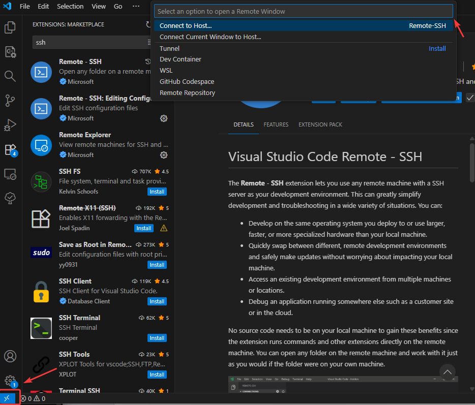
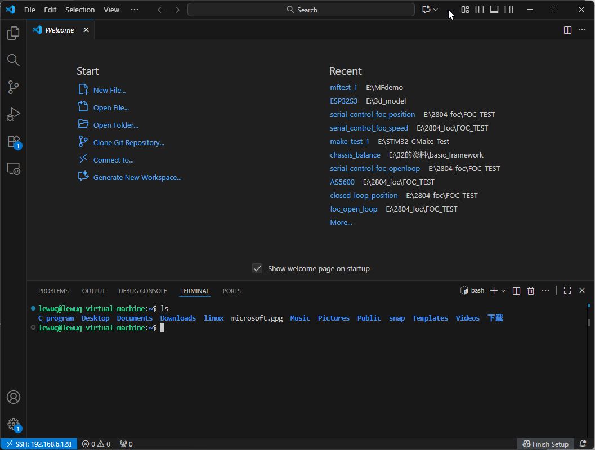
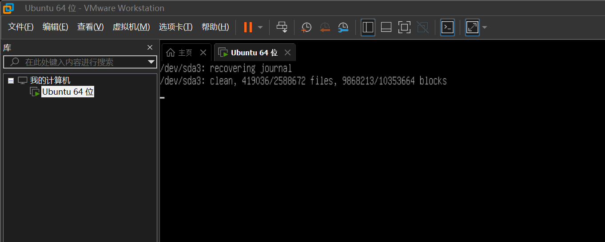
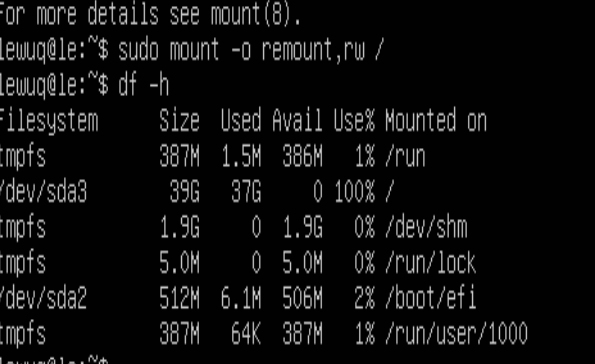
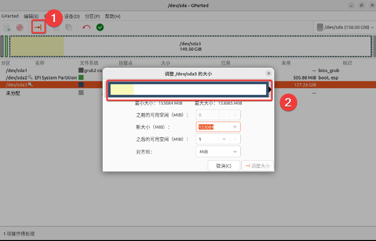
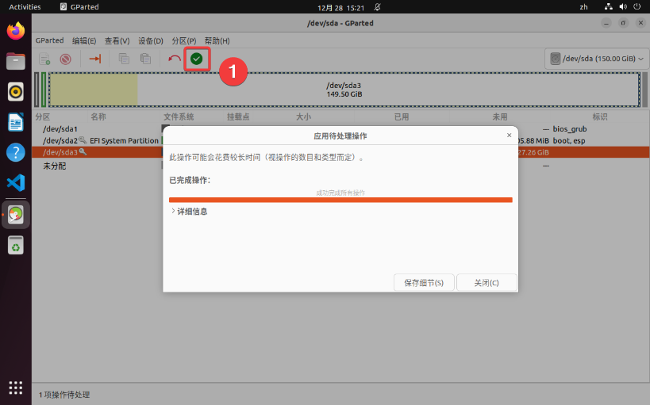
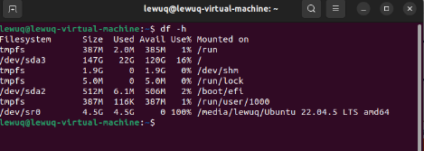

# ESP32-Matter 随笔


# 修改 json 为 cjson


ESP-IDF v6.01之后，json文件已被修改到组件管理器并改名为cjson，需要进行修改


```shell
# 1. 进入 esp_matter 组件目录
cd /home/user/esp/esp-matter/components/esp_matter

# 2. 备份原文件
cp CMakeLists.txt CMakeLists.txt.bak

# 3. 替换 json 为 cjson（使用 word boundary 确保精确替换）
sed -i 's/\bjson\b/cjson/g' CMakeLists.txt

# 4. 验证修改
echo "=== 修改后的 REQUIRES_LIST ==="
grep "REQUIRES_LIST" CMakeLists.txt

# 5. 清理之前的构建文件
cd /home/user/esp/esp-matter/examples/light
rm -rf build managed_components dependencies.lock

# 6. 重新配置和构建
idf.py set-target esp32c5
idf.py build
```


# Ubuntu 下走代理


二选一~，建议用下面的，除非你是Ubuntu主机

- 安装VPN（如果不是使用网线接入，可能使用桥接模式无法上网，需要改成net模式，然后使用ifconfig命令查询自己是否能上网，或者打开 firefox 网站进行查看）
    - 输入自己所使用的VPN网站，下载对应的安装包（这里推荐一个网站，xfltd.cc，朋友推荐的，还不错，建议多准备几个，以免失效）

    ```bash
    # 进入文件夹
    cd ~/Downloads
    
    #方法1
    	# 安装
    	sudo dpkg -i example.deb
    	
    	#如果出现依赖问题，可进行修复
    	sudo apt-get install -f
    	
    #方法2 必须包含 ./ 来指定当前目录，否则 apt 会从软件源搜索
    	sudo apt install ./文件名.deb
    	
    #方法3
    	sudo apt update
    	sudo apt install gdebi
    	sudo gdebi 文件名.deb
    	
    #方法4 图形界面安装
    ```

- 走主机代理
    - 配置教程

        [bookmark](https://blog.csdn.net/weixin_63594197/article/details/138069939)

    - 复用代理加速（可选）

        ```shell
        #复用主机代理，实测改完之后快了很多
        git config --global http.proxy  http://192.168.170.1:7890
        git config --global https.proxy http://192.168.170.1:7890
        
        export http_proxy=http://192.168.170.1:7890
        export https_proxy=http://192.168.170.1:7890
        
        #设置完之后验证
        curl -I https://github.com
        
        git config --global http.proxy  http://192.168.31.1:7699
        git config --global https.proxy http://192.168.31.1:7699
        
        export http_proxy=http://192.168.31.1:7699
        export https_proxy=http://192.168.31.1:7699
        ```


# Ubuntu 换源（改为清华源  / 阿里源）


有时候因为源很混乱导致下载失败，所以需要更新一个单纯的源确保下载


```shell
cat /etc/os-release


#以防出错，先备份
sudo cp /etc/apt/sources.list /etc/apt/sources.list.bak

#使用 nano 编辑器打开文件夹，如果是很多的一个混乱的源，那很可能会导致你的大多数拉取文件失败
sudo nano /etc/apt/sources.list

# 按住 Ctrl + X 退出当前的那个界面，使用命令将其清空
sudo truncate -s 0 /etc/apt/sources.list

#再度打开界面
sudo nano /etc/apt/sources.list

#粘贴下面的 清华源， 按住  Ctrl + O 保存 ，然后 #按住 Ctrl + X 退出, 再按Enter键退出

# 默认注释了源码镜像以提高 apt update 速度，如有需要可自行取消注释
deb http://mirrors.tuna.tsinghua.edu.cn/ubuntu/ jammy main restricted universe multiverse
# deb-src http://mirrors.tuna.tsinghua.edu.cn/ubuntu/ jammy main restricted universe multiverse

deb http://mirrors.tuna.tsinghua.edu.cn/ubuntu/ jammy-updates main restricted universe multiverse
# deb-src http://mirrors.tuna.tsinghua.edu.cn/ubuntu/ jammy-updates main restricted universe multiverse

deb http://mirrors.tuna.tsinghua.edu.cn/ubuntu/ jammy-backports main restricted universe multiverse
# deb-src http://mirrors.tuna.tsinghua.edu.cn/ubuntu/ jammy-backports main restricted universe multiverse

deb http://mirrors.tuna.tsinghua.edu.cn/ubuntu/ jammy-security main restricted universe multiverse
# deb-src http://mirrors.tuna.tsinghua.edu.cn/ubuntu/ jammy-security main restricted universe multiverse

#或者 阿里云的源 

deb https://mirrors.aliyun.com/ubuntu/ focal main restricted universe multiverse
deb-src https://mirrors.aliyun.com/ubuntu/ focal main restricted universe multiverse

deb https://mirrors.aliyun.com/ubuntu/ focal-security main restricted universe multiverse
deb-src https://mirrors.aliyun.com/ubuntu/ focal-security main restricted universe multiverse

deb https://mirrors.aliyun.com/ubuntu/ focal-updates main restricted universe multiverse
deb-src https://mirrors.aliyun.com/ubuntu/ focal-updates main restricted universe multiverse

# deb https://mirrors.aliyun.com/ubuntu/ focal-proposed main restricted universe multiverse
# deb-src https://mirrors.aliyun.com/ubuntu/ focal-proposed main restricted universe multiverse

deb https://mirrors.aliyun.com/ubuntu/ focal-backports main restricted universe multiverse
deb-src https://mirrors.aliyun.com/ubuntu/ focal-backports main restricted universe multiverse


# 清除缓存+更新索引
sudo apt clean
sudo apt update
sudo apt upgrade
```


或者参照清华源官方的进行配置


[bookmark](https://mirrors.tuna.tsinghua.edu.cn/help/ubuntu/)


参照阿里云镜像源


[bookmark](https://www.cnblogs.com/amsilence/p/16401845.html)


[bookmark](https://developer.aliyun.com/mirror/ubuntu?spm=a2c6h.13651102.0.0.3e221b11krjRjJ)


### 什么是curl


[bookmark](https://apifox.com/blog/understanding-curl/)


[bookmark](https://zhuanlan.zhihu.com/p/369516927)


# 连接FTP以及开启NFS和SSH

- 下载MobaXterm，免费版的就够用了

    [bookmark](https://mobaxterm.mobatek.net/)

- 在虚拟机内开启 FTP 盘服务

    ```shell
    #指令
    sudo apt-get install vsftpd
    
    #开启写权限
    sudo vi /etc/vsftpd.conf
    
    #是下列注释取消
    local_enbale=YES #27行
    write_enable=YES #31行
    
    #开启UFT8字符，防止出现中文乱码,没有就添加，当然了，建议虚拟机使用纯英文，中文路径一堆问题
    uft8_filesystem=YES
    
    #重启服务
    sudo /etc/init.d/vsftpd restart
    ```

    - 使用 MobaXterm 的FTP盘进行连接（连接之前使用ifconfig查看虚拟机的IP地址，如果怕下次变更，可以手动更改为静态IP）

        

    - 连接成功之后，使用下方的上传箭头即可传输文件，当然，也可以使用拖拽的方式

        

- Ubuntu下开启NFS和SSH服务

    ```shell
    #后续驱动开发需要用到NFS启动
    sudo apt-get install nfs-kernel-server rpcbind
    
    #在用户根目录创建下面linux文件夹和在 linux 文件夹下创建 nfs 文件
    mkdir linux
    cd linux
    mkdir nfs
    
    #配置nfs
    sudo vi /etc/exports
    #添加下面的内容
    /home/yourname/linux/nfs*(rw,sync,no_root_squash)
    # /home/yourname/linux/nfs：要共享的目录路径。
    # 注意：yourname应替换为你的实际用户名（如/home/alice/linux/nfs）。
    # *：允许所有网络客户端访问。也可以指定IP地址（如192.168.1.0/24）以限制访问。
    # rw：客户端具有读写权限。
    # sync：同步写入模式，确保数据一致性，但性能稍差。
    # no_root_squash：客户端以root用户访问时，服务器不会将其映射为匿名用户，保留root权限。
    # 这方便开发，但存在安全风险，仅建议在可信网络中使用。
    
    #重启NFS服务
    sudo /etc/init.d/nfs-kernel-server restart
    ```

- 开启 SSH ，开起了 SSH 之后可以使用 Windows 下的 VS Code SSH 远程进行代码编写，会
    - 在Unbuntu 下开启SSH服务

        ```shell
        sudo apt-get install openssh-server
        #使用默认服务，无需开启其他端口
        ```

    - 使用 VS Code SSH远程连接（或者使用 MobaXterm 的 SSH 远程，但是后者代码编辑没有 VS Code 好用）

        在 VS  Code 下安装 Romote -SSH 插件，安装完成后点击左下角开启远程，第一次设置需要进行配置，配置完保存到本地即可，再次打开远程密码即可


        ```shell
        #配置格式如下
        username@ip地址
        
        如 lewuq@196.168.x.111
        ```


        


        连接成功之后如下，新建终端也可以进行查看是不是自己的虚拟机，成功之后就可以愉快的进行编程了！


        


        文档目录结构输出，


# 磁盘崩坏修复


如果遇见下列情况





解决办法


按下 Ctrl + Alt + F2（或 F3、F4 等），查看是否能切换到文本终端（TTY）界面。如果成功，输入用户名和密码登录。


登录后，可以输入 `startx` 尝试启动图形界面，或输入 `reboot` 重启系统。


如果能进入 TTY，还可以查看系统日志：`cat /var/log/boot.log` 或 `journalctl -xb`。


强制关机/重启：如果等待 5—10 分钟仍无反应，且无法切换到 TTY，可以在 VMware 菜单中选择"重启客户机"或"关机"，然后再次启动。


元凶：磁盘空间不够了





需要删除一部分内容之后关闭这个虚拟机


然后继续扩容，教程如下：


[bookmark](https://blog.csdn.net/Chen_qi_hai/article/details/108814596)


如果不确定直接查看主分区 ext4 是否是和未扩展分区相邻，如果是，直接扩展
选择完成之后在主界面点击绿色的√，应用修改。








### 正确扩容步骤（在当前这个 gparted 里操作）

1. 确认现在是从 **U 盘 Live 系统** 启动的，而不是从这个硬盘启动。
2. 在 gparted 里，右键 `/dev/sda3`（有挂锁图标的话先 `Unmount` 卸载）。
3. 再次右键 `/dev/sda3` → 选择 **“Resize/Move”**：
    - 把右侧的滑块拖到最右边，完全覆盖后面的 `unallocated`。
    - 或者在 “New size” 里填成接近 90 GiB 的最大值。
4. 确认后点击工具栏上绿色的对勾按钮（Apply）执行操作，等进度条跑完。
5. 完成后可以关闭 gparted，重启回正常系统，再用：

    ```bash
    df -h
    ```


    查看 `/dev/sda3` 是否已经变成 80G。




