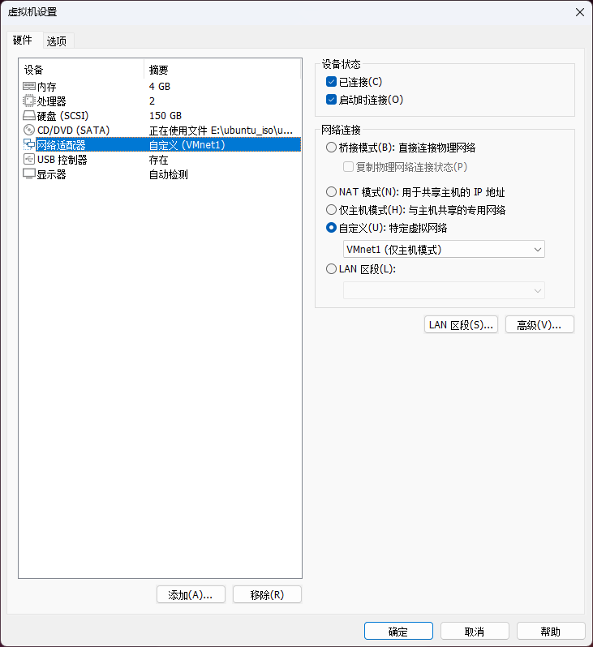
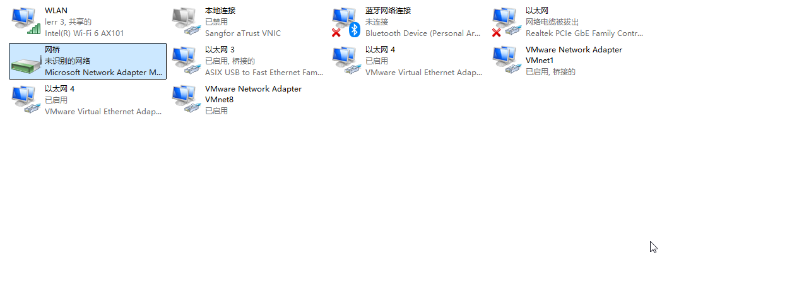
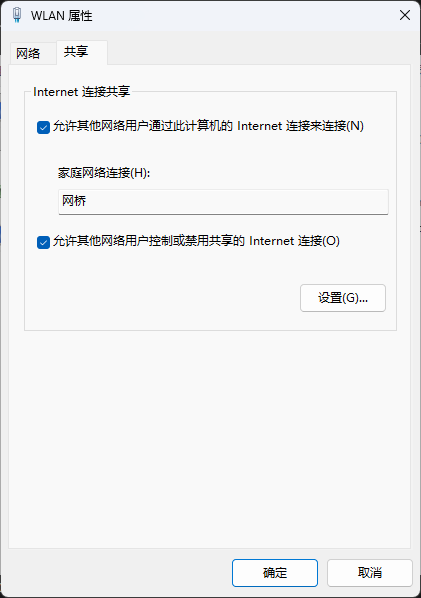
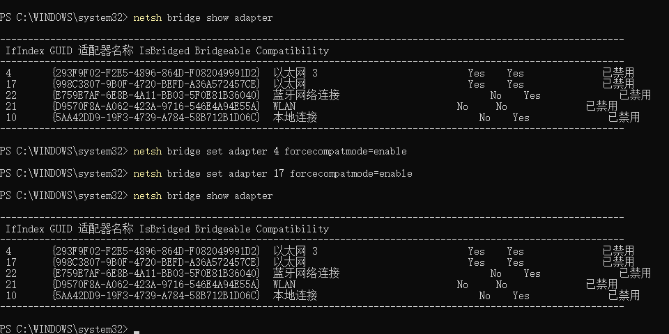
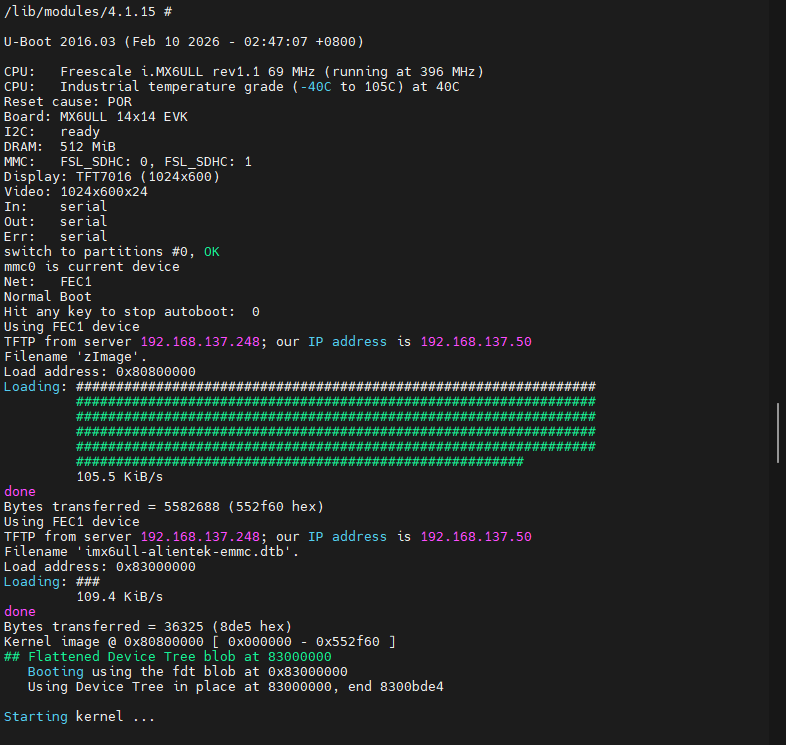

# 突破校园网限制：Windows+Ubuntu虚拟机+Linux开发板的高效联调网络拓扑

在进行嵌入式 Linux 系统开发（如 [i.MX](http://i.mx/)6ULL 车载中控终端或 Allwinner T113 智能桌面屏幕项目）时，我们通常需要同时使用 Windows 主机（运行 MobaXterm 的 TFTP 服务）、Ubuntu 虚拟机（提供 NFS 根文件系统和 SSH 编译环境）以及物理开发板。

然而，在校园网环境下，由于 **AP 隔离**以及**严格的设备数量限制**（通常仅限一台 PC 和一台移动设备），常规的路由器直连或虚拟机桥接方案往往难以奏效。本文记录了一种基于 Windows 底层网桥与网络共享（ICS）的终极解决方案。

## 核心拓扑思路

放弃容易与 Windows 产生冲突的 VMware 自带桥接（VMnet0），利用 Windows 自身的网桥（Network Bridge）将“开发板的 USB 网卡”与“虚拟机的仅主机网卡（VMnet1）”绑定成一个纯粹的内部局域网。随后，将连接校园网的 Wi-Fi 共享给该网桥。

**网络角色划分：**

- **对外**：校园网仅能看到 Windows 主机的 Wi-Fi 网卡，完美绕过设备限制。
- **对内**：网桥充当虚拟交换机与网关（IP 固定为 `192.168.137.1`），为虚拟机和开发板分配同网段 IP，实现全互通且均可访问外网。

## 详细配置步骤

### 1. 配置虚拟机网卡为“仅主机模式”

1. 关闭 Ubuntu 虚拟机。
2. 打开 VMware 虚拟机设置，将“网络适配器”的网络连接更改为 **“自定义 (特定虚拟网络)”**。
3. 在下拉菜单中选择 **`VMnet1 (仅主机模式)`**，保存退出。

    

### 2. 建立 Windows 物理网桥

1. 在 Windows 中按 `Win + R` 输入 `ncpa.cpl` 打开网络连接。
2. 按住 `Ctrl` 键，同时选中连接开发板的 **USB 网卡（以太网 3）** 和虚拟机的虚拟网卡 **VMware Network Adapter VMnet1**。
3. 右键点击其中任意一个，选择 **“桥接 (Bridge Connections)”**，等待系统生成名为 **“网桥”** 的新图标。

### 3. 配置 Internet 连接共享 (ICS)

1. 找到当前连接校园网并能正常上网的 **WLAN (Wi-Fi)** 网卡。
2. 右键点击 -> **属性** -> 共享 选项卡。
3. 勾选“允许其他网络用户通过此计算机的 Internet 连接来连接”。
4. 在家庭网络连接的下拉菜单中，务必选择刚刚生成的 **“网桥”**，点击确定。
_(此时，Windows 会强制将网桥的 IP 设置为_ _`192.168.137.1`__)_

### 4. 解决 USB 网卡底层丢包问题 (关键避坑)

多数 USB 转网口芯片在底层阉割了“混杂模式 (Promiscuous Mode)”，加入网桥后会出现“只发不收”的数据包丢失现象（如 Ubuntu 报 `Destination Host Unreachable`）。必须通过命令行强制开启兼容模式：

1. 以**管理员身份**运行命令提示符 (CMD)。
2. 输入 `netsh bridge show adapter` 查询网桥内的网卡编号（记录 USB 网卡对应的 `IfIndex` 数字）。
3. 输入以下命令强制开启兼容模式（将 `N` 替换为实际编号）：DOS

    `netsh bridge set adapter N forcecompatmode=enable`

4. 重新插拔开发板网线，触发硬件重新握手。

### 5. 联调服务映射清单

完成上述配置后，整个局域网即可顺畅运作：

- **TFTP 服务 (下载内核/设备树)**：在 Windows 运行 MobaXterm，TFTP 服务器 IP 指向网关 `192.168.137.1`。开发板 U-Boot 可直接拉取。
- **SSH 远程开发**：在 Ubuntu 中通过 `ifconfig` 查看分配到的 IP（如 `192.168.137.248`），Windows 使用 VSCode 即可直接 SSH 连接。
- **NFS 挂载根文件系统**：开发板启动 Linux 内核后，设置 `bootargs` 中的 `nfsroot` 参数，指向虚拟机的 IP 及共享路径（例如 `nfsroot=192.168.137.248:/home/user/nfs`），即可成功挂载。

# Tips

1. 缺点就是开发板子在通过 tftp 拉取 zImage 镜像文件的时候，速度会比较慢，大概需要花费 1-2 分钟，速度比较慢，只有 100k 左右的网速

