## 移植 NXP 的 linux 内核


1、将原子光盘中准备好的kernel文件通过MobaXterm上传到linux文件夹下


解压缩并重命名


```bash
tar -vxjf linux-imx-rel_imx_4.1.15_2.1.0_ga.tar.bz2
mv linux-imx-rel_imx_4.1.15_2.1.0_ga linux-imx-rel_imx_4.1.15_2.1.0_ga_alientek
```


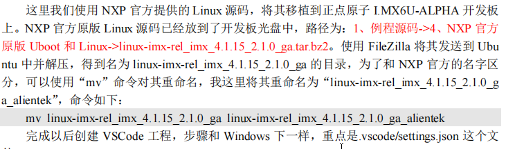


2、创建执行脚本 imx6ull_14×14_evk.sh


```bash
#!/bin/sh
make ARCH=arm CROSS_COMPILE=arm-linux-gnueabihf- distclean
make ARCH=arm CROSS_COMPILE=arm-linux-gnueabihf- imx_v7_mfg_defconfig
make ARCH=arm CROSS_COMPILE=arm-linux-gnueabihf- menuconfig
make ARCH=arm CROSS_COMPILE=arm-linux-gnueabihf- all -j12
```


编译时出现错误，兼容性问题，我的是 22.04，原子采用的是 18.04


```bash
/usr/bin/ld: scripts/dtc/dtc-parser.tab.o:(.bss+0x50): multiple definition of `yylloc'
scripts/dtc/dtc-lexer.lex.o:(.bss+0x0): first defined here
```


进行修改，再进行编译


```bash
sed -i 's/YYLTYPE yylloc;/extern YYLTYPE yylloc;/' scripts/dtc/dtc-lexer.lex.c
```


3、编译


执行脚本，编译需要花费一定的时间，编译完成后会生成一个 linux 内核镜像文件 zImage 和设备树文件 imx6ull-14x14-evk.dtb


4、拷贝并使用 tftp 上传


```bash
cp arch/arm/boot/zImage /home/lewuq/linux/tftpboot/ -f
cp arch/arm/boot/dts/imx6ull-14x14-evk.dtb /home/lewuq/linux/tftpboot/ -f
```


4、从网络启动


打开 MobaXterm 串口界面板子重启进入uboot界面


修改部分内容


```bash
setenv bootargs 'console=ttymxc0,115200'
saveenv
```


通过 tftp 下载镜像和设备树文件


```bash
tftp 80800000 zImage 
tftp 83000000 imx6ull-14x14-evk.dtb
bootz 80800000 - 83000000
```


从网络启动成功，但是缺少部分文件和网络驱动


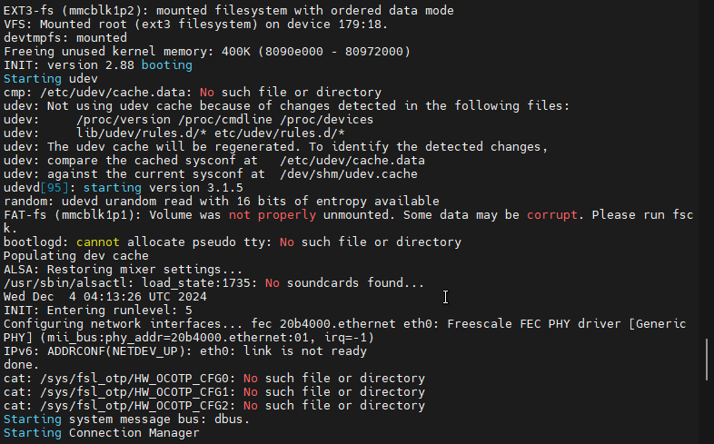


缺少根文件系统


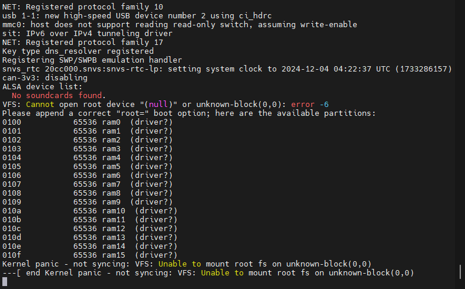


## 添加开发板


1、添加配置文件


```bash
cd arch/arm/configs
cp imx_v7_mfg_defconfig imx_alientek_emmc_defconfig
```


打开 imx_alientek_emmc_defconfig，屏蔽 CONFIG_ARCH_MULTI_V6=y


```bash
#CONFIG_ARCH_MULTI_V6=y
CONFIG_ARCH_MULTI_V7=y
CONFIG_ARCH_MULTI_V7_V6=y
```


2、添加设备树文件


```bash
cd arch/arm/boot/dts
cp imx6ull-14x14-evk.dts imx6ull-alientek-emmc.dts
```


找到该路径下的 Makfie 文件，将其加入路径


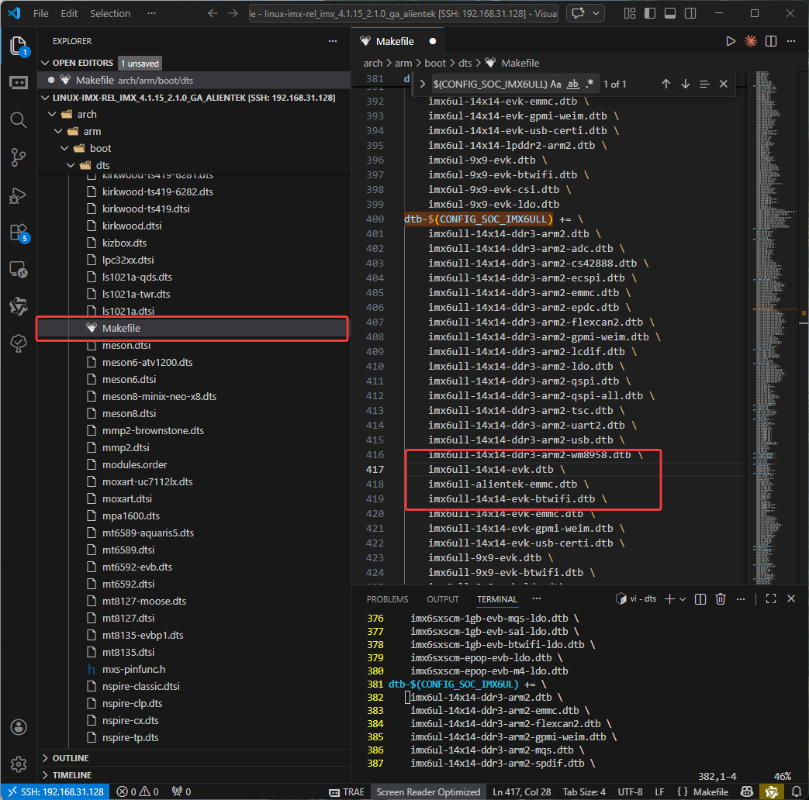


3、修改 EMMC 驱动


找到 imx6ull-alientek-emmc.dts (/home/lewuq/linux/IMX6ULL/linux/linux-imx-rel_imx_4.1.15_2.1.0_ga_alientek/arch/arm/boot/dts/imx6ull-alientek-emmc.dts )并替换为下列内容


```c++
&usdhc2 {
	pinctrl-names = "default", "state_100mhz", "state_200mhz";
	pinctrl-0 = <&pinctrl_usdhc2_8bit>;
	pinctrl-1 = <&pinctrl_usdhc2_8bit_100mhz>;
	pinctrl-2 = <&pinctrl_usdhc2_8bit_200mhz>;
	bus-width = <8>;
	non-removable;
	status = "okay";
};
```


4、修改执行脚本


```bash
#!/bin/sh
make ARCH=arm CROSS_COMPILE=arm-linux-gnueabihf- distclean
make ARCH=arm CROSS_COMPILE=arm-linux-gnueabihf- imx_alientek_emmc_defconfig
make ARCH=arm CROSS_COMPILE=arm-linux-gnueabihf- menuconfig
sed -i 's/YYLTYPE yylloc;/extern YYLTYPE yylloc;/' scripts/dtc/dtc-lexer.lex.c 2>/dev/null || true
make ARCH=arm CROSS_COMPILE=arm-linux-gnueabihf- all -j12
```


命令执行


```bash
./imx6ull_14×14_evk.sh 
sed -i 's/YYLTYPE yylloc;/extern YYLTYPE yylloc;/' scripts/dtc/dtc-lexer.lex.c
make ARCH=arm CROSS_COMPILE=arm-linux-gnueabihf- all -j12
```


拷贝文件


```bash
cp arch/arm/boot/zImage /home/lewuq/linux/tftpboot/ -f
cp arch/arm/boot/dts/imx6ull-alientek-emmc.dtb /home/lewuq/linux/tftpboot/ -f
```


tftp 挂载


```bash
tftp 80800000 zImage 
tftp 83000000 imx6ull-alientek-emmc.dtb
bootz 80800000 - 83000000

或者
setenv bootcmd 'tftp 80800000 zImage;tftp 83000000 imx6ull-alientek-emmc.dtb;bootz 80800000 - 83000000'
```


启动成功


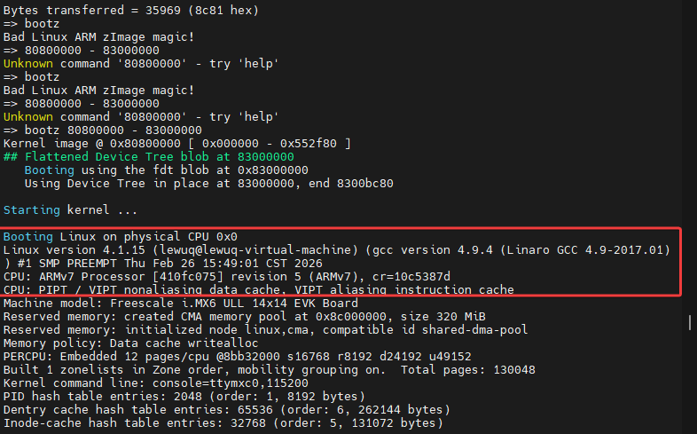


## CPU主频修改


要确保根文件系统可用，不可用前需要

- 检查 EMMC 的内容是否未被修改
- 检查 bootagrs 环境变量

    ```bash
    setenv bootargs 'console=ttymxc0,115200 root=/dev/mmcblk1p2 rootwait rw'
    saveenv
    bootargs=console=ttymxc0,115200 root=/dev/mmcblk1p2 rootwait rw
    boot
    ```

- 查看CPU的主频信息

    ```bash
    cd /
    cat /proc/cpuinfo
    ```


    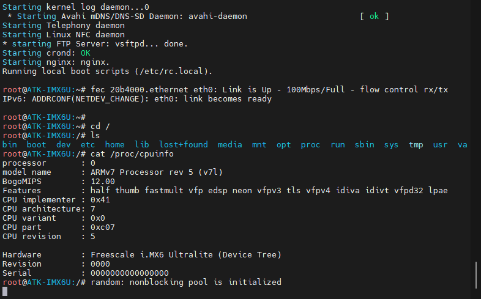


CPU运行信息如下


    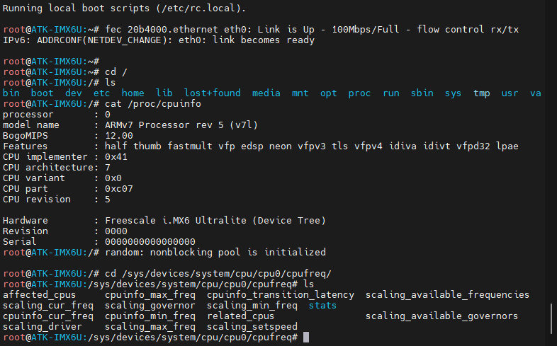


参数对照如图、具体内容可以使用 cat 命令进行查看


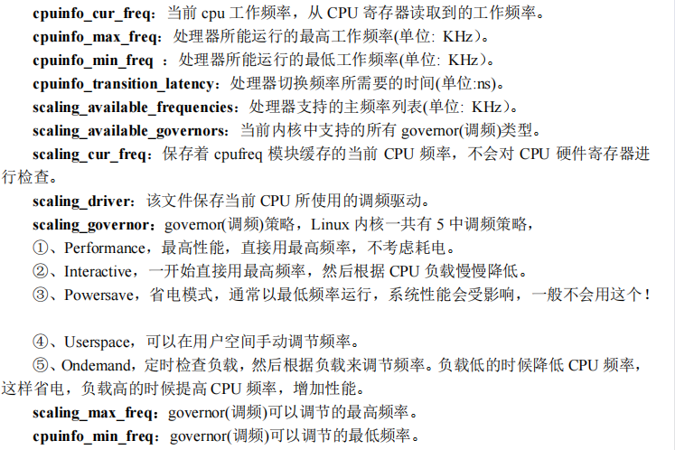


查看当前CPU的频率


```makefile
cd /sys/devices/system/cpu/cpu0/cpufreq/
cat cpuinfo_cur_freq
```


查看CPU在各频率下的工作时间


```makefile
cat /sys/bus/cpu/devices/cpu0/cpufreq/stats/time_in_state
```


1、设置开发板工作在792MHz


修改 imx_alientek_emmc_deconfig，注释 CONFIG_CPU_FREQ_DEFAULT_GOV_ONDEMAND=y，添加 


```makefile
#CONFIG_CPU_FREQ_DEFAULT_GOV_ONDEMAND=y
CONFIG_CPU_FREQ_GOV_POWERSAVE=y
CONFIG_CPU_FREQ_GOV_USERSPACE=y
CONFIG_CPU_FREQ_GOV_ONDEMAND=y
CONFIG_CPU_FREQ_GOV_CONSERVATIVE=y
```


输入 `make menuconfig` 打开 linux 内核图形化配置界面


调节路径，CPU Power Management - > CPU Frequency scaling - > Default CPUFreq governor，然后选择 performance


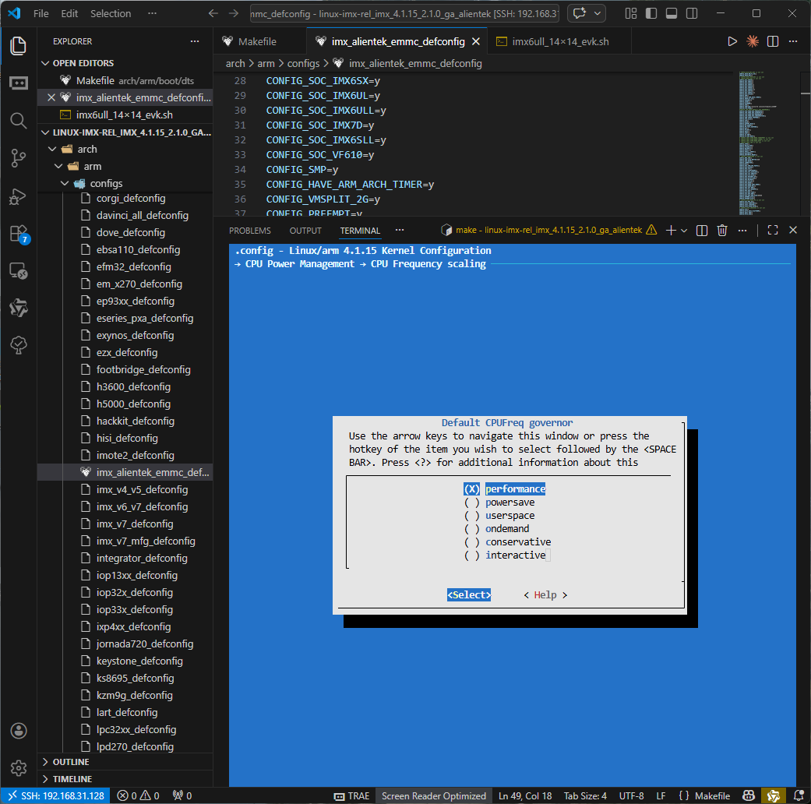


或者建议选择 ondemand


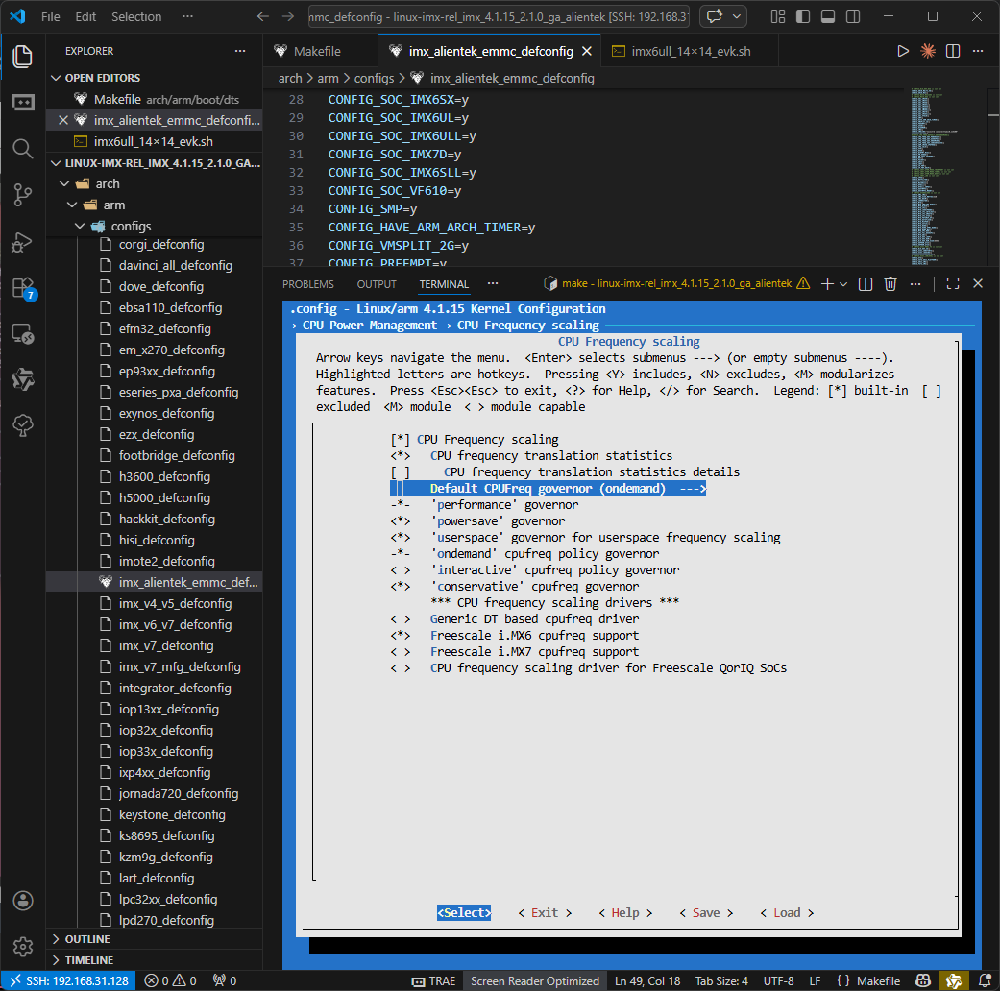


重新进行编译


```makefile
make -j12
```


编译完成后拷贝


```makefile
cp arch/arm/boot/zImage /home/lewuq/linux/tftpboot/ -f
```


然后复位重启，按照上面的步骤打开之后可以发现


```makefile
cd /sys/devices/system/cpu/cpu0/cpufreq/
cat cpuinfo_cur_freq
```


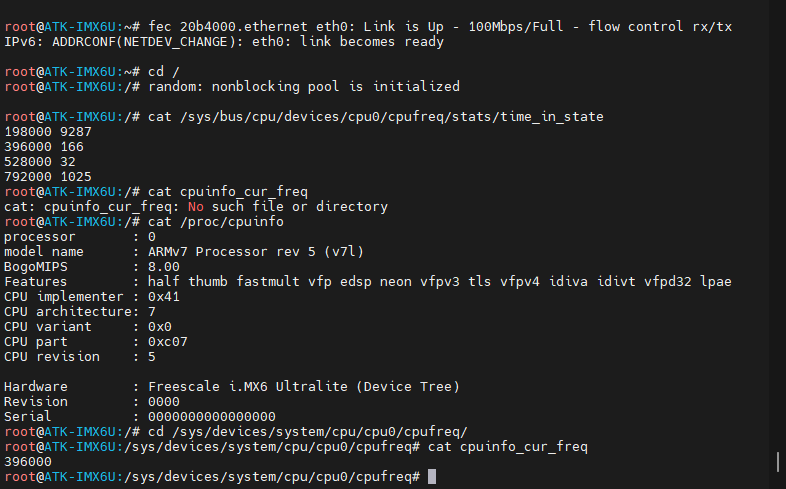


## 修改网络驱动


修改网络驱动是为了方便后面 nfs 挂载文件系统，在 设备树文件上修改 mx6ull-alientek-emmc.dts


### 修改 SR8201F 的复位以及网络时钟引脚驱动


1、打开 imx6ull-alientek-emmc.dts (/home/lewuq/linux/IMX6ULL/linux/linux-imx-rel_imx_4.1.15_2.1.0_ga_alientek/arch/arm/boot/dts/imx6ull-alientek-emmc.dts)
将MX6ULL_PAD_SNVS_TAMPER7__GPIO5_IO07 和 MX6ULL_PAD_SNVS_TAMPER8__GPIO5_IO08 的内容删除或者注释，并在后面添加  ENET1 和 ENET2 二者的网络复位信息


```c
pinctrl_spi4: spi4grp {
                      fsl,pins = <
                              MX6ULL_PAD_BOOT_MODE0__GPIO5_IO10        0x70a1
                              MX6ULL_PAD_BOOT_MODE1__GPIO5_IO11        0x70a1
                             /* MX6ULL_PAD_SNVS_TAMPER7__GPIO5_IO07      0x70a1*/
                             /* MX6ULL_PAD_SNVS_TAMPER8__GPIO5_IO08      0x80000000*/
                      >;
              };
              
   /*enet1 reset zuozhongkai*/
	pinctrl_enet1_reset: enet1resetgrp {
											fsl,pins = <
															/* used for enet1 reset */
															MX6ULL_PAD_SNVS_TAMPER7__GPIO5_IO07 0x10B0 
											>;
	};

		 /*enet2 reset zuozhongkai*/
			pinctrl_enet2_reset: enet2resetgrp {
											fsl,pins = <
															/* used for enet2 reset */
															MX6ULL_PAD_SNVS_TAMPER8__GPIO5_IO08 0x10B0 
											>;
		};
```


2、打开 imx6ull-alientek-emmc.dts (/home/lewuq/linux/IMX6ULL/linux/linux-imx-rel_imx_4.1.15_2.1.0_ga_alientek/arch/arm/boot/dts/imx6ull-alientek-emmc.dts)
将 `pinctrl-assert-gpios = <&gpio5 8 GPIO_ACTIVE_LOW>;` 和 `cs-gpios = <&gpio5 7 0>;`删除或者注释


```c
compatible = "spi-gpio";
		pinctrl-names = "default";
		pinctrl-0 = <&pinctrl_spi4>;
		/*pinctrl-assert-gpios = <&gpio5 8 GPIO_ACTIVE_LOW>;*/
		status = "okay";
		gpio-sck = <&gpio5 11 0>;
		gpio-mosi = <&gpio5 10 0>;
		/*cs-gpios = <&gpio5 7 0>;*/
		num-chipselects = <1>;
		#address-cells = <1>;
		#size-cells = <0>;
```


3、修改 ENTET1 和 ENTE2 的网络时钟引脚配置 (imx6ull-alientek-emmc.dts)


```c
pinctrl_enet1: enet1grp {
			fsl,pins = <
				MX6UL_PAD_ENET1_RX_EN__ENET1_RX_EN	0x1b0b0
				MX6UL_PAD_ENET1_RX_ER__ENET1_RX_ER	0x1b0b0
				MX6UL_PAD_ENET1_RX_DATA0__ENET1_RDATA00	0x1b0b0
				MX6UL_PAD_ENET1_RX_DATA1__ENET1_RDATA01	0x1b0b0
				MX6UL_PAD_ENET1_TX_EN__ENET1_TX_EN	0x1b0b0
				MX6UL_PAD_ENET1_TX_DATA0__ENET1_TDATA00	0x1b0b0
				MX6UL_PAD_ENET1_TX_DATA1__ENET1_TDATA01	0x1b0b0
				MX6UL_PAD_ENET1_TX_CLK__ENET1_REF_CLK1	0x4001b031
				
			>;
		};
		
				pinctrl_enet2: enet2grp {
			fsl,pins = <
				MX6UL_PAD_GPIO1_IO07__ENET2_MDC		0x1b0b0
				MX6UL_PAD_GPIO1_IO06__ENET2_MDIO	0x1b0b0
				MX6UL_PAD_ENET2_RX_EN__ENET2_RX_EN	0x1b0b0
				MX6UL_PAD_ENET2_RX_ER__ENET2_RX_ER	0x1b0b0
				MX6UL_PAD_ENET2_RX_DATA0__ENET2_RDATA00	0x1b0b0
				MX6UL_PAD_ENET2_RX_DATA1__ENET2_RDATA01	0x1b0b0
				MX6UL_PAD_ENET2_TX_EN__ENET2_TX_EN	0x1b0b0
				MX6UL_PAD_ENET2_TX_DATA0__ENET2_TDATA00	0x1b0b0
				MX6UL_PAD_ENET2_TX_DATA1__ENET2_TDATA01	0x1b0b0
				MX6UL_PAD_ENET2_TX_CLK__ENET2_REF_CLK2	0x4001b031
			>;
		};
```


### 修改 fec1 和 fec2 节点的 pinctrl-0 属性


1、修改 pinctrl-0 的属性


修改部分


```c
pinctrl-0 = < &pinctrl_enet1 
						&pinctrl_enet1_reset>;
	pinctrl-0 = <&pinctrl_enet2 
						&pinctrl_enet2_reset>;
```


完整部分


```c
&fec1 {
	pinctrl-names = "default";
	pinctrl-0 = < &pinctrl_enet1 
						&pinctrl_enet1_reset>;
	phy-mode = "rmii";
	phy-handle = <&ethphy0>;
	status = "okay";
};

&fec2 {
	pinctrl-names = "default";
	pinctrl-0 = <&pinctrl_enet2 
						&pinctrl_enet2_reset>;
	phy-mode = "rmii";
	phy-handle = <&ethphy1>;
	status = "okay";
```


### **修改 SR8201F 的 PHY 地址**


1、fec1 添加了 ENET1 网络复位引脚所使用的 IO 为 GPIO5_IO07，低电平有效。
复位低电平信号持续时间为 200ms


```c
phy-reset-gpios = <&gpio5 7 GPIO_ACTIVE_LOW>;
phy-reset-duration = <200>;
```


完整


```c
&fec1 {
	pinctrl-names = "default";
	pinctrl-0 = < &pinctrl_enet1 
						&pinctrl_enet1_reset>;
	phy-mode = "rmii";
	phy-handle = <&ethphy0>;
	phy-reset-gpios = <&gpio5 7 GPIO_ACTIVE_LOW>;
	phy-reset-duration = <200>;
	status = "okay";
};
```


2、fect2


修改部分


```c
phy-reset-gpios = <&gpio5 8 GPIO_ACTIVE_LOW>;
	phy-reset-duration = <200>;
	
	smsc,disable-energy-detect;
```


完整


```c
&fec2 {
	pinctrl-names = "default";
	pinctrl-0 = <&pinctrl_enet2 
						&pinctrl_enet2_reset>;
	phy-mode = "rmii";
	phy-handle = <&ethphy1>;
	phy-reset-gpios = <&gpio5 8 GPIO_ACTIVE_LOW>;
	phy-reset-duration = <200>;
	status = "okay";

	mdio {
		#address-cells = <1>;
		#size-cells = <0>;

		ethphy0: ethernet-phy@2 {
			compatible = "ethernet-phy-ieee802.3-c22";
			smsc,disable-energy-detect;
			reg = <2>;
		};

		ethphy1: ethernet-phy@1 {
			compatible = "ethernet-phy-ieee802.3-c22";
			smsc,disable-energy-detect;
			reg = <1>;
		};
	};
};
```


### 修改 fec_main.c 文件


打开  drivers/net/ethernet/freescale/fec_main.c 文件，加入下列文件


```c
static void fec_reset_phy(struct platform_device *pdev)
{
	int err, phy_reset;
	int msec = 1;
	struct device_node *np = pdev->dev.of_node;
	
	if (!np)
		return;
	
	err = of_property_read_u32(np, "phy-reset-duration", &msec);
	/* A sane reset duration should not be longer than 1s */
	if (!err && msec > 1000)
				msec = 1;
	
	phy_reset = of_get_named_gpio(np, "phy-reset-gpios", 0);
	if (!gpio_is_valid(phy_reset))
		return;
	
	err = devm_gpio_request_one(&pdev->dev, phy_reset,
							GPIOF_OUT_INIT_LOW, "phy-reset");
	if (err) {
			dev_err(&pdev->dev, "failed to get phy-reset-gpios: %d\n", err);
	return;
	}
	msleep(msec);
	gpio_set_value(phy_reset, 1);
	msleep(200); /* 复位结束后至少再延时 150ms 才能继续操作 SR8201F */
}
```


2、使用make -j12 编译镜像之后拷贝


```bash
make -j12
cp arch/arm/boot/zImage /home/lewuq/linux/tftpboot/ -f
cp arch/arm/boot/dts/imx6ull-alientek-emmc.dtb /home/lewuq/linux/tftpboot/ -f
```


3、重启并配置网络信息


一般接入网线之后即可获取地址，无需额外配置


配置网卡0和网卡1


```bash
ifconfig eth0 up
ifconfig eth0 192.168.31.22

ifconfig eth1 up
ifconfig eth1 192.168.31.22
```


如图


    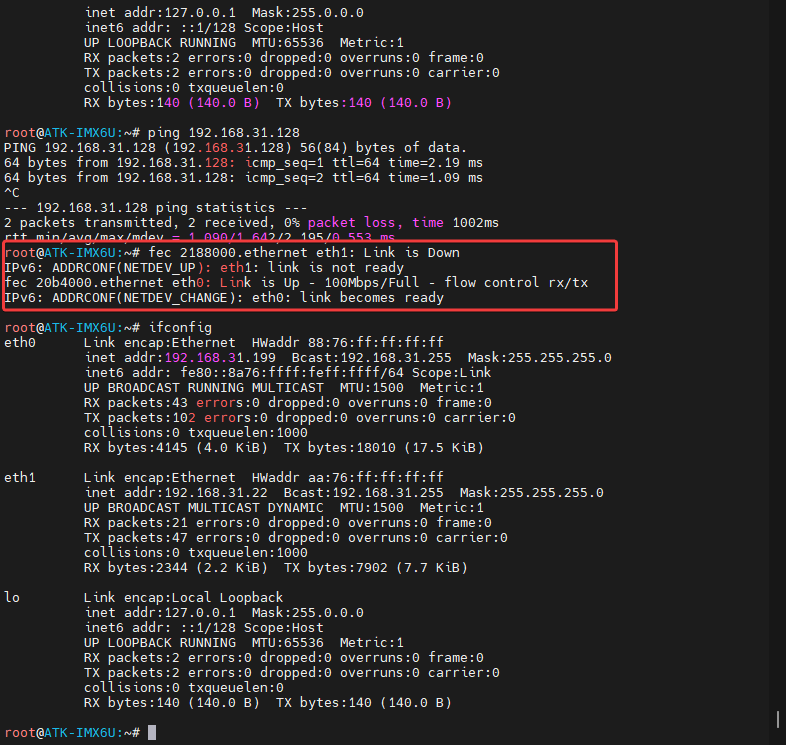

