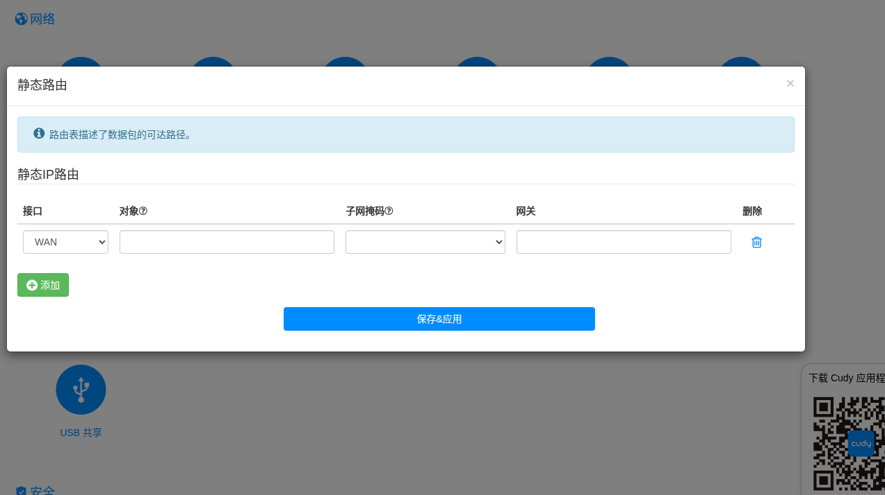
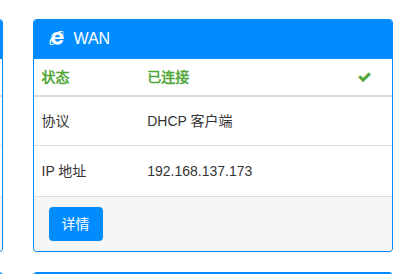
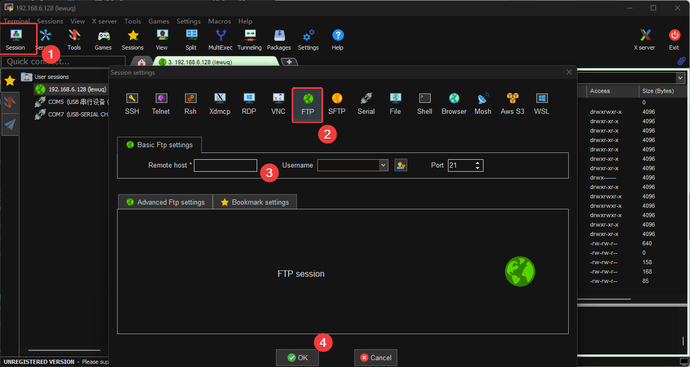
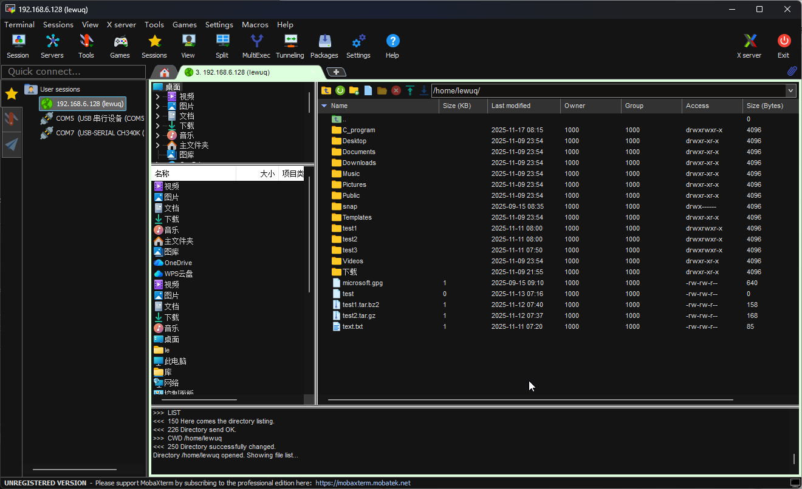
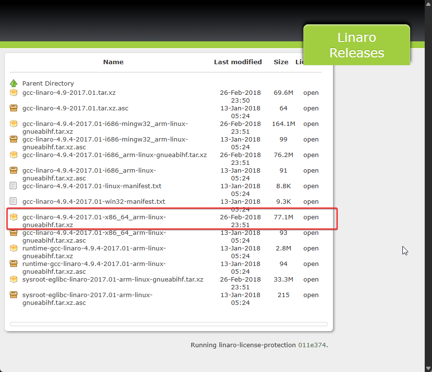
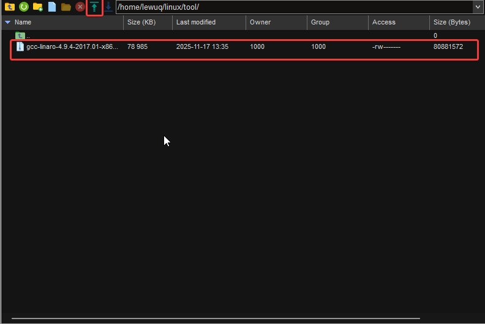
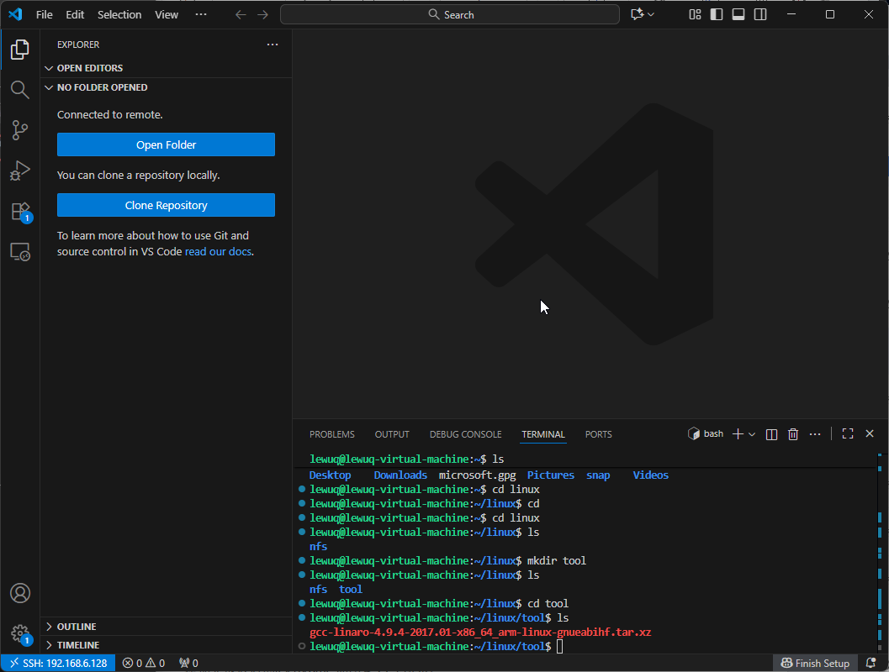
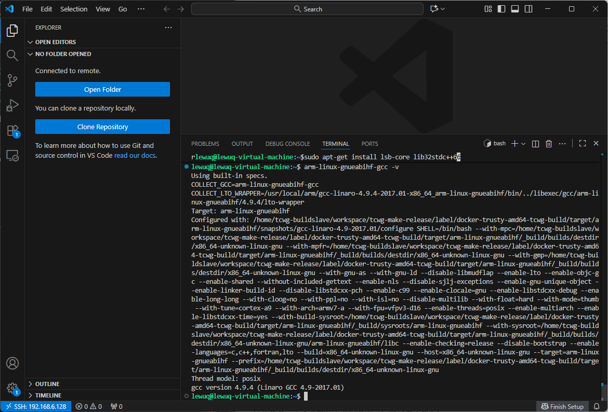
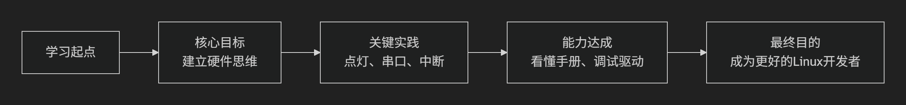

## 连接FTP以及开启NFS和SSH




- 下载MobaXterm，免费版的就够用了

    [bookmark](https://mobaxterm.mobatek.net/)

- 在虚拟机内开启FTP盘服务

    ```shell
    #指令
    sudo apt-get install vsftpd
    
    #开启写权限
    sudo vi /etc/vsftpd.conf
    
    #是下列注释取消
    local_enable=YES #27行
    write_enable=YES #31行
    
    #开启UFT8字符，防止出现中文乱码,没有就添加
    utf8_filesystem=YES
    
    #重启服务
    sudo /etc/init.d/vsftpd restart
    ```

    - 使用 MobaXterm 的FTP盘进行连接（连接之前使用ifconfig查看虚拟机的IP地址，如果怕下次更变，更改为静态IP）

        

    - 连接成功之后，使用下方的上传箭头即可传输文件，当然，也可以使用拖拽的方式

        

- Ubuntu下开启NFS和SSH服务

    ```shell
    #后续驱动开发需要用到NFS启动
    sudo apt-get install nfs-kernel-server rpcbind
    
    #在用户根目录创建下面linux文件夹和在 linux 文件夹下创建 nfs 文件
    mkdir linux
    cd linux
    mkdir nfs
    
    #配置nfs
    sudo vi /etc/exports
    #添加下面的内容
    /home/yourname/linux/nfs*(rw,sync,no_root_squash)
    # /home/yourname/linux/nfs：要共享的目录路径。
    # 注意：yourname应替换为你的实际用户名（如/home/alice/linux/nfs）。
    # *：允许所有网络客户端访问。也可以指定IP地址（如192.168.1.0/24）以限制访问。
    # rw：客户端具有读写权限。
    # sync：同步写入模式，确保数据一致性，但性能稍差。
    # no_root_squash：客户端以root用户访问时，服务器不会将其映射为匿名用户，保留root权限。
    # 这方便开发，但存在安全风险，仅建议在可信网络中使用。
    
    #重启NFS服务
    sudo /etc/init.d/nfs-kernel-server restart
    ```

- 开启 SSH ，开起了 SSH 之后可以使用 Windows 下的 VS Code SSH远程进行代码编写，会
    - 在Unbuntu 下开启SSH服务

        ```shell
        sudo apt-get install openssh-server
        #使用默认服务，无需开启其他端口
        ```

    - 使用 VS Code SSH远程连接（或者使用 MobaXterm 的 SSH 远程，但是后者代码编辑没有 VS Code 好用）

        在 VS  Code 下安装 Romote -SSH 插件，安装完成后点击左下角开启远程，第一次设置需要进行配置，配置完保存到本地即可，再次打开远程密码即可


        ```shell
        #配置格式如下
        username@ip地址
        
        如 lewuq@196.168.x.111
        ```


        


        连接成功之后如下，新建终端也可以进行查看是不是自己的虚拟机，成功之后就可以愉快的进行编程了！


        


        文档目录结构输出，


        Windows 下：


        ```shell
        # 按住 Alt + 数字键
        ├ : Alt + 195
        ─ : Alt + 196
        └ : Alt + 192
        ```


        在Linux/macOS中，安装tree命令后，在项目根目录下执行：


        ```shell
        tree
        
        #tree /path/to/directory
        ```


        则会得到


        ```shell
        ├── lib
        │   ├── motor
        │   └── servo
        └── main.c
        ```


## 安装 ARM - GCC 交叉编译器

- 首先创建两个目录

    ```shell
    #在 linux 下创建 tool 文件夹
    mkdir tool
    
    #在 /usr/local 下创建 arm 文件夹
    sudo mkdir /usr/local/arm
    ```

- 打开正点原子的开发板光盘下载 arm-gcc x86 的64位编译器压缩包或者点击下面网站：

    [bookmark](https://releases.linaro.org/components/toolchain/binaries/4.9-2017.01/arm-linux-gnueabihf/)

    - 下载64位的版本

        

    - 然后使用 MobaXterm 上传到 虚拟机的 linux 文件夹下的 tool 文件夹内（没有需要自行创建）

        

    - 使用远程工具查看是否创建成功

        

    - 将其复制到  usr/local/arm 文件夹下 （在 VS Code 下的好处就是可以直接复制命令）然后配置

        ```shell
        #需要在tool文件下进行复制
        sudo cp gcc gcc-linaro-4.9.4-2017.01-x86_64_arm-linux-gnueabihf.tar.xz /usr/local/arm/ -f
        
        #查看是否成功
        cd /usr/local/arm
        ls
        
        #解压,需要等待一段时间
        sudo tar -xvf gcc-linaro-4.9.4-2017.01-x86_64_arm-linux-gnueabihf.tar.xz
        
        #修改环境变量
        sudo vi /etc/profile
        export PATH=$PATH:/usr/local/arm/gcc-linaro-4.9.4-2017.01-x86_64_arm-linux-gnueabihf/bin
        
        #重启
        sudo reboot
        ```

    - 安装相关库，验证

        ```shell
        # C++库依赖
        sudo apt-get install lsb-core lib32stdc++6
        
        # 验证
        arm-linux-gnueabihf-gcc -v
        ```


        安装成功


        

    - 创建 driver/board_driver 并通过 MobaXterm 将正点原子的裸机例程放入其中

        ```shell
        mkdir driver
        mkdir board_driver
        ```


        出现 led.elf 的 linux 下可执行文件即搭建环境无问题，下面即将正式开始 Linux 驱动的学习

- 学习裸机编程不需要太过深入，而是要通过这一部分进行学习如何查看寄存器值以排查问题

    


    ```flow
    flowchart LR
        A[学习起点] --> B[核心目标<br>建立硬件思维]
        B --> C[关键实践<br>点灯、串口、中断]
        C --> D[能力达成<br>看懂手册、调试驱动]
        D --> E[最终目的<br>成为更好的Linux开发者]
    ```


## Ubuntu 换源（改为清华源  / 阿里源）


有时候因为源很混乱导致下载失败，所以需要更新一个单纯的源确保下载


```shell
cat /etc/os-release


#以防出错，先备份
sudo cp /etc/apt/sources.list /etc/apt/sources.list.bak

#使用 nano 编辑器打开文件夹，如果是很多的一个混乱的源，那很可能会导致你的大多数拉取文件失败
sudo nano /etc/apt/sources.list

# 按住 Ctrl + X 退出当前的那个界面，使用命令将其清空
sudo truncate -s 0 /etc/apt/sources.list

#再度打开界面
sudo nano /etc/apt/sources.list

#粘贴下面的 清华源， 按住  Ctrl + O 保存 ，然后 #按住 Ctrl + X 退出

# 默认注释了源码镜像以提高 apt update 速度，如有需要可自行取消注释
deb http://mirrors.tuna.tsinghua.edu.cn/ubuntu/ jammy main restricted universe multiverse
# deb-src http://mirrors.tuna.tsinghua.edu.cn/ubuntu/ jammy main restricted universe multiverse

deb http://mirrors.tuna.tsinghua.edu.cn/ubuntu/ jammy-updates main restricted universe multiverse
# deb-src http://mirrors.tuna.tsinghua.edu.cn/ubuntu/ jammy-updates main restricted universe multiverse

deb http://mirrors.tuna.tsinghua.edu.cn/ubuntu/ jammy-backports main restricted universe multiverse
# deb-src http://mirrors.tuna.tsinghua.edu.cn/ubuntu/ jammy-backports main restricted universe multiverse

deb http://mirrors.tuna.tsinghua.edu.cn/ubuntu/ jammy-security main restricted universe multiverse
# deb-src http://mirrors.tuna.tsinghua.edu.cn/ubuntu/ jammy-security main restricted universe multiverse

#或者 阿里云的源 

deb https://mirrors.aliyun.com/ubuntu/ focal main restricted universe multiverse
deb-src https://mirrors.aliyun.com/ubuntu/ focal main restricted universe multiverse

deb https://mirrors.aliyun.com/ubuntu/ focal-security main restricted universe multiverse
deb-src https://mirrors.aliyun.com/ubuntu/ focal-security main restricted universe multiverse

deb https://mirrors.aliyun.com/ubuntu/ focal-updates main restricted universe multiverse
deb-src https://mirrors.aliyun.com/ubuntu/ focal-updates main restricted universe multiverse

# deb https://mirrors.aliyun.com/ubuntu/ focal-proposed main restricted universe multiverse
# deb-src https://mirrors.aliyun.com/ubuntu/ focal-proposed main restricted universe multiverse

deb https://mirrors.aliyun.com/ubuntu/ focal-backports main restricted universe multiverse
deb-src https://mirrors.aliyun.com/ubuntu/ focal-backports main restricted universe multiverse


# 清除缓存+更新索引
sudo apt clean
sudo apt update
sudo apt upgrade
```


或者参照清华源官方的进行配置


[bookmark](https://mirrors.tuna.tsinghua.edu.cn/help/ubuntu/)


参照阿里云镜像源


[bookmark](https://www.cnblogs.com/amsilence/p/16401845.html)


[bookmark](https://developer.aliyun.com/mirror/ubuntu?spm=a2c6h.13651102.0.0.3e221b11krjRjJ)


## 什么是curl


[bookmark](https://apifox.com/blog/understanding-curl/)


[bookmark](https://zhuanlan.zhihu.com/p/369516927)

