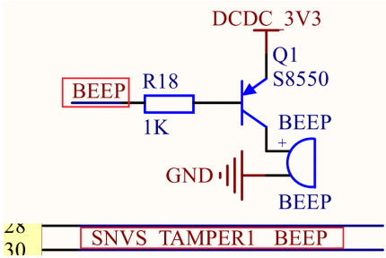

原理图如图所示，低电平使能蜂鸣器响





## 新建 beeo 文件夹

- 在 bsp 文件夹下新建文件文件夹 beef
- 在 beef 下新建 bsp_beef.c 和 bsp_beef.h 文件
<details>
<summary>bsp_beef</summary>

bsp_beef.h


```shell
#ifndef   __BSP_DELAY_H
#define   __BSP_DELAY_H

void delay_short(volatile unsigned int n);
void delay(volatile unsigned int n);

#endif
```


bsp_beef.c


```c
#include "bsp_beef.h"

void beef_init(void){

    /* 初始化 IO 复用 */
    IOMUXC_SetPinMux(IOMUXC_SNVS_SNVS_TAMPER1_GPIO5_IO01, 0);

    /* 配置 IO 的电气属性 */
    IOMUXC_SetPinConfig(IOMUXC_SNVS_SNVS_TAMPER1_GPIO5_IO01, 0x10B0);

    /* 配置 IO 的输出模式 */
    GPIO5->GDIR |= (1 << 1);

    /* 配置 IO 输出电平 */
    GPIO5->DR |= (1 << 1);

}

void beef_switch(int status){
    if (status == ON){
        GPIO5->DR &= ~( 1 << 1 );
    }else if(status == OFF )
    {
        GPIO5 ->DR |= (1 << 1);
    }

}
```


</details>

<details>
<summary>main.c</summary>

```c
#include "bsp_clk.h"
#include "bsp_delay.h"
#include "bsp_led.h"
#include "bsp_beef.h"
/*
 * 点灯步骤
 * 1. 使能GPIO时钟
 * 2. 设置GPIO复用功能
 * 3. 配置GPIO的电气属性
 * 4. 设置GPIO的输出模式
 * 5. 将 GPIO 对应的灯置 高/低 电平
 */
int main(void)
{
    clk_enable();
    // led_init();
    beef_init();
    

    while(1){
        // /* 打开 LED0 */
        // led_switch(LED0, ON);
        // delay(500);

        // /* 关闭 LED0 */
        // led_switch(LED0, OFF);
        // delay(500);

        led_switch(LED0, ON);
        beef_switch(ON);
        delay(500);

        led_switch(LED0, OFF);
        beef_switch(OFF);
        delay(500);
        
    }
    return 0;
}
```


</details>


## 修改 Makefile 文件


在 Makefile 文件下添加 INCDIRS  和 SRCDIRS 对应的路径


```c
bsp/beef
```


## 编译下载


使用指令下载到 SD 卡然后查看效果


```shell
make
ls /dev/sd*
./imxdownload bsp.bin /dev/sdb
```


效果即蜂鸣器响和按键亮

