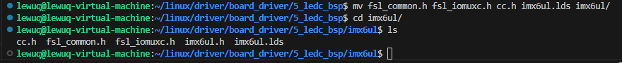
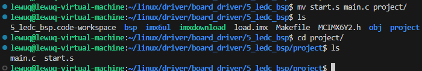
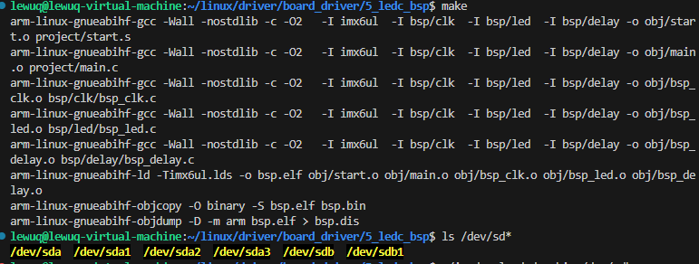
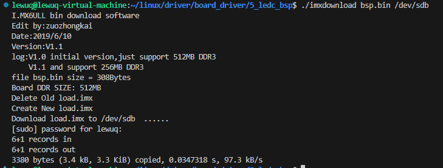

# BSP 工程管理


当进行驱动操作时，单一文件夹全部放置 .c 和 .h 以及其他文件会显得特别混乱而且不好管理，也不利于深度开发，所以将其存放于不同文件夹下，再以其属性进行区分，方便进行管理和开发，已经定位错误。


复制工作区


将 4_ledc_sdk 进行复制为 5_ledc_bsp


```shell
cp -rf 4_ledc_sdk/ 5_ledc_bsp
```


## 规划工程目录


创建 bsp  imx6ul obj  project 目录

- bsp

    存放驱动文件

- imx6ul

    存放与芯片有关的文件

- obj

    存放编译生成的 .o 文件

- project

    存放 start.s 和 main.c 文件


## 编写工程目录下文件

- bsp
    - 创建 led 文件夹 mkdir led
<details>
<summary>led</summary>

bsp_led.h


```c
#ifndef __BSP_LED_H
#define __BSP_LED_H

#include "imx6ul.h"

#define LED0 0
void led_init(void);
void led_switch(int led, int status);


#endif
```


bsp_led.c


```c
#include "bsp_led.h"

void led_init(void){

    /* 初始化 IO 复用 */
    IOMUXC_SetPinMux(IOMUXC_GPIO1_IO03_GPIO1_IO03, 0);

    /* 配置 IO 的电气属性 */
    IOMUXC_SetPinConfig(IOMUXC_GPIO1_IO03_GPIO1_IO03, 0x10B0);

    /* 配置 IO 的输出模式 */
    GPIO1->GDIR |= (1 << 0x03);

    /* 配置 IO 输出电平 */
    GPIO1->DR &= ~( 1 << 3);

}

void led_switch(int led, int status){
    switch (led)
    {
    case LED0:
        if(status == ON ){
            GPIO1->DR &= ~(1<<3);
        }else if( status == OFF)
            GPIO1->DR |= (1 << 3)

        break;
    
    default:
        break;
    }

}
```


</details>

<details>
<summary>clk</summary>

bsp_clk.h


```c++
#ifndef _BSP_CLK_H
#define _BSP_CLK_H

#include "imx6ul.h"
void clk_enable(void);

#endif
```


bsp_clk.c


```c++
#include "bsp_clk.h"

void clk_enable(void){

    CCM->CCGR0 = 0xffffffff;
    CCM->CCGR1 = 0xffffffff;
    CCM->CCGR2 = 0xffffffff;
    CCM->CCGR0 = 0xffffffff;
    CCM->CCGR0 = 0xffffffff;
    CCM->CCGR0 = 0xffffffff;
    CCM->CCGR0 = 0xffffffff;
    CCM->CCGR0 = 0xffffffff;
}
```


</details>

<details>
<summary>delay</summary>

bsp_delay.h


```c++
#ifndef   __BSP_DELAY_H
#define   __BSP_DELAY_H

void delay_short(volatile unsigned int n);
void delay(volatile unsigned int n);

#endif
```


bsp_delay.c


```c++
#include "bsp_delay.h"

void delay_short(volatile unsigned int n){
    while(n--){
    }
}

void delay(volatile unsigned int n){
    while(n--){
        delay_short(0x7ff);
    }
}
```


</details>

- imx6ul

    将相关的文件移动到该文件夹下


    ```shell
    mv fsl_common.h fsl_iomuxc.h cc.h MCIMX6Y2.h imx6ul/
    ```


    

<details>
<summary>创建 imx6ul.h</summary>

```c++
#ifndef __IMX6UL_H
#define __IMX6UL_H

/*
 * 存放一些常用的头文件
 */

#include "cc.h"
#include "MCIMX6Y2.h"
#include "fsl_common.h"
#include "fsl_iomuxc.h"

#endif
```


</details>

- obj

    暂无

- project

    将 main.c 和  start.s 移动到当前文件夹下


    ```shell
    mv start.s main.c project/
    ```


    

<details>
<summary>修改 main.c</summary>

```c
#include "bsp_clk.h"
#include "bsp_delay.h"
#include "bsp_led.h"
/*
 * 点灯步骤
 * 1. 使能GPIO时钟
 * 2. 设置GPIO复用功能
 * 3. 配置GPIO的电气属性
 * 4. 设置GPIO的输出模式
 * 5. 将 GPIO 对应的灯置 高/低 电平
 */
int main(void)
{
    clk_enable();
    led_init();

    while(1){
        /* 打开 LED0 */
        led_switch(LED0, ON);
        delay(500);

        /* 关闭 LED0 */
        led_switch(LED0, OFF);
        delay(500);
    }
    return 0;
}
```


</details>

- 修改 Makefile

    ```makefile
    CROSS_COMPILE 	?= arm-linux-gnueabihf-
    TARGET		  	?= bsp
    
    CC 				:= $(CROSS_COMPILE)gcc
    LD				:= $(CROSS_COMPILE)ld
    OBJCOPY 		:= $(CROSS_COMPILE)objcopy
    OBJDUMP 		:= $(CROSS_COMPILE)objdump
    
    INCDIRS 		:= imx6ul \
    				   bsp/clk \
    				   bsp/led \
    				   bsp/delay 
    				   			   
    SRCDIRS			:= project \
    				   bsp/clk \
    				   bsp/led \
    				   bsp/delay 
    				   
    				   
    				   
    INCLUDE			:= $(patsubst %, -I %, $(INCDIRS))
    
    SFILES			:= $(foreach dir, $(SRCDIRS), $(wildcard $(dir)/*.s))
    CFILES			:= $(foreach dir, $(SRCDIRS), $(wildcard $(dir)/*.c))
    
    SFILENDIR		:= $(notdir  $(SFILES))
    CFILENDIR		:= $(notdir  $(CFILES))
    
    SOBJS			:= $(patsubst %, obj/%, $(SFILENDIR:.s=.o))
    COBJS			:= $(patsubst %, obj/%, $(CFILENDIR:.c=.o))
    OBJS			:= $(SOBJS) $(COBJS)
    
    VPATH			:= $(SRCDIRS)
    
    .PHONY: clean
    # 即便是小写的 .s 文件，编译 bin 时也要用大写的 -S  
    $(TARGET).bin : $(OBJS)
    	$(LD) -Timx6ul.lds -o $(TARGET).elf $^
    	$(OBJCOPY) -O binary -S $(TARGET).elf $@ 
    	$(OBJDUMP) -D -m arm $(TARGET).elf > $(TARGET).dis
    
    $(SOBJS) : obj/%.o : %.s
    	$(CC) -Wall -nostdlib -c -O2  $(INCLUDE) -o $@ $<
    
    $(COBJS) : obj/%.o : %.c
    	$(CC) -Wall -nostdlib -c -O2  $(INCLUDE) -o $@ $<
    	
    clean:
    	rm -rf $(TARGET).elf $(TARGET).dis $(TARGET).bin $(COBJS) $(SOBJS)
    ```


## 编译下载


```shell
make 

ls /dev/sd* 

./imxdownload bsp.bin /dev/sdb
```








效果如下


