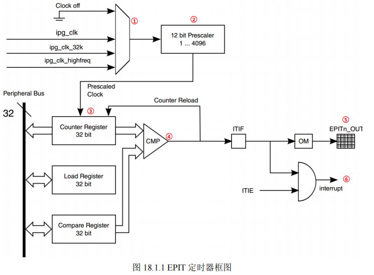
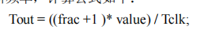

定时器是最常用的外设，常常需要使用定时器来完成精准的定时功能，I.MX6U 提供了多种硬件定时器，有些定时器功能非常强大


从最基本的 EPIT 定时器开始，学习如何配置 EPIT 定时器，使其按照给定的时间，周期性的产生定时器中断，在定时器中断里面我们可以做其它的处理，比如翻转 LED 灯。


## **EPIT 定时器简介**


EPIT 的全称是：Enhanced Periodic Interrupt Timer，直译过来就是增强的周期中断定时器，它主要是完成周期性中断定时的


I.MX6U 的 EPIT 定时器只是完成周期性中断定时的，仅此一项功能，至于输入捕获、PWM 输出等这些功能，I.MX6U 由其它的外设来完成





## 配置

1. 设置 EPIT1 的时钟源

    设置寄存器 EPIT1_CR 寄存器的 CLKSRC ( bit 25: 24)位，选择 EPIT1 的时钟源

2. 设置分频值

    设置寄存器 EPIT1_CR 寄存器的 PRESCALAR ( bit15:4) 位，设置分频值

3. 设置工作模式

    设置寄存器 EPIT1_CR 的 RLD ( bit 3 ) 位，设置 EPTI1 的工作模式

4. 设置计数器的初始值来源

    设置寄存器 EPIT1_CR 的 ENMOD ( bit 1) 位，设置计数器的初始值来源

5. 使能比较中断

    社会混子寄存器 EPIT1_CR  的 OCIEN ( bit 2 ) 位，使能比较中断

6. 设置加载值和比较值

    设置寄存器 EPIT1_LR 中的加载值和寄存器 EPIT1_CMPR 中的比较值，由此决定定时器的中断周期

7. EPIT1 中断设置和中断服务函数编写

    使能 GIC 中对应的 EPIT1 中断。注册中断服务函数

8. 使能 EPIT1 定时器

    设置 EPIT1_CR 的 EN ( bit 0 ) 位来设置


## 实验程序编写

- 添加对应的文件

    复制上一节的文件


    ```shell
    cp -rf 9_int/ 10_epit_timer/
    
    # 修改工作区文件
    cd 10_epit_timer/
    mv 9_int.code-workspacee 10_epit_timer.code-workspace
    ```

- 新建 bsp_epittimer 文件夹

    在此文件夹下添加 bsp_epittimer.c 和 bsp_epittimer.h

<details>
<summary>bsp_epittimer.c</summary>

```c
#include "bsp_epittimer.h"
#include "bsp_int.h"
#include "bsp_led.h"

void epit1_init(unsigned int frac, unsigned int value)
{
    if ( frac > 0xfff )
				 frac = 0xfff;
    EPIT1->CR = 0;

    EPIT1->CR = (1 << 24 | frac << 4 | 1<<3 | 1<<2 | 1<<1);
    EPIT1->LR = value;
    EPIT1->CMPR = 0;

    /* 使能 GIC 中对应的中断 */
    GIC_EnableIRQ(EPIT1_IRQn);

    /* 注册 GIC 中对应的中断*/
    system_register_irqhandler(EPIT1_IRQn,
                            (system_irq_handler_t)epit1_irqhandler,
                            NULL);
    EPIT1->CR |= 1 << 0;

}

void epit1_irqhandler(void){
    static unsigned char state = 0;
    state = !state;
    if( EPIT1-> SR & (1 << 0)){
        led_switch(LED0 , state);
    }
    EPIT1->SR |= 1 <<0;
}
```


</details>

<details>
<summary> bsp_epittimer.h</summary>

```c
#ifndef __BSP_EPITTIMER_
#define __BSP_EPITTIMER_

#include "imx6ul.h"
void epit1_init(unsigned int frac, unsigned int value);
void epit1_irqhandler(void);


#endif
```





</details>

<details>
<summary>main.c</summary>

```c
#include "bsp_clk.h"
#include "bsp_delay.h"
#include "bsp_led.h"
#include "bsp_beep.h"
#include "bsp_key.h"
#include "bsp_int.h"
#include "bsp_exit.h"
#include "bsp_epittimer.h"


/*
 * 点灯步骤
 * 1. 使能GPIO时钟
 * 2. 设置GPIO复用功能
 * 3. 配置GPIO的电气属性
 * 4. 设置GPIO的输出模式
 * 5. 将 GPIO 对应的灯置 高/低 电平
 */
int main(void)
{
	unsigned char state = OFF;

	int_init(); 		/* 初始化中断(一定要最先调用！) */
	imx6u_clkinit();	/* 初始化系统时钟 			*/
	clk_enable();		/* 使能所有的时钟 			*/
	led_init();			/* 初始化led 			*/
	beep_init();		/* 初始化beep	 		*/
	key_init();			/* 初始化key 			*/
	exit_init();		/* 初始化按键中断			*/
	epit1_init(0, 66000000 / 2 ); /* 初始化 EPIT1 定时器， 1 分频 */
								 /* 计数器值为 ： 66000000 / 2*/
								 /* 定时周期为 500ms */

	while(1)			
	{	
		delay(500);
	}

	return 0;
}
```


</details>


## 编译下载验证


修改 Makefile 文件，添加新建目录的路径、修改生成文件的目标名字


```makefile
TARGET                 ?= epit
												bsp/epittimer
```


下载验证


```shell
make
ls /dev/sd*
./imxdownload epit.bin /dev/sd*
```


烧写成功后，LED0 以 500ms 进行亮灭闪烁

