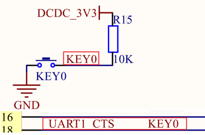

这里主要讲解 I.MX6U 的 GPIO 输入控制功能


按照前面的章节解释所说，GDIR 配置为 1 为输出，那么配置为 0 则为输入


原理图





## 新建 key 和 gpio 文件夹


首先将 上一节的内容拷贝到 新的文件夹下 


    ```shell
    cp -rf 6_ledc_beep/ 7_ledc_key/
    
    cd 7_ledc_key/
    #重命名工作区
    mv 6_ledc_beep.code-workspace 7_ledc_key.code-workspace
    ```

- 在 bsp 文件下创建 key 和 gpio 文件夹

    ```shell
    mkdir key gpio
    cd key/
    touch bsp_key.c bsp_key.h
    cd ../gpio/
    touch bsp_gpio.c bsp_gpio.h
    ```

- 添加各自对应的代码
<details>
<summary>bsp_gpio</summary>

bsp_gpio.h


```c
#ifndef __BSP_GPIO_H
#define __BSP_GPIO_H

#include "imx6ul.h"

/* 枚举类型和结构体定义 */
typedef enum _gpio_pin_direction{
    kGPIO_DigitalInput = 0U,        /* 输入 */
    kGPIO_DigitalOutpOutput = 1U,   /* 输出 */

}gpio_pin_direction_t;

/* GPIO 配置结构体 */
typedef struct _gpio_pin_config{
    gpio_pin_direction_t direction; /* GPIO 方向： 输入还是输出  */
    uint8_t outputLogic;            /* 如果为输出，默认输出低电平 */

}gpio_pin_config_t;

void gpio_init(GPIO_Type *base, int pin, gpio_pin_config_t *config);
int gpio_pinread(GPIO_Type *base, int pin);
void gpio_pinwrite(GPIO_Type *base, int pin, int value);

#endif
```


bsp_gpio.c


```c
#include "bsp_gpio.h"

 /*
 *@description : GPIO 初始化
 *@param - base : 要初始化的 GPIO 组
 *@param - pin : 要初始化 GPIO 在组内的编号
 *@param - config : GPIO 配置结构体
 *@return : 无
 */
void gpio_init(GPIO_Type *base, int pin, gpio_pin_config_t *config){

    if(config -> direction == kGPIO_DigitalInput){
        /* 输入 */
        base -> GDIR &= ~( 1 << pin );
    }else
    {
        /* 输出 */
        base -> GDIR |= 1 << pin ;
        gpio_pinwrite(base, pin, config -> outputLogic); /* 默认输出电平 */
    }

}

/*
 * @description : 读取指定 GPIO 的电平值
 * @param – base : 要读取的 GPIO 组
 * @param - pin : 要读取的 GPIO 脚号
 * @return : 无
 */
int gpio_pinread(GPIO_Type *base, int pin){
    return ( ( ( base -> DR ) >> pin) & 0x1 );
}


/*
 * @description : 指定 GPIO 输出高或者低电平
 * @param – base : 要输出的的 GPIO 组
 * @param - pin : 要输出的 GPIO 脚号
 * @param – value : 要输出的电平，1 输出高电平， 0 输出低低电平
 * @return : 无
 */ 
void gpio_pinwrite(GPIO_Type *base, int pin, int value){
    if ( value == 0U){
        base -> DR &= ~(1U << pin );  /* 输出低电平 */
    }else {
        base -> DR |= (1U << pin );   /* 输出高电平 */
    }

}
```


</details>

<details>
<summary>bsp_key</summary>

bsp_key.h


```c
#ifndef __BSP_KEY_H
#define __BSP_KEY_H

#include "imx6ul.h"

/* 定义按键值 */
enum keyvalue{
    KEY_NONE = 0,
    KEY0_VALUE ,
};

/* 函数声明 */
void key_init(void);
int key_getvalue(void);


#endif
```


bsp_key.c


```c
#include "bsp_key.h"
#include "bsp_gpio.h"
#include "bsp_delay.h"


void key_init(void){
    gpio_pin_config_t key_config;

    IOMUXC_SetPinMux(IOMUXC_UART1_CTS_B_GPIO1_IO18, 0);

    key_config.direction = kGPIO_DigitalInput;
    gpio_init(GPIO1, 18, &key_config);
}


int key_getvalue(void){
    int ret = 0;                      /* */
    static unsigned char release = 1; /* 按键松开 */
    
    if( (release == 1 ) && ( gpio_pinread(GPIO1, 18) == 0 )){ 
        /* 按键按下*/
        delay(10);   /* 延时消抖     */
        release = 0; /* 标记按键按下 */
        if (gpio_pinread(GPIO1, 18) == 0){
            ret = KEY0_VALUE;
        }
    }
    else if( gpio_pinread(GPIO1, 18) == 1){
        ret = 0;
        release = 1; /* 标记按键释放 */
    }

    return ret;

}
```


</details>

<details>
<summary>main.c</summary>

```c
#include "bsp_clk.h"
#include "bsp_delay.h"
#include "bsp_led.h"
#include "bsp_beef.h"
#include "bsp_key.h"
/*
 * 点灯步骤
 * 1. 使能GPIO时钟
 * 2. 设置GPIO复用功能
 * 3. 配置GPIO的电气属性
 * 4. 设置GPIO的输出模式
 * 5. 将 GPIO 对应的灯置 高/低 电平
 */
int main(void)
{
    int i = 0;
    int keyvalue = 0;
    unsigned char led_state = OFF;
    unsigned char beep_state = OFF;

    clk_enable();
    led_init();
    beef_init();
    key_init();
    

    while(1){
        keyvalue = key_getvalue();
        if( keyvalue ){
            switch (keyvalue)
            {
            case KEY0_VALUE:
                beep_state = !beep_state;
                beep_switch(beep_state);
                /* code */
                break;
            
            default:
                break;
            }
        }
        i++;
        if( i== 50 ){
            i = 0;
            led_state =!led_state;
            led_switch(LED0, led_state);
        }
        delay(10);
    }
    return 0;
}
```


</details>


## 修改 Makefile 文件


添加 INCDIRS 和 SRCDIRS 的路径


上一节的 beef 改为 beep （太粗心啦！！！）


```c
bsp/gpio \
bsp/key
```


## 编译下载


```c
make
ls /dev/sd*
./imxdownload bsp.bin /dev/sdb
```


## 效果展示


LED0 会以大约 500ms 周期闪烁， 按下开发板上的 KEY0 按键，蜂鸣器打开，再按下 KEY0 按键，蜂鸣器关闭。

