# 汇编点灯

- 使用汇编程序点亮LED

    GNU基础汇编语法介绍，具体用到不会到可以用AI进行查询


    ```assembly
    /* 注释 */
    label: instruction@comment
    
    //标号
    label // 表示地址位置,任何以 “:” 结尾的标识符都会被识别成标号
    instruction // 指令，汇编指令或伪指令
    @ //注释符号，也可以用 C 的注释符号
    comment // 注释内容
    
    //预定义段
    
    .text    // 代码段
    .data    // 数据段
    .bss     // 未初始化数据段
    .rodata  // 只读数据段
    .byte    // 定义单字节数据，比如.byte 0x12。
    .short   // 定义双字节数据，比如.short 0x1234。
    .long    // 定义一个 4 字节数据，比如.long 0x12345678。
    .equ     // 赋值语句，格式为：.equ 变量名，表达式，比如.equ num, 0x12，表示 num=0x12。
    .align   // 数据字节对齐，比如：.align 4 表示 4 字节对齐。
    .end     // 表示源文件结束。
    .global 定义一个全局符号，格式为：.global symbol，比如：.global _start
    
    /* 函数定义 */
    函数名:
    	函数体
    	返回语句
    	
    /* 未定义中断 */
    Undefined_Handler:
    	ldr r0, =Undefined_Handler
    	bx r0
    	
    /* SVC中断 */
    SVC_Handler:
    	ldr r0, =SVC_Handler
    	bx r0
    	
    /* 预处理终止中断 */
    PrefAbort_Handler:
    	ldr r0, =PrefAbort_Handler
    	bx r0
    ```

- 常用汇编指令

    | MOV                     | R0   | R1   | 将 R1 里面的数据复制到 R0 中                        |
    | ----------------------- | ---- | ---- | ----------------------------------------- |
    | MRS                     | R0   | CPSR | 将特殊寄存器 CPSR 里面的数据复制到 R0 中，特殊寄存器 → 通用寄存器   |
    | MSR                     | CPSR | R1   | 将 R1 里面的数据复制到特殊寄存器 CPSR 里中，
    通用寄存器 → 特殊寄存器 |
    | LDR Rd,  [Rn , #offset] |      |      | 从存储器 Rn+offset 的位置读取数据存放到 Rd 中            |
    | STR Rd, [Rn, #offset]   |      |      | 将 Rd 中的数据写入到存储器中的 Rn+offset 位置。           |
    | PUSH                    |      |      | 入栈                                        |
    | POP                     |      |      | 出栈                                        |


## 汇编LED实验

- 回顾

    如何配置一个IO？这里举STM32的IO输出为例：

    1. 使能GPIO时钟
    2. 初始化GPIO，设置输出功能、上拉、速度等（结构体配置）
    3. IO 复用，如果有（如复用位SPI、UART等）
    4. 设置GPIO输出高低电平

tips:


    配置寄存器地址时，同常会加入**前导零**来对齐8字节数据格式（对于32位机而言），是为了格式和美观，实际意义相等，比如0X020E005C = 0X20E005C，二者意义表示一致


    在遇到

- 硬件，开发板上LED0对应GPIO1_IO03，由图可知低电平点亮

    


    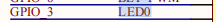


    
配置步骤如下：

    1. 使能GPIO1时钟

        打开IMX6ULL参考手册可查


        GPIO1 的时钟由 CCM_CCGR1 的 bit27 和 bit26 这两个位控制


        


        | 位设置 | 时钟控制                             |
        | --- | -------------------------------- |
        | 00  | 所有模式下都关闭外设时钟                     |
        | 01  | 只有在运行模式下打开外设时钟，等待模式和停止模式下均关闭外设时钟 |
        | 10  | 未使用（保留）                          |
        | 11  | 除了停止模式，其他外设模式下时钟都打开              |

    2. 设置GPIO1_IO03的复用功能

        找到复用寄存器 IOMUXC_SW_MUX_CTL_PAD_GPIO1_IO03，其地址为 0x020E0068，根据配置，需要写入地址为0x65，也可以使用位于的方式，将第3位和第0位置1


        复用为GPIO功能，即ALT5
        


        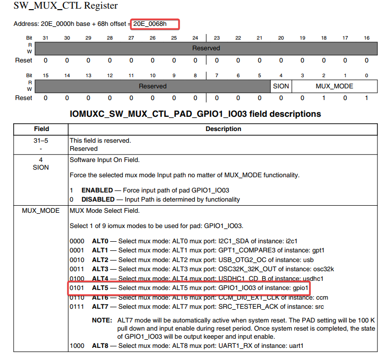

    3. 配置GPIO1_IO03

        找到 GPIO1_IO03的配置寄存器 IOMUXC_SW_PAD_CTL_PAD_GPIO1_IO03 ，查看地址为 0X020E02F4，根据所需要的配置写入数值


        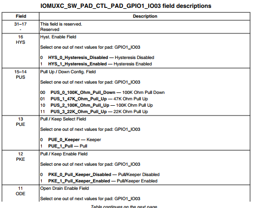


        bit 31 - 17 Reserved 保留位，可写 0
        bit 16 迟滞比较器，为0时禁止，为1时使能 （使能施密特触发器）
        bit 15:14 设置上下拉电阻
        00  100K下拉
        01   47K上拉
        10   100K上拉
        11   22K上拉
        bit 13 为0保持保持器，为1使用上下拉  
        bit 12  使能/禁止 上下拉/状态 保持器 ，0-禁止，1-使能
        bit 11  禁止/使能 开路输出，0-禁止，1-使能
        


        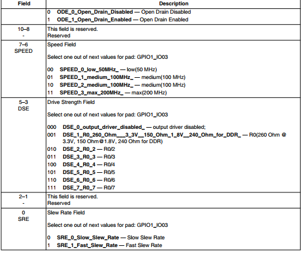


        bit 10-8 Reserve，保留位
        bit 7-6 IO速度
        bit 5-3 驱动能力设置
        bit 2-1 保留位
        bit 1 压摆率，0-低，1-高，—-电平跳变时间，过EMC使用低压摆率，波形缓和


        下面是GPIO1_IO03的配置，使用程序员计算器计算得出 10B0 H
        


        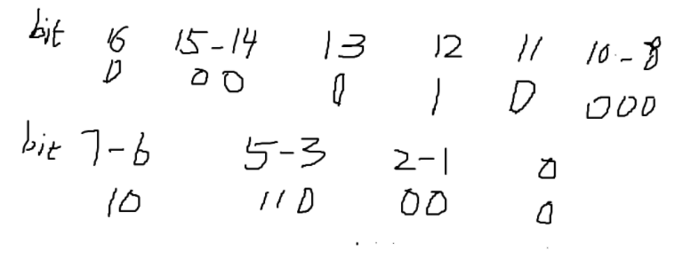

    4. 设置 GPIO

        将 GPIO1_GDIR 的 bit3 设置为 1

    5. 控制 GPIO 的输出电平

        将 GPIO1_DR 寄存器的 bit3 写入0，即控制 GPIO1_IO03 输出低电平


        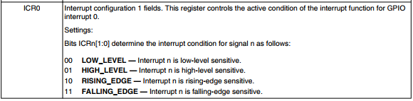


## 编写汇编代码

- 按照上面的解析进行汇编代码的编写，可以借助AI，不一定要全懂，要了解是怎么个过程

    ```assembly
    /*****
    time: 2025/11/26
    athuor: zeller
    copy by: 正点原子
    *****/
    
    .global _start /*全局标号*/
    
    /*
    * 描述: _start函数，程序从此函数开始执行此函数完成时钟使能
    *       GPIO初始化。最终控制GPIO输出低电平来点亮LED灯
    */
    _start :
    /*使能所有时钟 */
    /* 根据参考手册置1则全部打开， */
    ldr r0, =0x020C4068  /* 寄存器CCGR0 */
    ldr r1, =0xFFFFFFFF
    str r1, [r0]
    
    ldr r0, =0x020C606C /* 寄存器 CCGR1 */
    str r1, [r0]
    
    ldr r0, =0x020C4070 /* 寄存器 CCGR2 */
    str r1, [r0]
    
    ldr r0, =0x020C4074 /* 寄存器 CCGR3 */
    str r1, [r0]
    
    ldr r0, =0x020C4078 /* 寄存器 CCGR4 */
    str r1, [r0]
    
    ldr r0, =0x020C407C /* 寄存器 CCGR5 */
    str r1, [r0]
    
    ldr r0, =0x020C4080 /* 寄存器 CCGR6 */
    str r1, [r0]
    
    /* 设置GPIO1_IO03 复用为GPIO1_IO03 */
    ldr r0, =0x020E0068 /* 写入地址，实际为 IO的复用 */
    ldr r1, =0x5 /* 将寄存器 SW_MUX_CTL_PAD_GPIO1_IO03 写入对应GPIO位。对应为 101 B */
    str r1, [r0]
    
    /* 3、配置 GPIO1_IO03 的 IO 属性 
     *bit 16:0 HYS 关闭
     *bit [15:14]: 00 默认下拉
     *bit [13]: 0 kepper 功能
     *bit [12]: 1 pull/keeper 使能
     *bit [11]: 0 关闭开路输出
     *bit [7:6]: 10 速度 100Mhz
     *bit [5:3]: 110 R0/6 驱动能力
     *bit [0]: 0 低转换率
     */
    
    ldr r0, =0x020E02F4   /* SW_PAD_CTL_PAD_GPIO1_IO03_BASE*/
    ldr r1, =0x10B0       /* 写入为 10B0 ， 用程序员计算器算出 */
    str r1, [r0]
    
    /* 4 设置GPIO1_IO03 为输出 */
    ldr r0, =0x0209C004 /* 寄存器 GPIO1_GDIR */
    ldr r1, =0x0000008
    str r1, [r0]/*  */
    
    /* 5 打开LED0
     * 设置GPIO1_IO03输出低电平
     */
    ldr r0, =0x0209C000 /* 寄存器 GPIO1_DR */
    ldr r1, =0
    str r1, [r0]
    
    /*
     * 描述： loop 死循环
     */
     loop :
        b loop
    ```


## 编译汇编代码

- 对编写的代码进行编译，在 1_leds 下进行编译 `.o`  文件

    ```shell
    arm-linux-gnueabihf-gcc -g -c led.s -o led.o
    ```


    编译结果如下，有错误需要及时修正
    


    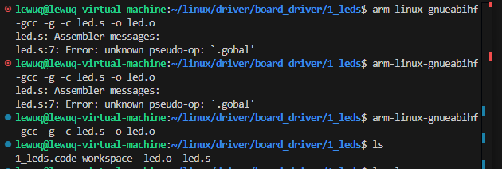

- 编译可执行文件 `.elf`

    ```shell
    arm-linux-gnueabihf-ld -Ttext 0x87800000 led.o -o led.elf
    ```


    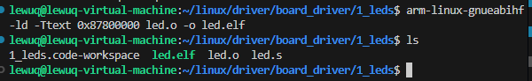

- 编译成 `.bin` 文件，让板子能识别并可执行

    ```shell
    arm-linux-gnueabihf-objcopy -O binary -S -g led.elf led.bin
    ```


    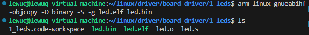

- 反汇编

    ```shell
    arm-linux-gnueabihf-objdump -D led.elf > led.dis
    ```


    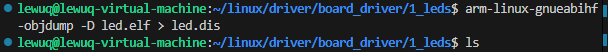


    反汇编文件


    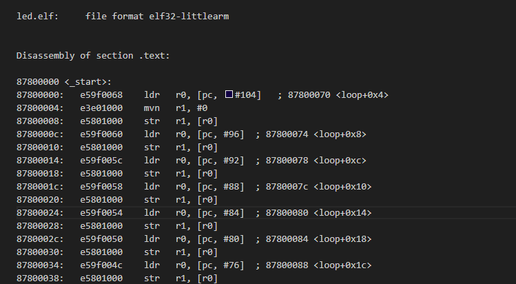


    ```shell
    rm -rf led.bin led.elf led.o led.dis
    ```


## 使用 Makefile 编译文件


```makefile
led.bin:
	arm-linux-gnueabihf-gcc -g -c led.s -o led.o
	arm-linux-gnueabihf-ld -Ttext 0x87800000 led.o -o led.elf
	arm-linux-gnueabihf-objcopy -O binary -S -g led.elf led.bin
	arm-linux-gnueabihf-objdump -D led.elf > led.dis

clean:
	rm -rf *.o led.bin led.elf led.dis
```


## 从 SD 卡启动

1. 从正点原子网盘中将烧录工具 imxdownload 装入当前文件夹（从MobaXterm 上拖过去即可 ）
2. 修改权限为可读可写 `chmod 777 imxdownload`

    记得查看是否修改成功


    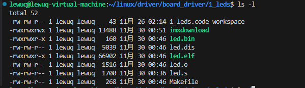

3. 确定烧写的SD卡

    `ls /dev/sd*`

    - 多出来的后面就是我们要烧写地方，应该烧录到sdb上

        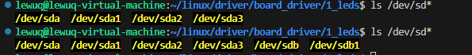

        - `sdb`：代表整个 SD 卡设备（块设备）。
        - `sdb1`：代表 SD 卡上的第一个分区（通常是 FAT32 或 ext4 分区）
        - 应该从整一个SD卡启动
- 烧写

    ```makefile
    #格式
    ./imxdownload <.bin file> <SD Card>
    
    #烧写
    ./imxdownload led.bin /dev/sdb
    ```


    如果下载速度很快，则是正常的，然后还会生成一个 load.imx 的文件


    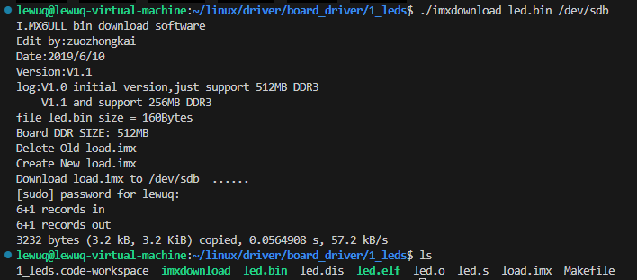

- 将拨码开关波动到 100 000 10 （在上为1）
- 效果如下，红色 LED，即CS0被点亮，和上文的 RED 一致

    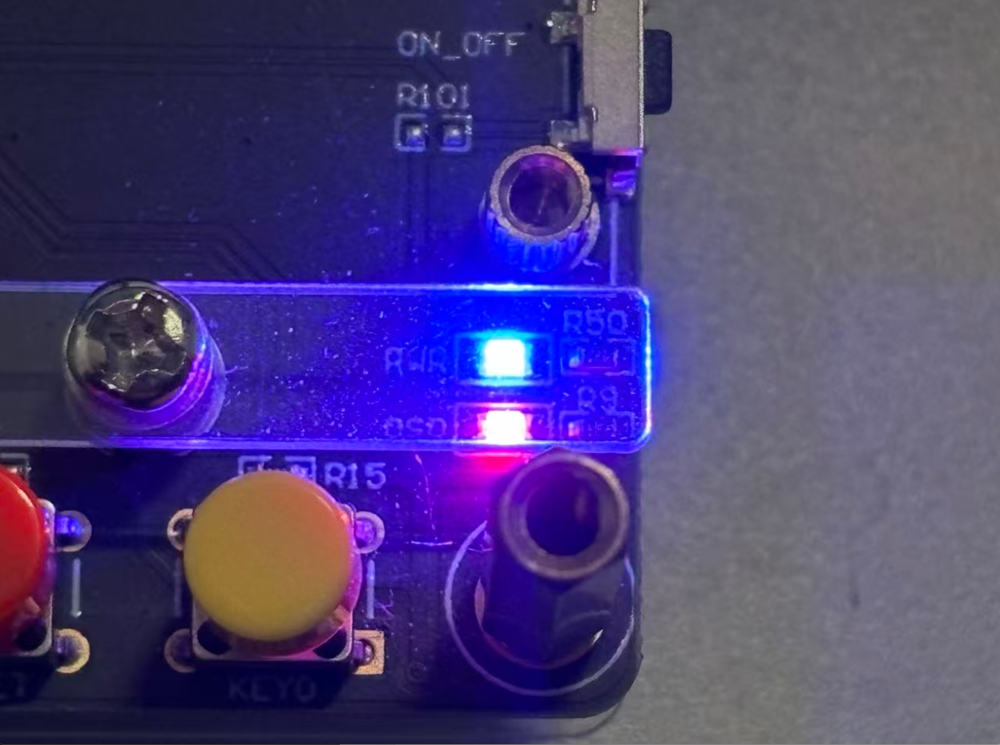

