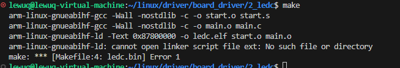
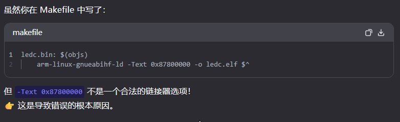
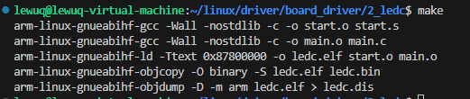

使用C语言点灯，主要为编写启动汇编文件和main主函数文件


## 汇编启动文件 start.s


```assembly
.global _start

_start:
/*
 *_start函数，设置C运行环境
 */
	
	/* 进入SVC模式 */
	mrs r0, cpsr
	bic r0, r0, #0x1f  /* 将 r0 的低 5 为清零*/
	orr r0, r0, #0x13  /* r0 或上 0x13,表示使用 SVC 模式*/
	msr cpsr, r0       /* 将 r0 的数据写入到 cpsr_c 中*/
	
	ldr sp, =0x80200000  /* 设置栈指针  */
	b main               /* 跳转到 main 函数 */
```


## main.c 和 main.h 文件

- 在实现时需要安装插件到 C/C++ 到远程主机上（在 VS Code 上安装即可，还有 global GNU），不然无法实现跳转
<details>
<summary>main.h</summary>

```c
使用C语言点灯，主要为编写启动汇编文件和main主函数文件

- 汇编启动文件 start.s
    
    ```nasm
    .global _start
    
    _start:
    /*
     *_start函数，设置C运行环境
     */
    	
    	/* 进入SVC模式 */
    	mrs r0, cpsr
    	bic r0, r0, #0x1f  /* 将 r0 的低 5 为清零*/
    	orr r0, r0, #0x13  /* r0 或上 0x13,表示使用 SVC 模式*/
    	msr cpsr, r0       /* 将 r0 的数据写入到 cpsr_c 中*/
    	
    	ldr sp, =0x80200000  /* 设置栈指针  */
    	b main               /* 跳转到 main 函数 */
    ```
    
- main.c 和 main.h 文件
    - 在实现时需要安装插件到 C/C++ 到远程主机上（在 VS Code 上安装即可，还有 global GNU），不然无法实现跳转
    - main.h
        
        ```c
        #ifndef __MAIN_H
        #define __MAIN_H
        
        /* 
        * CCM 相关寄存器地址
        */
        #define CCM_CCGR0 *((volatile unsigned int *)0X020C4068)
        #define CCM_CCGR1 *((volatile unsigned int *)0X020C406C)
        #define CCM_CCGR2 *((volatile unsigned int *)0X020C4070)
        #define CCM_CCGR3 *((volatile unsigned int *)0X020C4074)
        #define CCM_CCGR4 *((volatile unsigned int *)0X020C4078)
        #define CCM_CCGR5 *((volatile unsigned int *)0X020C407C)
        #define CCM_CCGR6 *((volatile unsigned int *)0X020C4080)
         /* 
        * IOMUX 相关寄存器地址
        */
        #define SW_MUX_GPIO1_IO03 *((volatile unsigned int *)0X020E0068)
        #define SW_PAD_GPIO1_IO03 *((volatile unsigned int *)0X020E02F4)
        
         /* 
          * GPIO1 相关寄存器地址
         */
        #define GPIO1_DR *((volatile unsigned int *)0X0209C000)
        #define GPIO1_GDIR *((volatile unsigned int *)0X0209C004)
        #define GPIO1_PSR *((volatile unsigned int *)0X0209C008)
        #define GPIO1_ICR1 *((volatile unsigned int *)0X0209C00C)
        #define GPIO1_ICR2 *((volatile unsigned int *)0X0209C010)
        #define GPIO1_IMR *((volatile unsigned int *)0X0209C014)
        #define GPIO1_ISR *((volatile unsigned int *)0X0209C018)
        #define GPIO1_EDGE_SEL *((volatile unsigned int *)0X0209C01C)
        
        #endif
        ```
        
    - main.c
```


</details>

<details>
<summary>main.c</summary>

```c
#include "main.h"

int main(void)
{
    clk_enable();
    led_init();

    while(1){
        led_off();
        delay(500);

        led_on();
        delay(500);
    }
}

/*
 * 点灯步骤
 * 1. 使能GPIO时钟
 * 2. 设置GPIO复用功能
 * 3. 配置GPIO的电气属性
 * 4. 设置GPIO的输出模式
 * 5. 将 GPIO 对应的灯置 高/低 电平
 */

void clk_enablev(void){

    CCM_CCGR0 = 0xffffffff;
    CCM_CCGR1 = 0xffffffff;
    CCM_CCGR2 = 0xffffffff;
    CCM_CCGR0 = 0xffffffff;
    CCM_CCGR0 = 0xffffffff;
    CCM_CCGR0 = 0xffffffff;
    CCM_CCGR0 = 0xffffffff;
    CCM_CCGR0 = 0xffffffff;
}

void led_init(void){

    SW_MUX_GPIO1_IO03 = 0x5;     /* 设置 GPIO 复用功能 */
    SW_PAD_GPIO1_IO03 = 0x10B0;  /* 配置 GPIO 的电气属性 */
    GPIO1_GDIR = 0x0000008;      /* 设置 GPIO 的输出模式 */
    GPIO1_DR = 0x0;              /* 默认置低电平 */
    
}

void led_on(void)
{
    /**
     * 将 GPIO1_DR 的 bit 3 清零（置为 0），其他位保持不变。
     * 
     * 步骤：
     *   1. (1 << 3)      → 生成一个只有 bit 3 为 1 的掩码（二进制: ...00001000）
     *   2. ~(1 << 3)     → 对掩码取反，得到 bit 3 为 0、其余位为 1 的值（...11110111）
     *   3. GPIO1_DR &= ... → 按位与操作：bit 3 被强制清零，其他位不变。
    */
    GPIO1_DR &= ~(1 << 3);
}

void led_off(void){
    /**
     * 将 GPIO1_DR 的 bit3 置 1
     * 按位或操作：bit 3 被保留 1 ,其他位保持不变
     */
    GPIO1_DR |=( 1<< 3);

}

void delay_short(volatile unsigned int n){
    while(n--){
    }
}

void delay(volatile unsigned int n){
    while(n--){
        delay_short(0x7ff);
    }
}
```


</details>


## 编写 Makefile 文件


```makefile
objs := start.o main.o

ledc.bin:$(objs)
	arm-linux-gnueabihf-ld -Ttext 0x87800000 -o ledc.elf $^
	arm-linux-gnueabihf-objcopy -O binary -S ledc.elf $@
	arm-linux-gnueabihf-objdump -D -m arm ledc.elf > ledc.dis

%.o: %.s
	arm-linux-gnueabihf-gcc -Wall -nostdlib -c -o $@ $<

%.o: %.S
	arm-linux-gnueabihf-gcc -Wall -nostdlib -c -o $@ $<

%.o: %.c
	arm-linux-gnueabihf-gcc -Wall -nostdlib -c -o $@ $<

clean:
	rm -rf *.o ledc.bin ledc.elf ledc.dis
```


## 编译和下载

- make

    


    出现错误


    原因：原文中 -Ttext 写成了 -Text


    


    然后再编译


    

- 下载
    - 从 1_leds 中拷贝 imxdowload 到当前文件夹下
        1. 在  2_ledc 下使用相对路径进行拷贝

            ```shell
            cp ../1_leds/imxdownload .
            ```

        2. 在 1_ledc 下使用相对路径进行拷贝

            ```shell
            cp imxdownload ../2_ledc/
            ```

- 烧录
    - 烧录前查看分区是否正确，正确后再执行烧录

        

    - 烧录
    同样的，要烧录到整个 SD 分区下，也就是 /dev/sdb

        ```shell
        ./imxdownload ledc.bin /dev/sdb
        ```


## 效果


红色 LED0 间隔 500ms 闪烁


## 添加链接文件

- 将指定起始地址的 -Ttext 0x87800000 修改为链接文件，以后则不必再手写起始地址

    imx6ul.lds


    ```shell
    SECTIONS{
        . = 0X87800000;
        .text :
        {
        start.o 
        main.o 
        *(.text)
        }
        .rodata ALIGN(4) : {*(.rodata*)} 
        .data ALIGN(4) : { *(.data) } 
        __bss_start = .; 
        .bss ALIGN(4) : { *(.bss) *(COMMON) } 
        __bss_end = .;
    }
    ```

- 修改 Makefile

    将 arm-linux-gnueabihf-ld -Ttext 0x87800000 -o ledc.elf $^ 替换为 arm-linux-gnueabihf-ld -Timx6ul.lds -o ledc.elf $^ 即可


    下载后效果一致

