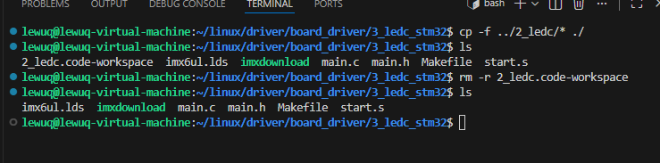
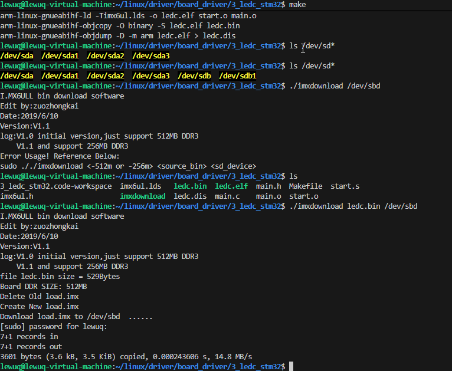

## 复制启动文件

- 从 2_ledc 中复制启动文件内容到当前文件下

    ```shell
    # 在 3_ledc_stm32 文件夹操作
    cp -r ../2_ledc/* ./
    
    # 在 上一级目录下操作
    cp -r 2_ledc/* 3_ledc/
    cp -r 2_ledc/. 3_ledc/
    ```


    

- 从 2_ledc 中移动其启动文件内容到当前文件下（使用这一命令源文件夹的内容会消失）

    ```shell
    # 在 3_ledc_stm32 文件夹操作
    mv ../2_ledc/* ./
    
    # 在 上一级目录下操作
    mv 2_ledc/* 3_ledc/
    ```


## 创建 imx6ul.h 和重写 main.c

- imx6ul.h

    此部分用于存放结构体头文件，由于这部分内容过多，直接从 MobaXterm 上传到指定文件夹即可，不必重复造轮子

- 重写 main.c

    访问结构体成员的方式及区别


    | 方式        | 含义          | 要求                      | 含义                                                  |
    | --------- | ----------- | ----------------------- | --------------------------------------------------- |
    | `A.B`     | 结构体变量直接访问成员 | `A` 是一个结构体类型的变量（对象）不是指针 | 直接从变量 `A` 中取出成员`B`                                  |
    | **`A→B`** | 结构体指针访问成员   | `A` 是一个指向结构体的指针         | 先对指针 `A` 解引用（`A`），再访问其成员 `B`。`A->B` 是 `(*A).B` 的简写。 |

    - 代码解释

        A.B


        ```shell
        #include <stdio.h>
        
        struct Point {
            int x;
            int y;
        };
        
        int main() {
            struct Point p;      // p 是结构体变量（不是指针）
            p.x = 10;            // ✅ 使用 . 访问
            p.y = 20;
        
            printf("x = %d, y = %d\n", p.x, p.y);
            return 0;
        }
        ```


         A→B


        ```shell
        #include <stdio.h>
        
        struct Point {
            int x;
            int y;
        };
        
        int main() {
            struct Point p = {10, 20};
            struct Point *ptr = &p;   // ptr 是指向结构体的指针
        
            printf("x = %d\n", ptr->x);   // ✅ 等价于 (*ptr).x
            printf("y = %d\n", (*ptr).y); // ✅ 也可以这样写，但不常用
        
            ptr->x = 30;  // 修改 p.x 的值
        
            return 0;
        }
        ```

- main.c

    ```shell
    #include "main.h"
    #include "imx6ul.h"
    
    int main(void)
    {
        clk_enable();
        led_init();
    
        while(1){
            led_off();
            delay(500);
    
            led_on();
            delay(500);
        }
        return 0;
    }
    
    /*
     * 点灯步骤
     * 1. 使能GPIO时钟
     * 2. 设置GPIO复用功能
     * 3. 配置GPIO的电气属性
     * 4. 设置GPIO的输出模式
     * 5. 将 GPIO 对应的灯置 高/低 电平
     */
    
    void clk_enable(void){
    
        CCM->CCGR0 = 0xffffffff;
        CCM->CCGR1 = 0xffffffff;
        CCM->CCGR2 = 0xffffffff;
        CCM->CCGR0 = 0xffffffff;
        CCM->CCGR0 = 0xffffffff;
        CCM->CCGR0 = 0xffffffff;
        CCM->CCGR0 = 0xffffffff;
        CCM->CCGR0 = 0xffffffff;
    }
    
    void led_init(void){
    
        IOMUX_SW_MUX->GPIO1_IO03 = 0x5;     /* 设置 GPIO 复用功能 */
        IOMUX_SW_PAD->GPIO1_IO03 = 0x10B0;  /* 配置 GPIO 的电气属性 */
        GPIO1->GDIR = 0x0000008;      /* 设置 GPIO 的输出模式 */
        GPIO1->DR = 0x0;              /* 默认置低电平 */
        
    }
    
    void led_on(void)
    {
        /**
         * 将 GPIO1_DR 的 bit 3 清零（置为 0），其他位保持不变。
         * 
         * 步骤：
         *   1. (1 << 3)      → 生成一个只有 bit 3 为 1 的掩码（二进制: ...00001000）
         *   2. ~(1 << 3)     → 对掩码取反，得到 bit 3 为 0、其余位为 1 的值（...11110111）
         *   3. GPIO1_DR &= ... → 按位与操作：bit 3 被强制清零，其他位不变。
        */
        GPIO1->DR &= ~(1 << 3);
    }
    
    void led_off(void){
        /**
         * 将 GPIO1_DR 的 bit3 置 1
         * 按位或操作：bit 3 被保留 1 ,其他位保持不变
         */
        GPIO1->DR |=( 1<< 3);
    
    }
    
    void delay_short(volatile unsigned int n){
        while(n--){
        }
    }
    
    void delay(volatile unsigned int n){
        while(n--){
            delay_short(0x7ff);
        }
    }
    ```


## 编译下载

- make编译

    Makefile内容和链接文件imx6ul.lsh内容无需改变

- 下载

    使用下载工具进行下载


    


## 效果如下


