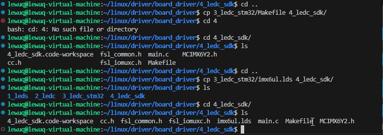
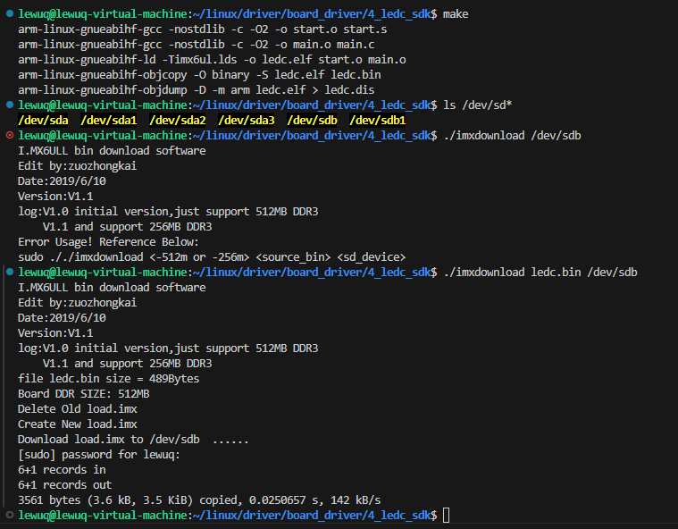
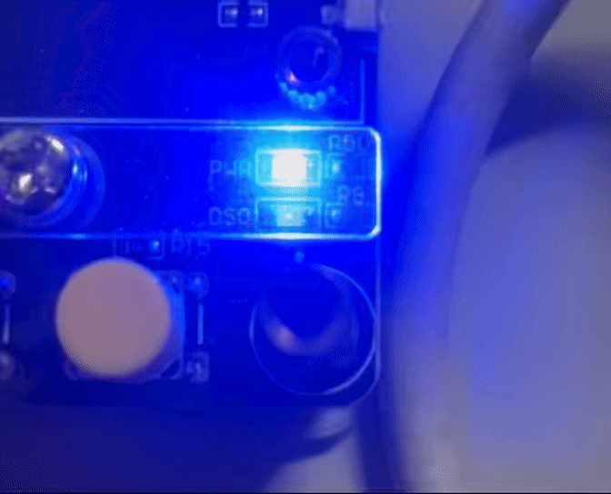

官方 SDK 下载链接：[https://www.nxp.com.cn/webapp/sps/download/license.jsp?colCode=SDK2.2_iMX6ULL_WIN&appType=file1&DOWNLOAD_ID=null](https://www.nxp.com.cn/webapp/sps/download/license.jsp?colCode=SDK2.2_iMX6ULL_WIN&appType=file1&DOWNLOAD_ID=null)


或者从正点原子的网盘下载


使用 官方 SDK 可以类比使用 STM32 的 HAL 库使用，基于裸机开发的情况下


## SDK移植


从上面的链接下载或者从正点原子的网盘移植，使用 MobaXterm 的FTP将文件上传到指定文件文件夹下


我上传了


```shell
/projects
|
|--cc.h
|--fsl_common.h
|--fsl_iomuxc.h
|--MCIMX6Y2.h
```


## 编写主函数


主要是使用库函数的方式


```c
#include "fsl_common.h"
#include "fsl_iomuxc.h"
#include "MCIMX6Y2.h"

int main(void){

}

/*
 * 点灯步骤
 * 1. 使能GPIO时钟
 * 2. 设置GPIO复用功能
 * 3. 配置GPIO的电气属性
 * 4. 设置GPIO的输出模式
 * 5. 将 GPIO 对应的灯置 高/低 电平
 */

void clk_enable(void){

    CCM->CCGR0 = 0xffffffff;
    CCM->CCGR1 = 0xffffffff;
    CCM->CCGR2 = 0xffffffff;
    CCM->CCGR0 = 0xffffffff;
    CCM->CCGR0 = 0xffffffff;
    CCM->CCGR0 = 0xffffffff;
    CCM->CCGR0 = 0xffffffff;
    CCM->CCGR0 = 0xffffffff;
}

void led_init(void){

    /* 初始化 IO 复用 */
    IOMUXC_SetPinMux(IOMUXC_GPIO1_IO03_GPIO1_IO03, 0);

    /* 配置 IO 的电气属性 */
    IOMUXC_SetPinConfig(IOMUXC_GPIO1_IO03_GPIO1_IO03, 0x10B0);

    /* 配置 IO 的输出模式 */
    //GPIO1->GDIR = 0x0000008; 
		GPIO1->GDIR |= (1 << 0x03);
		
    /* 配置 IO 输出电平 */
    //GPIO1->DR = 0x0;
		GPIO1->DR &= ~( 1 << 3);
}


void led_on(void)
{
    /**
     * 将 GPIO1_DR 的 bit 3 清零（置为 0），其他位保持不变。
     * 
     * 步骤：
     *   1. (1 << 3)      → 生成一个只有 bit 3 为 1 的掩码（二进制: ...00001000）
     *   2. ~(1 << 3)     → 对掩码取反，得到 bit 3 为 0、其余位为 1 的值（...11110111）
     *   3. GPIO1_DR &= ... → 按位与操作：bit 3 被强制清零，其他位不变。
    */
    GPIO1->DR &= ~(1 << 3);
}

void led_off(void){
    /**
     * 将 GPIO1_DR 的 bit3 置 1
     * 按位或操作：bit 3 被保留 1 ,其他位保持不变
     */
    GPIO1->DR |=( 1<< 3);

}

int main(void)
{
    clk_enable();
    led_init();

    while(1){
        led_off();
        delay(500);

        led_on();
        delay(500);
    }
    return 0;
}
```


## 编写Makefile


**文件夹 A 中的文件 1** 复制到**文件夹 B** 的命令    `cp A/文件1 B/`  （在父文文件夹下进行两个子文件夹内容的操作）





修改 Makefile 的内容


```makefile
CROSS_COMPILE ?= arm-linux-gnueabihf-
NAME		  ?= ledc

CC            := $(CROSS_COMPILE)gcc
LD            := $(CROSS_COMPILE)ld
OBJCOPY       := $(CROSS_COMPILE)objcopy
OBJDUMP       := $(CROSS_COMPILE)objdump

OBJS       := start.o main.o

$(NAME).bin:$(OBJS)
	$(LD) -Timx6ul.lds -o $(NAME).elf $^
	$(OBJCOPY) -O binary -S $(NAME).elf $@
	$(OBJDUMP) -D -m arm $(NAME).elf > $(NAME).dis


%.o: %.s
	arm-linux-gnueabihf-gcc -nostdlib -c -O2 -o $@ $<

%.o: %.S
	arm-linux-gnueabihf-gcc -nostdlib -c -O2 -o $@ $<

%.o: %.c
	arm-linux-gnueabihf-gcc -nostdlib -c -O2 -o $@ $<

clean:
	rm -rf *.o $(NAME).bin $(NAME).elf $(NAME).dis
```


下面逐部分解释其作用：


### 1. **变量定义（带默认值）**


```makefile
CROSS_COMPILE ?= arm-linux-gnueabihf-
NAME		  ?= ledc
```

- `?=` 表示：**仅当该变量尚未被定义时**才赋予默认值。
    - `CROSS_COMPILE`：指定交叉编译工具链前缀。默认使用 `arm-linux-gnueabihf-`（适用于 ARM Cortex-A 系列，硬浮点 ABI）。
    - `NAME`：指定最终输出文件的主名，默认为 `ledc`。

---


### 2. **工具链命令定义**


```makefile
CC            := $(CROSS_COMPILE)gcc
LD            := $(CROSS_COMPILE)ld
OBJCOPY       := $(CROSS_COMPILE)objcopy
OBJDUMP       := $(CROSS_COMPILE)objdump
```

- 使用 `:=`（立即展开赋值），将交叉编译工具拼接完整命令：
    - `CC`：C 编译器（实际是 `arm-linux-gnueabihf-gcc`）
    - `LD`：链接器
    - `OBJCOPY`：用于将 ELF 文件转为二进制（如 `.bin`）
    - `OBJDUMP`：反汇编工具，用于生成汇编代码清单

---


### 3. **目标对象文件列表**


```makefile
OBJS := start.o main.o
```

- 指明本项目需要编译生成的 `.o` 文件：`start.o`（通常是汇编启动代码）和 `main.o`（C 语言主程序）。

---


### 4. **主目标：生成** **`.bin`** **文件**


```makefile
$(NAME).bin: $(OBJS)
	$(LD) -Timx6ul.lds -o $(NAME).elf $^
	$(OBJCOPY) -O binary -S $(NAME).elf $@
	$(OBJDUMP) -D -m arm $(NAME).elf > $(NAME).dis
```


这个规则表示：**要生成** **`ledc.bin`****，必须先有** **`start.o`** **和** **`main.o`**。


执行步骤：

1. **链接**：

    ```bash
    arm-linux-gnueabihf-ld -Timx6ul.lds -o ledc.elf start.o main.o
    ```

    - `T imx6ul.lds`：使用名为 `imx6ul.lds` 的链接脚本（定义内存布局、段分配等，专为 NXP i.MX6UL 芯片设计）。
    - 生成 `ledc.elf` 可执行文件（ELF 格式）。
2. **转二进制**：

    ```bash
    arm-linux-gnueabihf-objcopy -O binary -S ledc.elf ledc.bin
    ```

    - `O binary`：输出为纯二进制（无 ELF 头），适合烧写到 Flash 或通过 bootloader 加载。
    - `S`：移除调试符号和注释，减小体积。
    - `$@` 是 Makefile 自动变量，代表当前目标（即 `ledc.bin`）。
3. **生成反汇编文件**：

    ```bash
    arm-linux-gnueabihf-objdump -D -m arm ledc.elf > ledc.dis
    ```

    - `D`：反汇编所有段。
    - `m arm`：指定架构为 ARM。
    - 输出到 `ledc.dis`，便于调试和查看生成的机器码。

---


### 5. **编译规则（模式匹配规则）**


```makefile
%.o: %.s
	arm-linux-gnueabihf-gcc -nostdlib -c -O2 -o $@ $<

%.o: %.S
	arm-linux-gnueabihf-gcc -nostdlib -c -O2 -o $@ $<

%.o: %.c
	arm-linux-gnueabihf-gcc -nostdlib -c -O2 -o $@ $<
```


这三条是**通用规则**，用于自动将 `.s`、`.S`、`.c` 文件编译成 `.o`：

- `%.o: %.s` → 汇编文件（小写 `.s`，不经过 C 预处理器）
- `%.o: %.S` → 汇编文件（大写 `.S`，会先经过 C 预处理器，支持 `#define`、`#include` 等）
- `%.o: %.c` → C 源文件

**编译选项说明**：

- `nostdlib`：**不链接标准 C 库**（常见于裸机程序，因为没有操作系统提供 libc）。
- `c`：只编译，不链接。
- `O2`：开启二级优化。
- `$<`：第一个依赖文件（如 `start.s`）
- `$@`：目标文件（如 `start.o`）
> 💡 虽然用了 arm-linux-gnueabihf-gcc，但因为是裸机程序（-nostdlib），其实和 arm-none-eabi-gcc 更匹配。这里可能是为了复用现有工具链。

---


### 6. **清理规则**


```makefile
clean:
	rm -rf *.o $(NAME).bin $(NAME).elf $(NAME).dis
```

- 执行 `make clean` 会删除所有中间文件和输出文件，方便重新构建。

---


###  总结

> 为 NXP i.MX6UL 等 ARM 嵌入式平台编译一个裸机（bare-metal）程序（如 LED 控制），
>
> 生成：
>
> - `ledc.bin`：可直接烧录的二进制镜像
> - `ledc.elf`：带符号的可执行文件（用于调试）
> - `ledc.dis`：反汇编代码（用于分析）
>

## 编译下载


使用 make  编译以及下载工具进行下载





效果如下




