Linux驱动三大巨头：uboot、kernel、rootfs


## BusyBox


使用其编译繁杂的根文件，其余还有yocto、ubuntu-base 根文件系统


为了适配和学习可以使用网盘中的根文件系统，先完成基础的学习后面再去折腾后两者根文件系统


1、下载并通过 MobaXterm 上传到 Ubuntu当中


在  /home/lewuq/linux/nfs 下创建 roofts 文件夹以存放根文件系统


上传路径：/home/lewuq/linux/busybox


1.1 解压


```bash
tar -vxjf busybox-1.29.0.tar.bz2
```


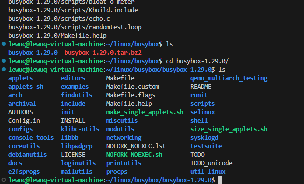


1.2 添加编译路径


打开 Makefile 文件，找到 CROSS_COMPILE 的内容，将其修改为绝对的编译路径，编译架构选择 ARCH ?= arm


```bash
CROSS_COMPILE ?= /usr/local/arm/gcc-linaro-4.9.4-2017.01-x86_64_arm-linux-gnueabihf/bin/arm-linux-gnueabihf-
ARCH ?= arm
```


usr:  Unix Software Resource 


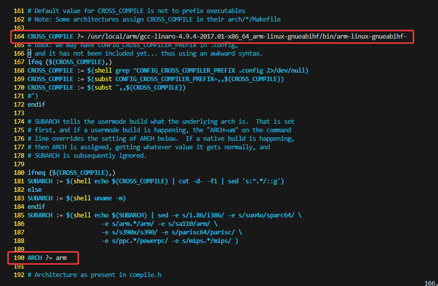


2、busybox 中文字符支持


打开 路径下的 /home/lewuq/linux/busybox/busybox-1.29.0/libbb/printable_string.c 文件


修改为如下内容


```c++
/* vi: set sw=4 ts=4: */
/*
 * Unicode support routines.
 *
 * Copyright (C) 2010 Denys Vlasenko
 *
 * Licensed under GPLv2, see file LICENSE in this source tree.
 */
#include "libbb.h"
#include "unicode.h"

const char* FAST_FUNC printable_string(uni_stat_t *stats, const char *str)
{
	char *dst;
	const char *s;

	s = str;
	while (1) {
		unsigned char c = *s;
		if (c == '\0') {
			/* 99+% of inputs do not need conversion */
			if (stats) {
				stats->byte_count = (s - str);
				stats->unicode_count = (s - str);
				stats->unicode_width = (s - str);
			}
			return str;
		}
		if (c < ' ')
			break;
		/*if (c >= 0x7f)*/
		/*	break;  */
		s++;
	}

#if ENABLE_UNICODE_SUPPORT
	dst = unicode_conv_to_printable(stats, str);
#else
	{
		char *d = dst = xstrdup(str);
		while (1) {
			unsigned char c = *d;
			if (c == '\0')
				break;
			/*if (c < ' ' || c >= 0x7f)*/
			if (c < ' ')
				*d = '?';
			d++;
		}
		if (stats) {
			stats->byte_count = (d - dst);
			stats->unicode_count = (d - dst);
			stats->unicode_width = (d - dst);
		}
	}
#endif
	return auto_string(dst);
}
```


找到 /home/lewuq/linux/busybox/busybox-1.29.0/libbb/unicode.c 文件， 搜索 static char***** FAST_FUNC unicode_conv_to_printable2 函数


```c++
// 将 *d++ = (c >= ' ' && c < 0x7f) ? c : '?'; 注释并修改为
*d++ = (c >= ' ' ) ? c : '?';

// 将 if (c < ' ' || c >= 0x7f) 注释并修改为
if (c < ' ')
```


3、配置 busybox


busybox 支持图形化配置


```makefile
#默认配置 make defconfig
make menuconfig
```


路径：Settings - > Build static binary (no shared libs ) ，即使用静态编译，不建议使用，编译文件过大


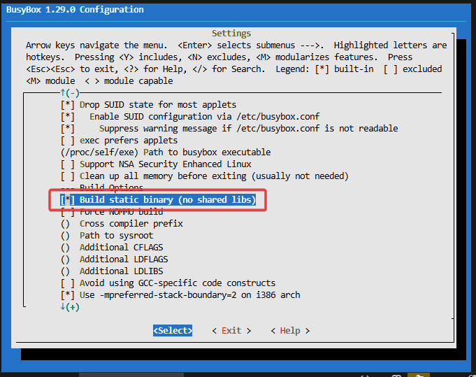


3.1 配置 editing commands


路径： Settings - > vi-style line editing commands ，按Y选中，按 / 进行搜索


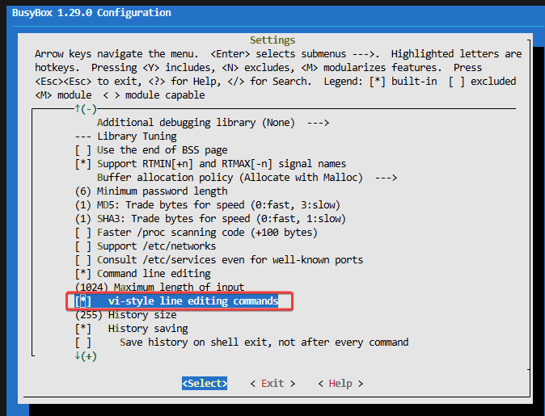


3.2 配置 Simplified moudutils


路径：Linux Moudle Utilities - > Simplified moudutils , 取消选中


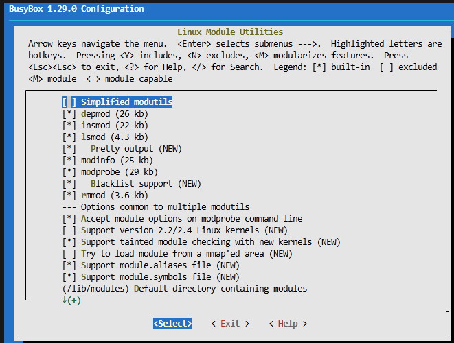


3.3  配置 mdev


路径：Linux System Utilities - > mdev (16 kb) ,以及下列方框的内容全选，默认已全选


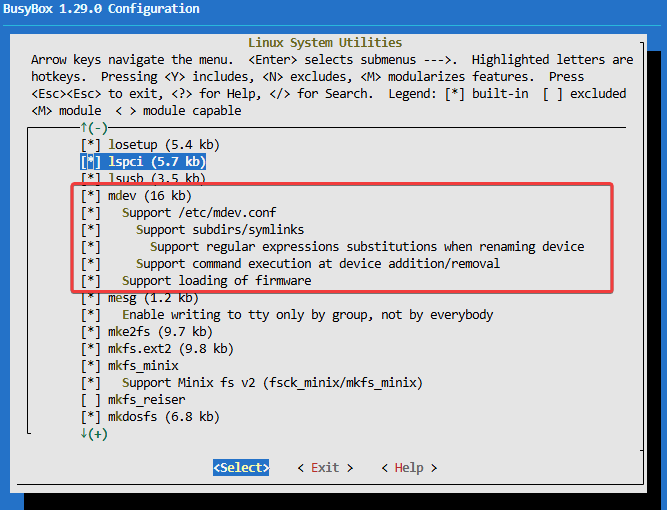


3.4 使能 busybox 的 unicode 编码


路径：Setting - > Support Unicode & Check $LC_ALL, $LC_CTYPE and $LANG environment variables


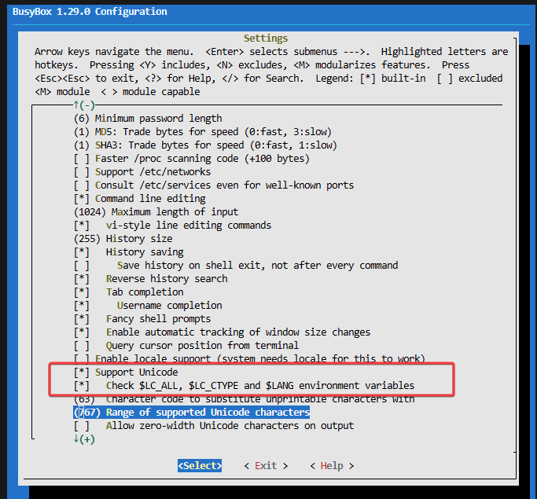


3.4 编译并安装到指定目录下


```makefile
make install CONFIG_PREFIX=/home/lewuq/linux/nfs/rootfs
```


编译大概所需时间是5分钟


编译结果如下


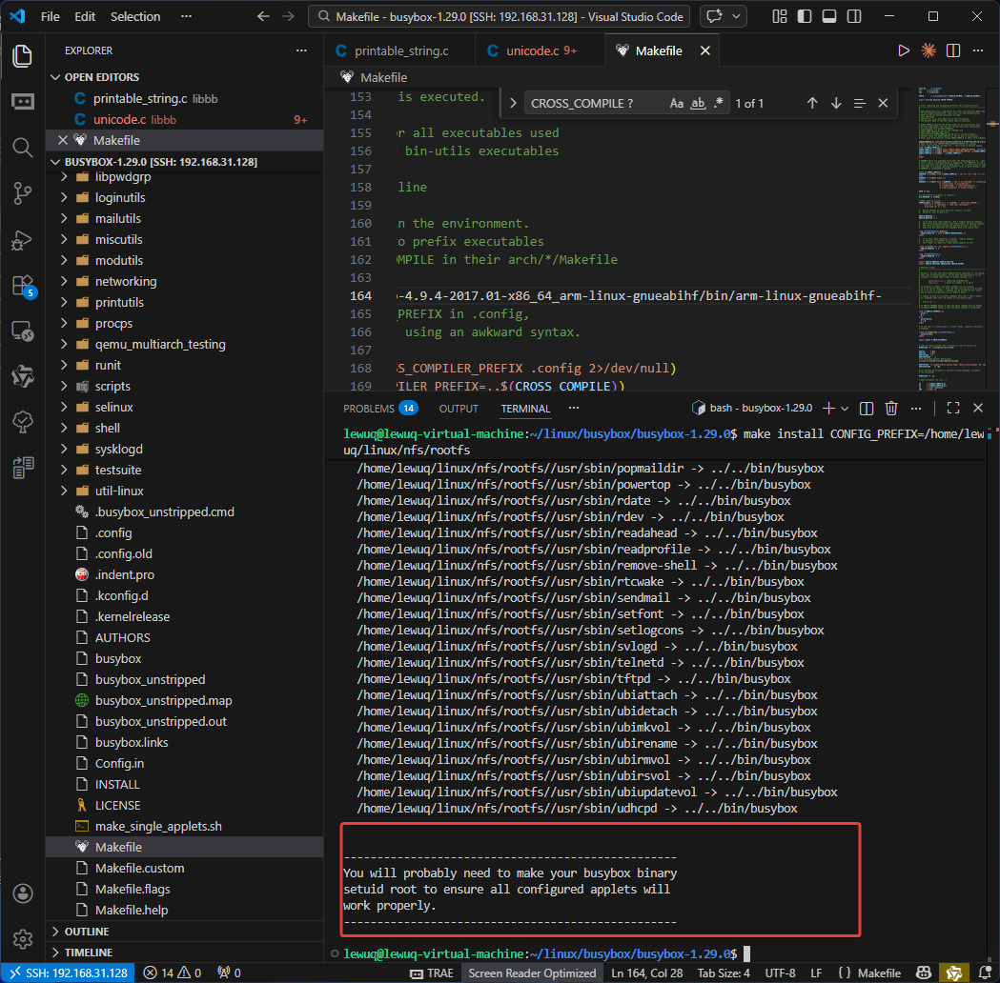


打开安装的目录进行查看


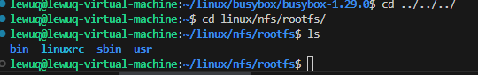


## 添加根文件所需文件


完成编译后还需添加一些文件才可以使用


### 添加 lib 库


1、在rootfs目录下创建 lib 文件


```bash
mkdir lib
```


2、打开 交叉编译器的 libc 文件夹下的 lib 进行复制


```bash
cd /usr/local/arm/gcc-linaro-4.9.4-2017.01-x86_64_arm-linux-gnueabihf/arm-linux-gnueabihf/libc/lib/
```


将此目录下所有的_so_和.a 文件都拷贝到 rootfs/lib 目录中


```bash
cp *so* *.a /home/lewuq/linux/nfs/rootfs/lib/ -d
```


进行查看无误


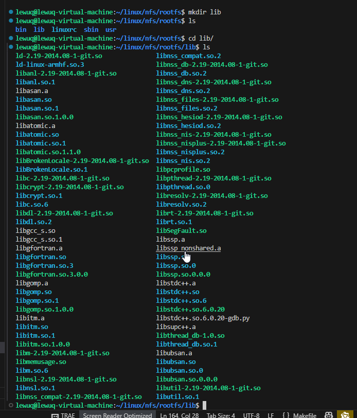


2、删除软连接文件、确保根文件系统会在执行程序中正常执行


```bash
ls ld-linux-armhf.so.3 -l
rm ld-linux-armhf.so.3
```


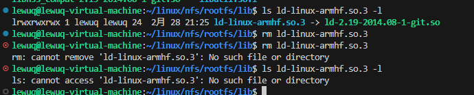


3、重新拷贝 ld-linux-armhf.so.3


```bash
cp ld-linux-armhf.so.3 /home/lewuq/linux/nfs/rootfs/lib/
```


4、打开交叉编译器的 lib 下进行复制


```bash
cd /usr/local/arm/gcc-linaro-4.9.4-2017.01-x86_64_arm-linux-gnueabihf/arm-linux-gnueabihf/lib
cp *so* *.a /home/lewuq/linux/nfs/rootfs/lib/ -d
```


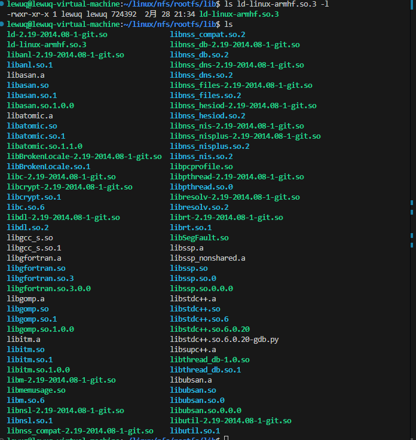


### 添加 usr/lib 库


1、在 rootfs 的 usr 文件夹下创建 lib 文件夹


```bash
cd usr
mkdir lib
```


2、复制交叉编译的 libc/usr/lib 库到 rootfs/usr/lib 下


```bash
cd  /usr/local/arm/gcc-linaro-4.9.4-2017.01-x86_64_arm-linux-gnueabihf/arm-linux-gnueabihf/libc/usr/lib
cp *so* *.a /home/lewuq/linux/nfs/rootfs/usr/lib -d
```


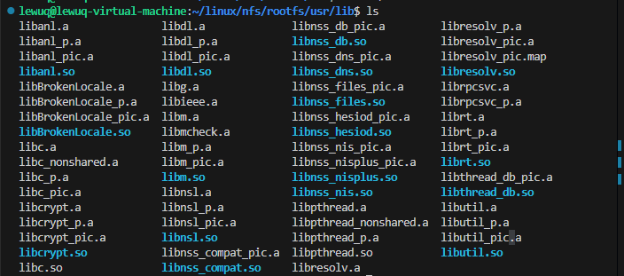


### 创建其他文件夹


在 rootfs 中创建其他文件夹。


dev、proc、mnt、sys、tmp、root 等


```bash
mkdir dev proc mnt sys tmp root
```


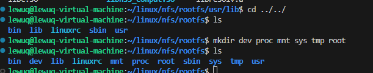


## 根文件系统初步测试


1、设置 uboot 的信息


进入开发板的 uboot 模式


```bash
setenv bootargs 'console=ttymxc0,115200 root=/dev/nfs nfsroot=192.168.31.128:/home/lewuq/linux/nfs/rootfs,v3,proto=tcp rw ip=192.168.31.50:192.168.31.128:192.168.31.1:255.255.255.0::eth0:off'
saveenv

setenv bootargs 'console=ttymxc0,115200 root=/dev/nfs nfsroot=192.168.24.119:/home/lewuq/linux/nfs/rootfs,v3,proto=tcp rw ip=192.168.24.55:192.168.24.119:192.168.24.1:255.255.255.0::eth0:off'
saveenv
```


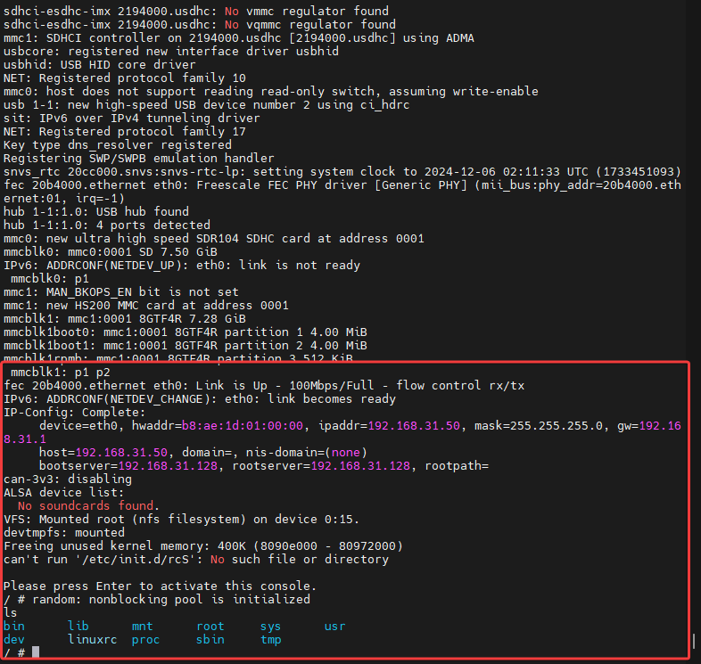


因为soudcards found 的驱动没有，所以可能会在这里卡一下，但是没有关系


## 完善根文件系统


在 /home/lewuq/linux/nfs/rootfs 操作，通过 MobaXterm 窗口在开发板上操作 rootfs 根文件


### 创建 /etc/init.d/rcS 文件夹


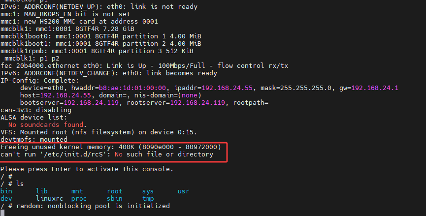


1、创建文件


```bash
vi /etc/init.d/rcS
```


2、rcS 内容


```bash
#!/bin/sh

PATH=/sbin:/bin:/usr/sbin:/usr/bin:$PATH
LD_LIBRARY_PATH=$LD_LIBRARY_PATH:/lib:/usr/lib
export PATH LD_LIBARY_PATH

mount -a
mkdir /dev/pts
mount -t devpts devpts /dev/pts

echo /sbin/mdev > /proc/sys/kernel/hotplug

mdev -s
```


3、赋予可执行权限


```bash
chmod 777 rcS
```


4、重启内核，发现无法找到 /etc/fstab 文件


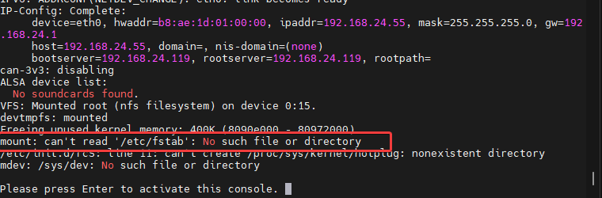


### 创建 /etc/fstab 文件


1、创建文件


```bash
vi /etc/fstab
```


2、输入内容


```bash
#<file system> <mount point> <type> <options> <dump> <pass>
proc    /proc   proc    defaults        0       0
tmpfs   /tmp    tmpfs   defaults        0       0
sysfs   /sys    sysfs   defaults        0       0
```


重启内核，发现已无任何错误


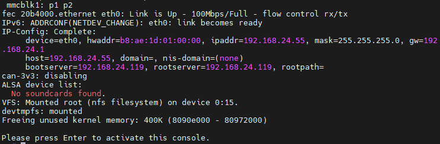


### 创建 /etc/inttab 文件


nittab 的详细内容可以参考 busybox 下的文件 examples/inittab。


1、创建文件


```bash
vi /etc/initab
```


2、文件内容


```bash
#etc/inittab
::sysinit:/etc/init.d/rcS
console::askfirst:-/bin/sh
::restart:/sbin/int
::ctrlaltdel:/sbin/reboot
::shutdown:/bin/umount -a -r
::shutdown:/sbin/swapoff -a
```


3、重启即可


## 根文件系统测试


### 软件运行测试

1. 软件运行测试

创建 drivers 文件夹并也创建 hello.c


hello.c 内容如下


```bash
#include <stdio.h>
#include <unistd.h>

int main(void)
{
        while(1){
                printf("hello world\r\n");
                sleep(2);
        }
        return 0;
}
```

1. 编译

```bash
arm-linux-gnueabihf-gcc hello.c -o hello
```

1. 执行

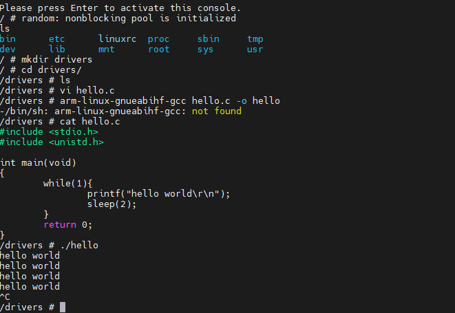

1. 后台运行

执行指令


```bash
./hello &
```


后台进程查看


```bash
ps
```


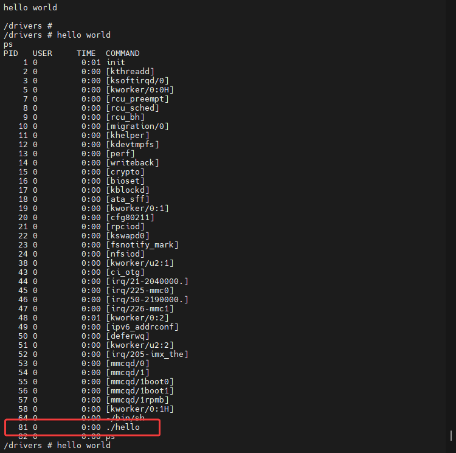


杀死进程


```bash
kill -9 81
```


### 中文字符测试

1. 创建测试文件夹

```bash
sudo vi 测试文档.txt
```

1. cat 查看文件内容

```bash
cat 测试文档.txt
```


### 开启自启动测试

1. 在  /etc/init.d/rcS 文件下自启动内容

```bash
#!/bin/sh

PATH=/sbin:/bin:/usr/sbin:/usr/bin:$PATH
LD_LIBRARY_PATH=$LD_LIBRARY_PATH:/lib:/usr/lib
export PATH LD_LIBARY_PATH

mount -a
mkdir /dev/pts
mount -t devpts devpts /dev/pts

echo /sbin/mdev > /proc/sys/kernel/hotplug

mdev -s

#开机自启动
cd /drivers
./ hello ^&
cd /
```


2. 重启观察


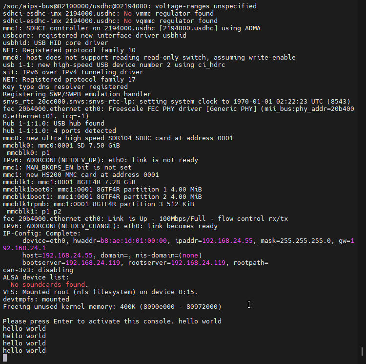


### 外网连接测试

1. ping 外网网址，发现 ping 地址不行

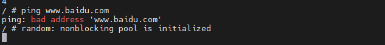


2.配置域名解析地址


2.1 新建 /etc/resolv.conf


2.2 添加解析地址，一般为所处网络的网关地址


```bash
#运营商地址
nameserver 114.114.114.114

#所处网络的网关地址
namesersever 192.168.24.1
```

1. 重启验证

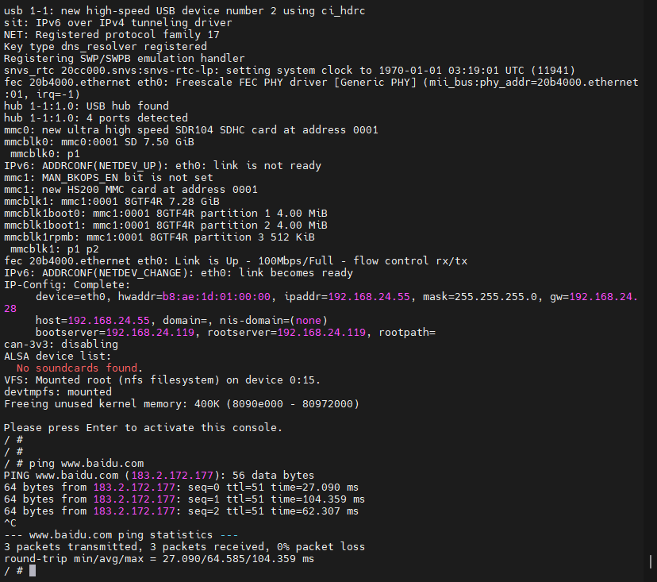


## Q&A


遇到的问题记录


### 使用 make menuconfig 出现错误的场景


原因：终端尺寸太小，将宽度调大即可


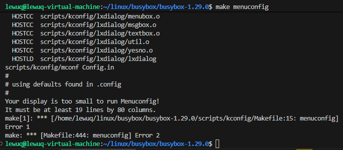


### nfs 无法挂载


Ubuntu 版本太高，我所使用的是 Ubuntu22.04，教程的是 Ubuntu18.04 ，前者不支持 nfs v2，所以要在 bootgrags 下加入v3，以使用 nfsv3


**rootfs,v3,proto=tcp rw** 


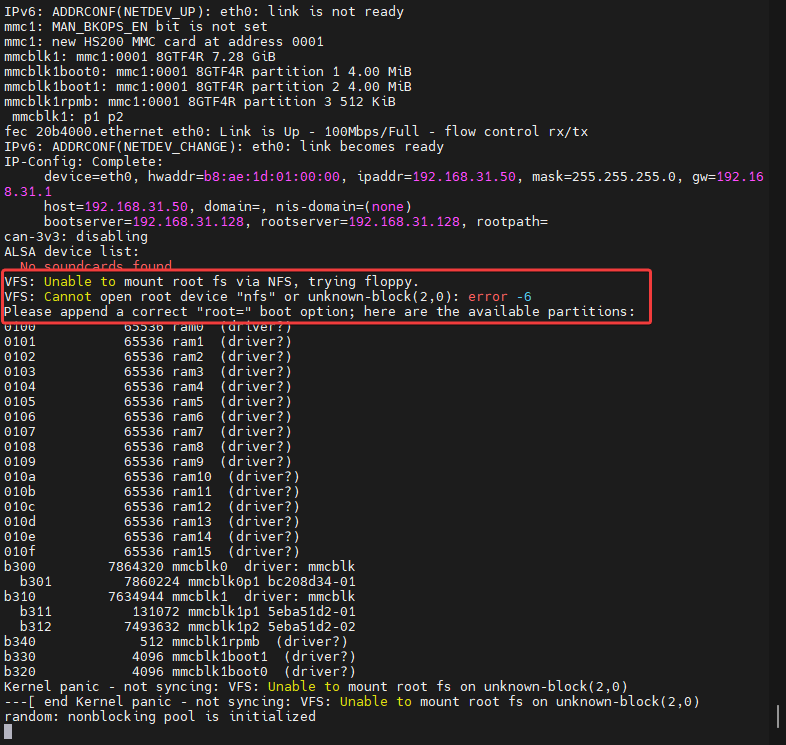


### 更换了物理 ip 之后无法实现 NFS 挂载


原因：bootargs 的开发板 ip 设置错误，设置成了 Windows  的主机 IP


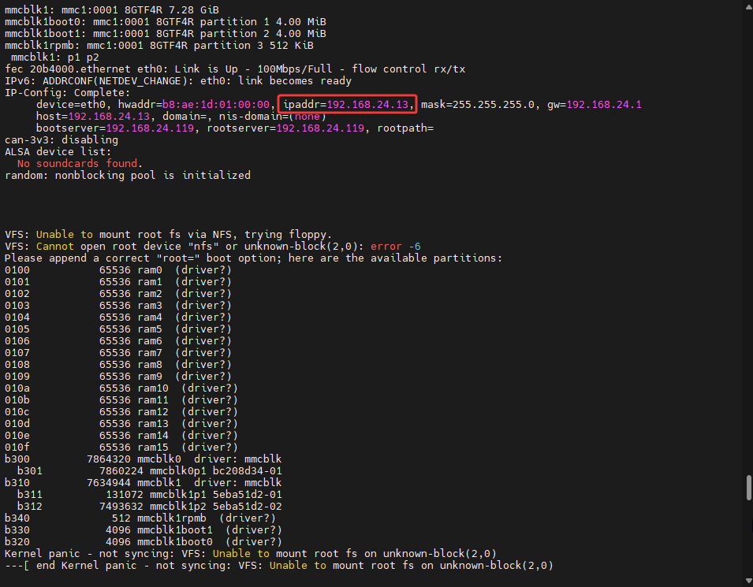


### 编译权限问题


在 nfs 挂载的根目录想要编译测试文件时无法编译的问题


1、权限不够


2、使用root权限显示命令不存在


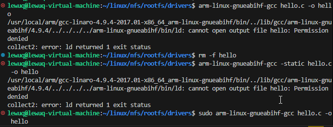


解决办法：


一、修改目录权限


```bash
sudo chown -R $USER:$USER ~/linux/nfs/rootfs/drivers
```


二、继承环境变量


```bash
sudo chown -R $USER:$USER ~/linux/nfs/rootfs/drivers
```


三、使用编译器的绝对路径


```bash
sudo /usr/local/arm/gcc-linaro-4.9.4-2017.01-x86_64_arm-linux-gnueabihf/bin/arm-linux-gnueabihf-gcc hello.c -o hello
```


### 无法 ping 通外网

1. 检查是否修改对 resolv.conf 文件
2. 检查路由器网关
    1. 一般默认网关为 192.168.x.1，如果不是，查阅路由器数据手册进行查看
    2. 修改完网关之后也需要修改 uboot 的环境变量和 resolv.conf 的内容

        ```bash
        setenv bootargs 'console=ttymxc0,115200 root=/dev/nfs nfsroot=192.168.24.119:/home/lewuq/linux/nfs/rootfs,v3,tcp rw ip=192.168.24.50:192.168.24.119:192.168.24.28:255.255.255.0::eth0:off'
        setenv gatewayip 192.168.24.28 //网关
        setenv ipaddr 192.168.24.55 //开发板 IP 地址
        setenv ethaddr b8:ae:1d:01:00:00 //开发板网卡 MAC 地址
        setenv gatewayip 192.168.24.28//开发板默认网关
        setenv netmask 255.255.255.0 //开发板子网掩码
        setenv serverip 192.168.24.119 //服务器地址，也就是 Ubuntu 地址
        saveenv
        saveenv
        
        
        setenv bootargs 'console=ttymxc0,115200 root=/dev/nfs nfsroot=192.168.137.248:/home/lewuq/linux/nfs/rootfs,v3,tcp rw ip=192.168.137.50:192.168.137.248:192.168.137.1:255.255.255.0::eth0:off'
        setenv gatewayip 192.168.137.1
        setenv ipaddr 192.168.137.50
        setenv serverip 192.168.137.248
        
        setenv bootargs 'console=ttymxc0,115200 root=/dev/nfs nfsroot=192.168.0.9:/home/lewuq/linux/nfs/rootfs,v3,tcp rw ip=192.168.0.50:192.168.0.9:192.168.0.1:255.255.255.0::eth0:off'
        setenv gatewayip 192.168.0.1
        setenv ipaddr 192.168.0.50
        setenv serverip 192.168.0.9
        ping 192.168.0.95
        ```


        注意定义的 ip 地址也要和下面的环境变量的 ip 一致


        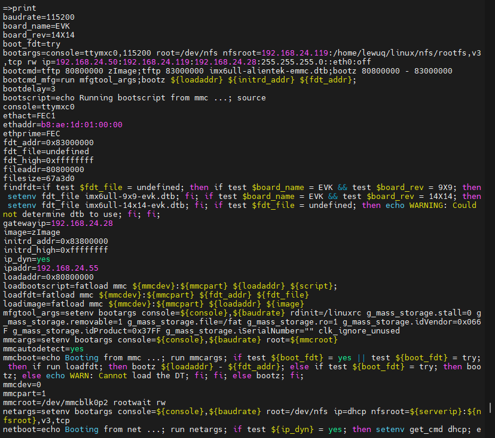

3. 将主机网口和开发板的网口接入正确的位置
    1. 要么同时接入 LAN 口或者接入 WAN 口
    2. 使用交换机时主机网口和开发板都要接入、然后交换机接入 LAN 口
