## 前置知识

- bootloader

    作用：上电后运行一段 bootloader，初始化 DDR 等外设，然后将 Linux 内核从 flash (NAND，NOR FLASH，SD，EMMC等)拷贝到 DDR 中，最后启动 Linux 内核


    现成的 bootloader 软件类别：U-Boot、vivi、RedBoot


    uboot 名称：Universal Boot Loader


    U-Boot 网站（现在的网站和原子哥手册上已经不一样了，不过可以自行去 Github 上直接寻找）


    [bookmark](https://docs.u-boot.org/en/latest/index.html)


    此外 bootloader 按照使用维护分类大致分为以下三个部分


    | 种类                  | 描述                                                |
    | ------------------- | ------------------------------------------------- |
    | uboot 官方维护 uboot 代码 | 由 uboot 官方维护开发的 uboot 版本，版本更新快，基本包含所有常用的芯片        |
    | 半导体厂商 uboot 代码      | 半导体厂商维护的一个 uboot，专门针对自家的芯片，在对自家芯片支持上要比 uboot 官方的好 |
    | 开发板厂商的 uboot 代码     | 开发板厂商在半导体厂商提供的 uboot 基础上加入了对自家开发板的支持              |


    显然笔者使用的是正点原子的 IMX6ULL 开发板，所以最好使用后两者的 uboot 代码


## U - Boot 初次编译


这里使用开发板厂商的 uboot 代码即正点原子推出代码进行编译


### 拷贝文件


```shell
# 之前忘记创建 IMX6ULL 文件夹了，现在进行创建
cd linux/
mkdir IMX6ULL

# 将之前的三个文件夹移动到 IMX6ULL 文件夹下
mv driver nfs tool IMX6ULL
```

- 安装 ncurses 库

    ```shell
    sudo apt-get install libncurses5-dev
    
    # apt-get 获取稳定版，apt 获取最新版
    ```

- 创建 boot 、alientek_uboot 文件夹。

    ```shell
    cd ~/linux/IMX6ULL/
    mkdir boot
    cd boot/
    mkdir alientek_uboot
    ```


    使用 MobaXterm  将原子哥的源码移到 alientek_uboot 文件夹下 uboot-imx-2016.03-2.1.0-ge468cdc-v1.5.tar.bz2


    ```shell
    # 解压
    tar -vxjf uboot-imx-2016.03-2.1.0-g8b546e4.tar.bz2
    ```


    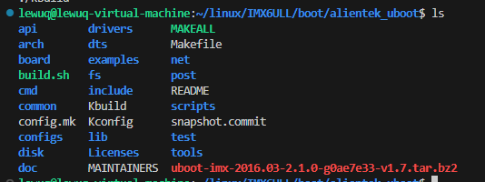


## 编译


笔者使用的 512 MB (DDR3) + 8 GB (EMMC) 版


编译指令

- 编译前清除指令

    ```bash
    make ARCH=arm CROSS_COMPILE=arm-linux-gnueabihf- distclean
    ```

- 配置 uboot

    ```bash
    make ARCH=arm CROSS_COMPILE=arm-linux-gnueabihf- mx6ull_14x14_ddr512_emmc_defconfig
    ```

- 使用 12 核来编译 uboot

    ```bash
    make V=1 ARCH=arm CROSS_COMPILE=arm-linux-gnueabihf- -j12
    ```


编译完成如下图所示


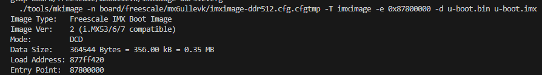


其中 u-boot.imx 文件为所需烧录到开发板的镜像文件


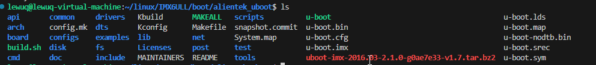


编写 shell 脚本


将上面的指令编写为一个 mx6ull_alientek_emmc.sh 并赋予可执行权限，下次直接执行脚本即可编译 


```shell
#!/bin/bash
make ARCH=arm CROSS_COMPILE=arm-linux-gnueabihf- distclean
make ARCH=arm CROSS_COMPILE=arm-linux-gnueabihf- mx6ull_14x14_ddr512_emmc_defconfig
make V=1 ARCH=arm CROSS_COMPILE=arm-linux-gnueabihf- -j12
```


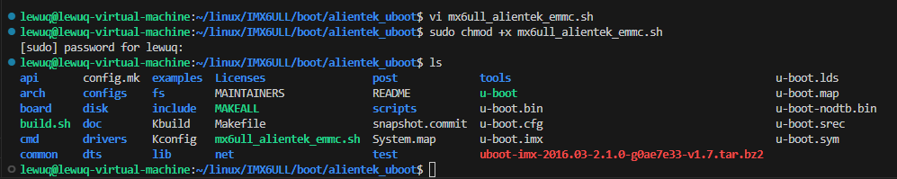


## 修改 Makefile 文件


避免删除配置信息，修改 Makefile 文件的内容


```bash
vi  Makefile
```


在 248 行左右添加配置信息，按 i 进入编辑模式，添加内容，使用 ESC 退出编辑模式然后使用 wq 保存退出


```makefile
ARCH ?= arm
CROSS_COM[ILE ?= arm-linux-gnueabihf-
```


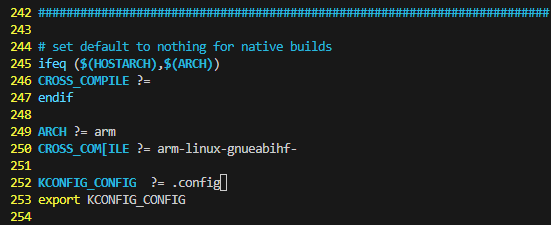


## 烧写到 SD 卡（从 SD卡 启动） 


```bash
ls /dev/sd*

./imxdownload uboot.bin /dev/sdb
```


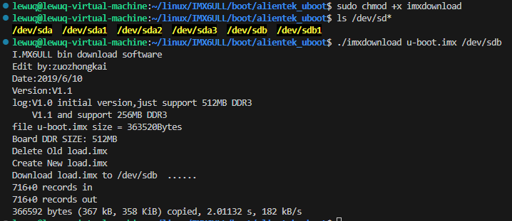

- 打开 MobaXterm 串口查看，速率为 115200，因为没有接入屏幕，可能有部分会读取失败或者 Warning

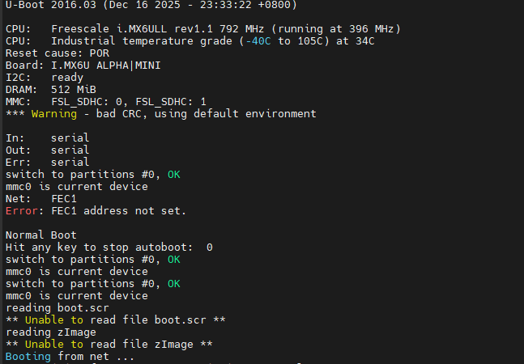


## 使用 USB - OTG 烧录 U-Boot


一键烧录，较为快捷


使用正点原子烧写工具进行烧写


Mfgtool2-eMMC-ddr512-eMMC


一般都是烧写到 NAND 或者 EMMC 当中


将开发板上的启动拨码器拨到 USB 位置，即 01000000，然后点击符合开发板的烧写软件，打开串口，将会打印下面的界面，烧写内容如右边所示，同时注意烧写路劲要使用要英文路径，烧写也会花费一定的时间


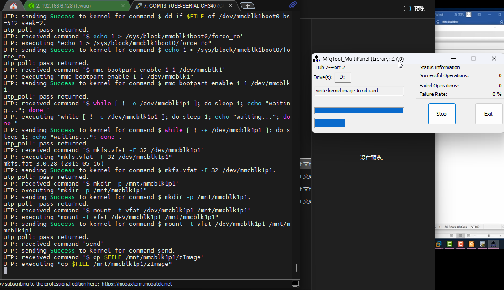


烧写到 NAND Flash 上也是同理


烧写完成之后则可以 将拨码开关拨到指定的位置选择指定的方式进行启动


烧写 EMMC 或者烧写 NAND 都是相当于正点原子的出厂固件


如果烧写失败，将将 mftool 工具放到 C盘的根目录下


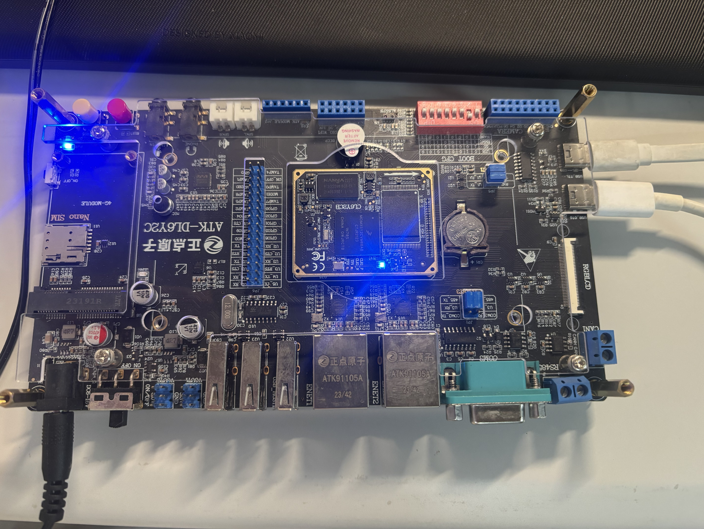


烧写完成，先停止再退出


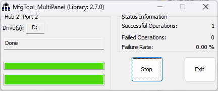


后面自由发挥~


## U-Boot 命令使用


这里简单介绍一下 U-Boot 的使用命令


使用 help 查看命令进行帮助查看，前者是指令，后面跟着的是参数


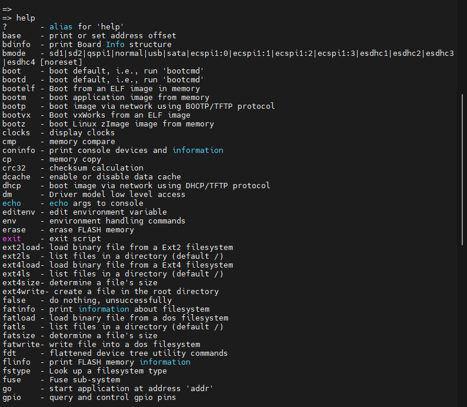


### 查询命令


介绍一些简单的查询指令


### bdinfo 板级信息查询


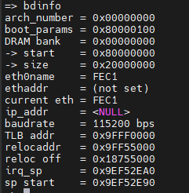


### printenv 环境变量查询


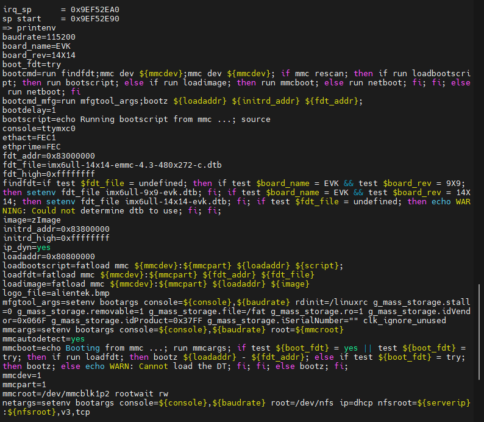


### version U-Boot版本号查询


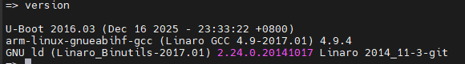


### 环境变量操作指令


介绍一些简单的与环境变量有关的指令


### setenv & saveenv 修改环境变量


setenv 设置或修改环境变量的值


saveenv 保存修改后的环境变量


按以下修改则会修改重启后进入uboot的时间


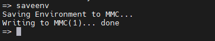


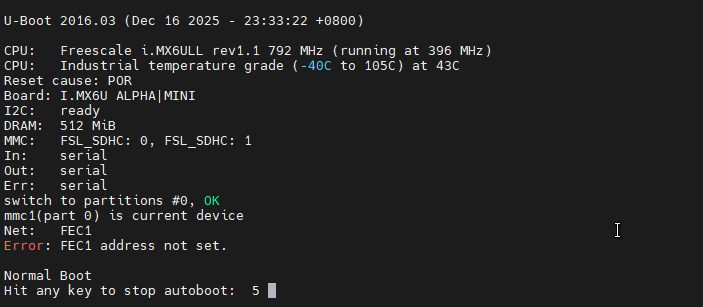


新建环境变量


```bash
setenv author mazhile
saveenv
```


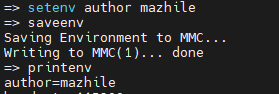


删除环境变量


设置对应的变量为空即可


```bash
setenv author
saveenv
```


### 内存操作指令


对 DRAM 进行读写

1. md 命令
md 命令用于显示内存值

    ```bash
    md[.b, .w, .l] address [# of objects]
    ```


    b -  byte  1个字节


    w - word 2个字节


    l - long  4个字节


    address  - 查看的内存起始地址


    数字采用 16 进制


    以显示起始地址 80000000 为例，显示 10 时分别为 16*1 字节 、16*2 字节、16*4字节


    ```bash
    md.b 80000000 10
    md.w 80000000 10
    md.l 80000000 10
    ```


    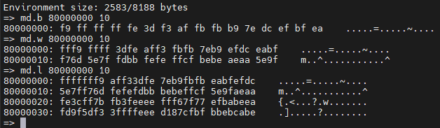

2. nm 命令
nm 命令用于修改指定地址的内存值

    ```bash
    nm [.b, .w, .l] address
    ```

3. mm 命令

    mm 命令也是修改指定地址内存值的，使用 mm 修改内存值的时候地址会自增，而使用命
    令 nm 的话地址不会自增

4. mw 命令

     用于使用一个指定的数据填充一段


    ```bash
    mw [.b, .w, .l] address value [count]
    ```

5. cp 命令

    数据拷贝命令，用于将 DRAM 中的数据从一段内存拷贝到另一段内存中，或者把 Nor Flash 中的数据拷贝到 DRAM 中，可以参考 Linux 命令行程 cp 的指令


    ```bash
    cp [.b, .w, .l] source target count
    ```

6. cmp 命令

    比较命令，用于比较两段内存的数据是否相等


    ```bash
    cmp [.b, .w, .l] addr1 addr2 count
    cmp.l 80000000 80000100 10
    ```


    可以以.b、.w 和.l 来指定操作格式，addr1 为第一段内存首地址，addr2 为第二段内存首地址，count 为要比较的长度


### 网络操作命令


虚拟机需要采用桥接模式，接入路由分配 IP


uboot 支持大量的网络相关命令，比如 dhcp、ping、nfs 和 tftpboot


此步骤需要使用到网线，可以使用一个路由桥接一个 wifi 然后通过网线接入到板子上，可以在某东上搜索购买


| 环境变量      | 描述                                       |
| --------- | ---------------------------------------- |
| ipaddr    | 开发板 ip 地址，可以不设置，使用 dhcp 命令来从路由器获取 IP 地址。 |
| ethaddr   | 开发板的 MAC 地址                              |
| gatewayip | 网关地址                                     |
| netmask   | 子网掩码                                     |
| serverip  | 服务器 IP 地址，也就是 Ubuntu 主机 IP 地址，用于调试代码     |


需要根据实际情况进行设置


我所使用的电脑IP为 192.168.0.104


虚拟机IP为 192.168.0.128


所以将其IP设置为192.168.0.50 ，mac地址可以随机使用，但是不可与电脑主机和虚拟机mac的相同


服务ip为虚拟机的ip


```bash
setenv ipaddr 192.168.0.50
setenv ethaddr b8:ae:1d:01:00:00
setenv gatewayip 192.168.0.1
setenv netmask 255.255.255.0
setenv serverip 192.168.0.128
saveenv
```


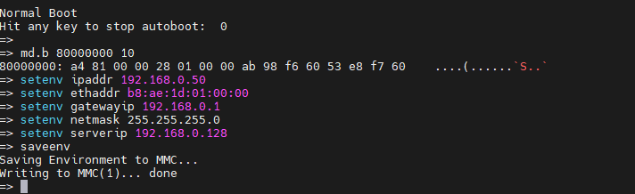

1. ping 命令

    检查网络是否能用，ping 服务器地址（未修改为桥接模式和修改为桥接模式）


    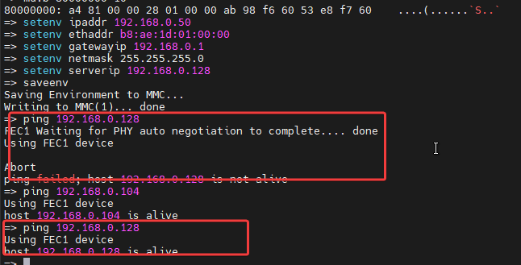

2. dhcp 命令

    dhcp 用于从路由器获取 IP 地址，前提得开发板连接到路由器上的，如果开发板是和电脑直连的，那么 dhcp 命令就会失效


     DHCP 不仅获取 IP 地址，还会通过 TFTP 来启动 linux 内核，输入 `? dhcp` 即可查看 dhcp 命令详细的信息


    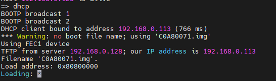

3. **nfs 命令**

    nfs(Network File System)网络文件系统，通过 nfs 可以在计算机之间通过网络来分享资源


    一般使用 uboot 中的 nfs 命令将 Ubuntu 中的文件下载到开发板的 DRAM 中，在使用之前需要开启 Ubuntu 主机的 NFS 服务，并且要新建一个 NFS 使用的目录，以后所有要通过 NFS 访问的文件都需要放到这个 NFS 目录中


    将正点原子资料盘的 zImage 镜像通过MobaXterm 上传到 Ubuntu 虚拟机


    path: 8、系统镜像->1、出厂系统镜像->2、kernel 镜像\linux-imx-4.1.15-2.1.0-gbfed875-v1.6 ->zImage


    命令挂载


    ```bash
    nfs 80800000 192.168.0.128:/home/lewuq/linux/nfs/zImage
    nfs 80800000 192.168.0.128:/home/lewuq/linux/IMX6ULL/nfs/zImage
    ```


    无法挂载办法解决


    因为我使用的内核版本为 6.8.0-90-generic ，该版本已移除 NFSv2的支持


    而正点原子采用的版本为 NFSv2，需要降低内核版本才可使用


    改用 tftp 下载


    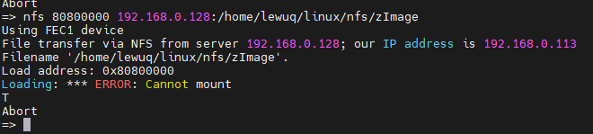

4. tftp 命令

    tftp 命令的作用和 nfs 命令一样，都是用于通过网络下载东西到 DRAM 中，只是 tftp 命令使用的 TFTP 协议，Ubuntu 主机作为 TFTP 服务器


    （MobaXterm 下传输服务）


    ```bash
    sudo apt-get install tftp-hpa tftpd-hpa
    sudo apt-get install xinetd
    ```


    和 NFS 一样，TFTP 也需要一个文件夹来存放文件，在用户目录下新建一个目录


    ```bash
    mkdir /home/lewuq/linux/tftpboot
    chmod 777 /home/lewuq/linux/tftpboot
    ```


    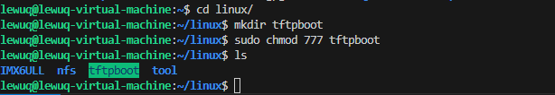


    新建文件/etc/xinetd.d/tftp


    ```bash
    sudo vi /etc/xinetd.d/tftp
    ```


    添加内容


    ```bash
    server tftp
    {
    socket_type = dgram
    protocol = udp
    wait = yes
    user = root
    server = /usr/sbin/in.tftpd
    server_args = -s /home/lewuq/linux/tftpboot/
    disable = no
    per_source = 11
    cps = 100 2
    flags = IPv4
    }
    ```


    开启服务


    ```bash
    sudo service tftpd-hpa start
    ```


    修改开 /etc/default/tftpd-hpa 内容


    ```bash
    sudo vi /etc/default/tftpd-hpa
    ```


    修改为(dd可快速删除所在行)


    ```bash
    TFTP_USERNAME="tftp"
    TFTP_DIRECTORY="/home/lewuq/linux/tftpboot"
    TFTP_ADDRESS=":69" 
    TFTP_OPTIONS="-l -c -s"
    ```


    重启服务


    ```bash
    sudo service tftpd-hpa restart
    ```


    搭建好服务器开始传输文件


    ```bash
    cp zImage /home/lewuq/linux/tftpboot/
    cd /home/lewuq/linux/tftpboot/
    sudo chmod 777 zImage
    ```


    下载，在 uboot 中


    ```bash
    tftpboot [loadAddress] [[hostIPaddr:]bootfilename]
    ```


    loadAddress 是文件在 DRAM 中的存放地址，[[hostIPaddr:] bootfilename] 是要从 Ubuntu 中下载的文件


    tftp 命令不需要输入文件在 Ubuntu 中的完整路径，只需要输入文件名即可


    ```bash
    tftp 80800000 zImage
    ```


    操作 成功截图


    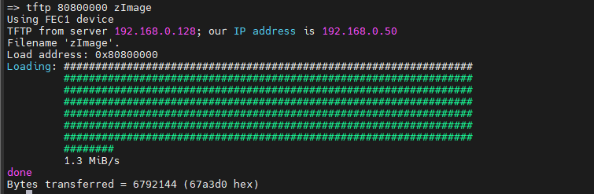


### **EMMC 和 SD 卡操作命令**


可以使用 `?mmc` 查看指令


mmc指令


| 命令              | 描述                               | 举例                                        |
| --------------- | -------------------------------- | ----------------------------------------- |
| mmc info        | 输出 MMC 设备信息                      | mmc info                                  |
| mmc read        | 读取 MMC 中的数据                      | mmc read addr blk# cnt                    |
| mmc write       | 向 MMC 设备写入数据                     | mmc write addr blk# cnt
addr 是要写入 MMC 中的数 |
| mmc erase       |                                  | mmc erase blk# cnt                        |
| mmc rescan      | 扫描 MMC 设备                        | **mmc rescan**                            |
| mmc part        | 列出 MMC 设备的分区                     | mmc dev 1  mmc part                       |
| mmc dev         | 切换 MMC 设备                        | mmc dev 0                                 |
| mmc list        | 列出当前有效的所有MMC设备                   | **mmc list**                              |
| mmc hwpartition | 设置 MMC 设备的分区                     |                                           |
| mmc bootbus     | 设置指定 MMC 设备的 BOOT_BUS_WIDTH 域的值  |                                           |
| mmc partconf    | 设置指定 MMC 设备的 PARTITION_CONFG 域的值 |                                           |
| mmc rst         | 复位 MMC 设备                        |                                           |
| mmc setdsr      | 设置 DSR 寄存器的值                     |                                           |


### **FAT 格式文件系统操作命令**

1. fatinfo 命令

    用于查看制定MMC设备分区的文件系统信息


    ```bash
    fatinfo <interface> [<dev[:part]>]
    ```

2. fatls 命令

    ```bash
    fatls <interface> [<dev[:part]>] [directory]
    # fatls mmc 1:1
    ```


    用于查询 FAT 格式设备的目录和文件信息

3. fstype 命令

    用于查看 MMC 设备某个分区的文件系统格式


    ```bash
    fstype <interface> <dev>:<part>
    fstype mmc 1:0
    ```

4. **fatload 命令**

    将指定的文件读取到 DRAM 中


    ```bash
    fatload <interface> [<dev[:part]> [<addr> [<filename> [bytes [pos]]]]]
    ```

5. **fatwrite 命令**

    将 DRAM 中的数据写入到 MMC 设备中


    ```bash
    fatwrite <interface> <dev[:part]> <addr> <filename> <bytes>
    ```


### **EXT 格式文件系统操作命令**


uboot 有 ext2 和 ext4 这两种格式的文件系统的操作命令，常用的就四个命令，分别为：ext2load、ext2ls、ext4load、ext4ls 和 ext4write。这些命令的含义和使用与 fatload、fatls 和 fatwrite 一样，只是 ext2 和 ext4 都是针对 ext 文件系统的


### **NAND 操作命令**


略


### **BOOT 操作命令**


uboot 的本质工作是引导 Linux，所以 uboot 肯定有相关的 boot(引导)命令来启动 Linux。常用的跟 boot 有关的命令有：bootz、bootm 和 boot。

1. bootz 命令

    启动zimage镜像文件


    ```bash
    bootz [addr [initrd[:size]] [fdt]]
    ```


    addr 是 Linux 镜像文件在 DRAM 中的位置，initrd 是 initrd 文件在DRAM 中的地址，如果不使用 initrd 的话使用‘-’代替即可，fdt 就是设备树文件在 DRAM 中的地址

2. **bootm 命令**

    bootm 用于启动 uImage 镜像文件


    ```bash
    bootm [addr [initrd[:size]] [fdt]]
    ```


    addr 是 uImage 在 DRAM 中的首地址，initrd 是 initrd 的地址，fdt 是设备树(.dtb)文件在 DRAM 中的首地址，如果 initrd 为空的话，同样是用“-”来替代

3. **boot 命令**

    boot 会读取环境变量 bootcmd 来启动 Linux 系统


    uboot 倒计时结束以后就会启动 Linux 系统，其实就是执行的 bootcmd 中的启动命令


### **其他常用命令**

1. reset 命令 重启命令
2. go命令 用于跳到指定的地址出执行应用

    ```bash
    go addr [arg ...]
    ```

3. **run 命令**

    run 命令用于运行环境变量中定义的命令，比如可以通过“run bootcmd”来运行 bootcmd中的启动命令，但是 run 命令最大的作用在于运行自定义的环境变量。

4. **mtest 命令
一个简单的内存读写测试命令，可以用来测试自己开发板上的 DDR**

    ```bash
    mtest [start [end [pattern [iterations]]]]
    ```


    start 是要测试的 DRAM 开始地址，end 是结束地址


## U-Boot 顶层 Makefile 


移植的准备，便于了解启动流程源码。


### U-Boot 工程目录分析


将其下载到 Windows 下进行分析


```bash
cd ~/linux/IMX6ULL/boot/alientek_boot
./mx6ull_alientek_emmc.sh 
cd ../
tar -vcjf alientek_uboot.tar.bz2 alientek_uboot
```


压缩完成后从 Mobaxterm 下载到 Windows目录下


解压后的文件夹


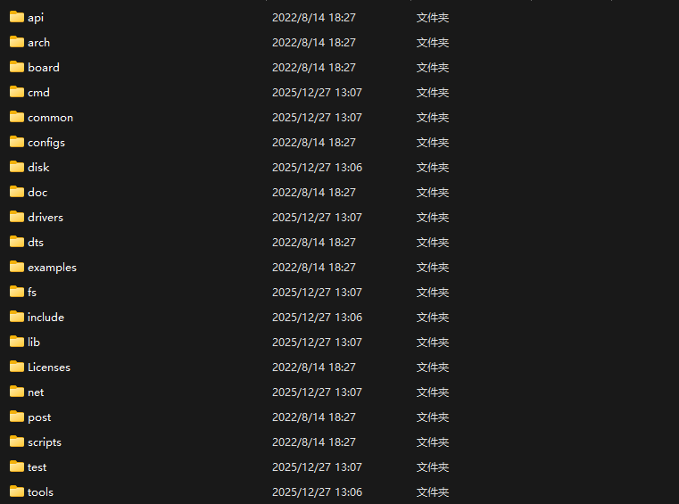


含义


| name     | 描述             | 备注      |
| -------- | -------------- | ------- |
| api      | 与硬件无关的API函数    | uboot自带 |
| arch     | 与架构体系有关的代码     |         |
| board    | 不同板子（开发板）的定制代码 |         |
| common   | 通用代码           |         |
| configs  | 配置文件           |         |
| disk     | 磁盘分区相关代码       |         |
| doc      | 文档             |         |
| drives   | 驱动代码           |         |
| dts      | 设备树            |         |
| examples | 示例代码           |         |
| fs       | 文件系统           |         |
| include  | 头文件            |         |
| lib      | 库文件            |         |
| License  | 许可证相关文件        |         |
| net      | 网络相关代码         |         |
| post     | 上电自检程序         |         |
| scripts  | 脚本文件           |         |
| test     | 测试代码           |         |
| tools    | 工具文件夹          |         |
|          |                |         |


其余文件


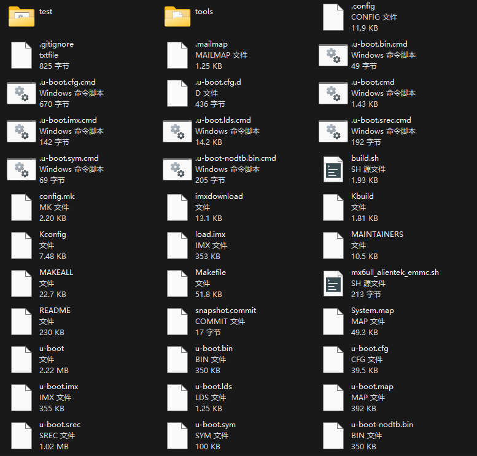


解释


| name                    | type                      | 备注        |
| ----------------------- | ------------------------- | --------- |
| .config                 | 配置文件                      | 编译生成的文件   |
| .gitignore              | git 工具相关文件                | uboot自带   |
| .mailmap                | 邮件列表                      | uboot自带   |
| .u-boot.xxx.cmd         | 这是一系列的文件，用于保存着一些命令        | 编译生成的文件   |
| config.mk               | 某个 Makefile 会调用此文件        | uboot 自带  |
| imxdownload             | 正点原子编写的SD卡烧录文件            | 原子哥提供     |
| Kbuild                  | 用于生成一些和汇编有关的代码            | uboot 自带  |
| Kconfig                 | 图形配置界面描述文件                | uboot 自带  |
| MAKEALL                 | 一个 shell 脚本文件，帮助编译 uboot  | uboot 自带  |
| Makefile                | 主 Makefile，存放编译的一些指令      | uboot 自带  |
| mx6ull_alientek_emmc.sh | 编译脚本文件                    |           |
| mx6ull_alientek_nand.sh | 编译脚本文件                    |           |
| README                  | 读我                        | u-boot 自带 |
| System.map              | 系统映射文件                    | u-boot 自带 |
| u-boot                  | 编译生成的文件                   | 编译生成      |
| u-boot.xxx              | 编译生成文件                    | 编译生成      |
|                         |                           |           |


### Makefile 流程


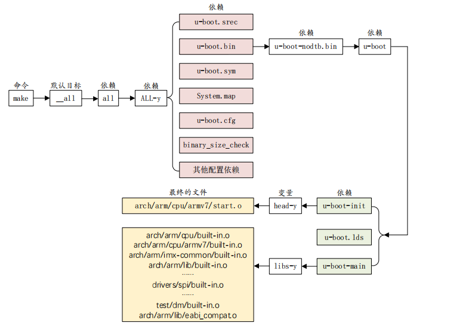


## U-Boot 启动流程

