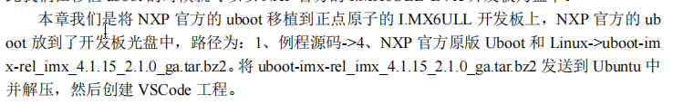
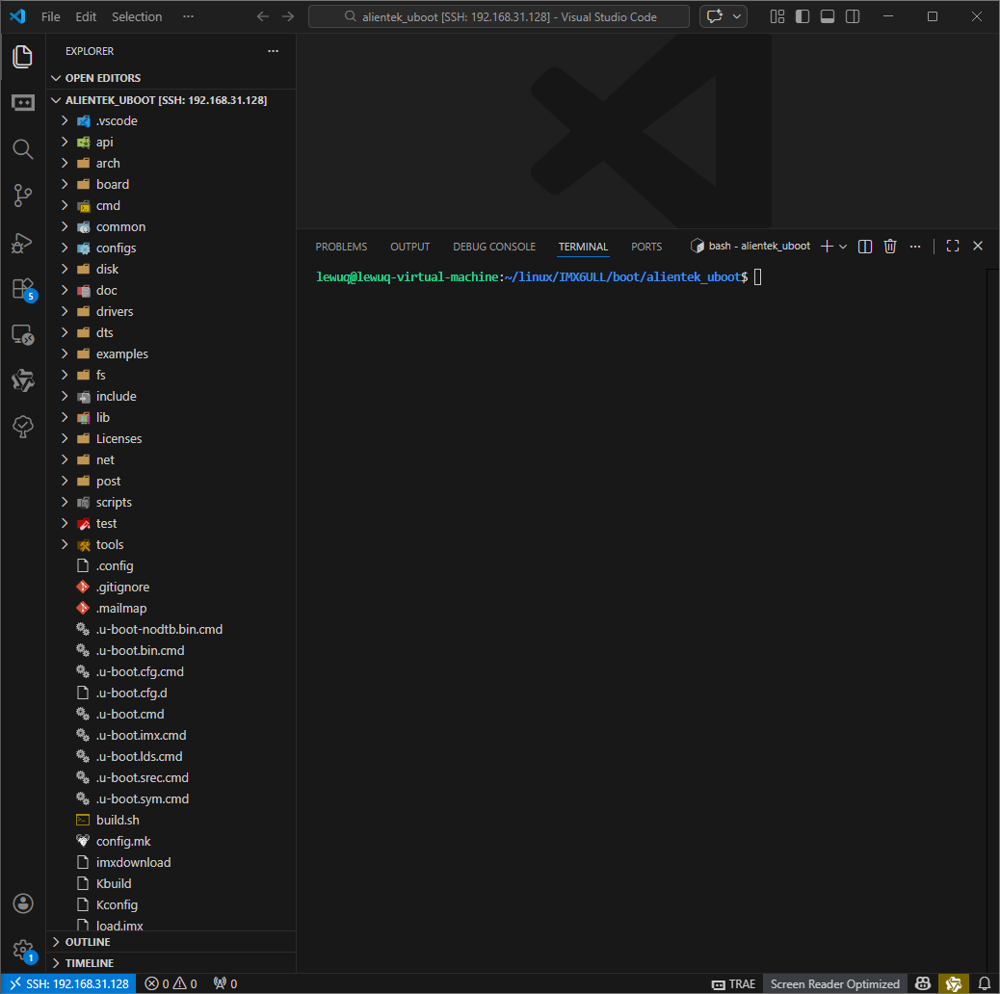
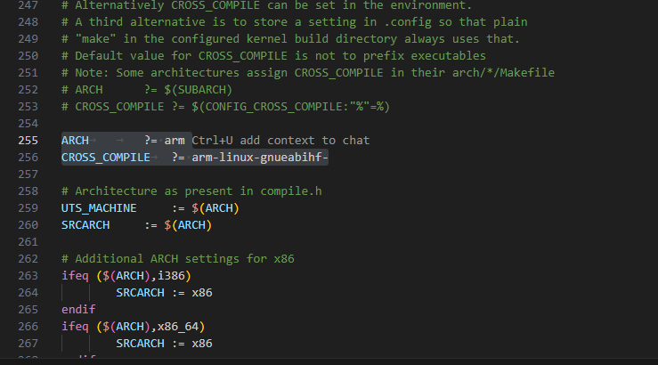
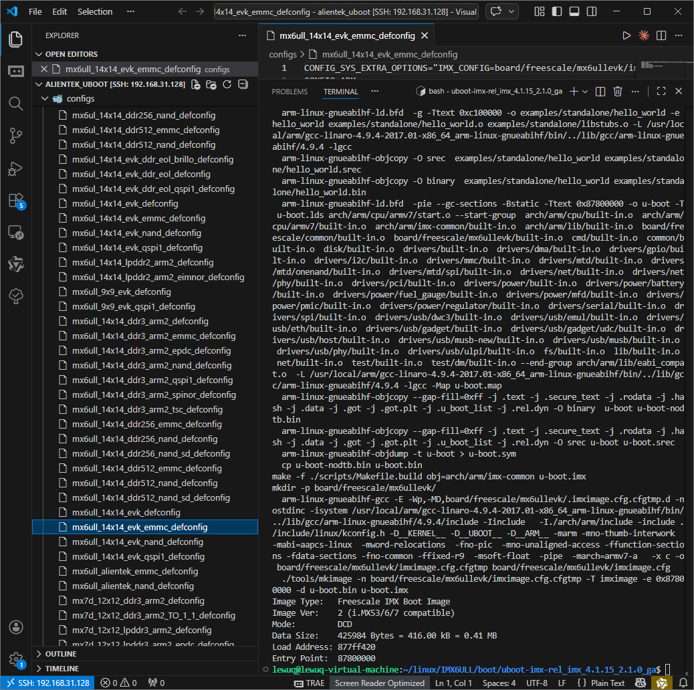
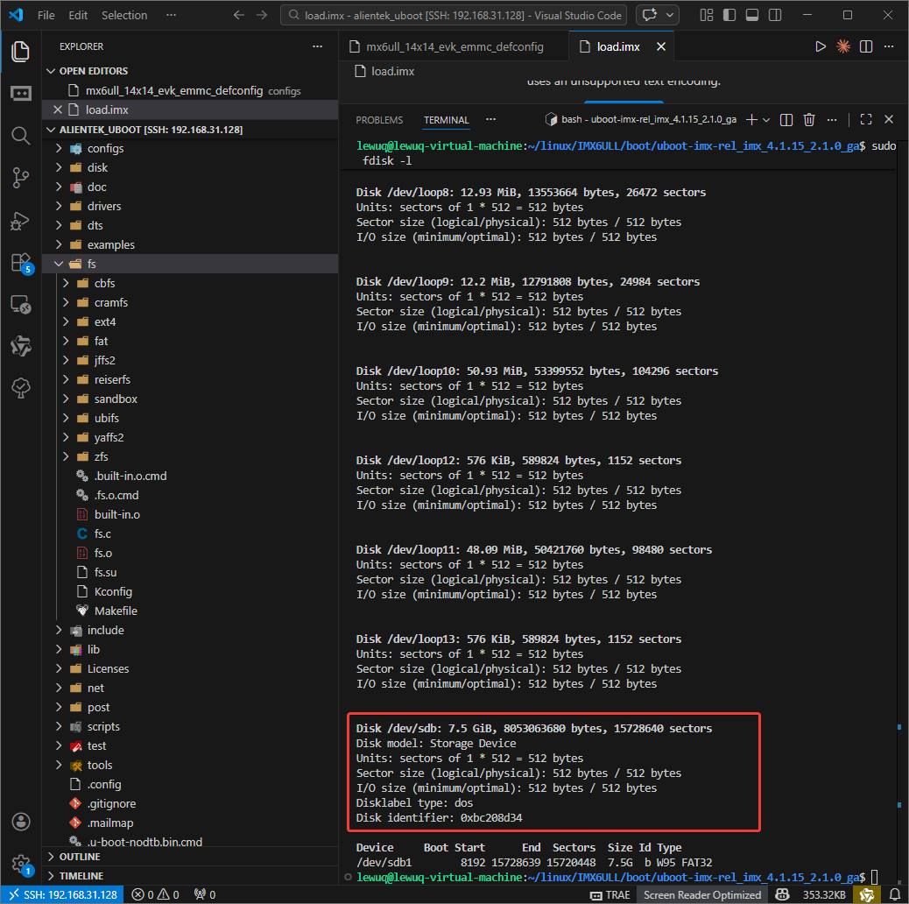
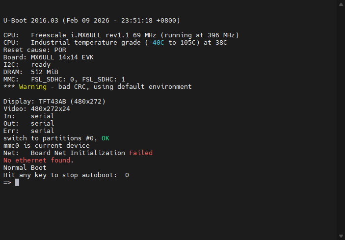
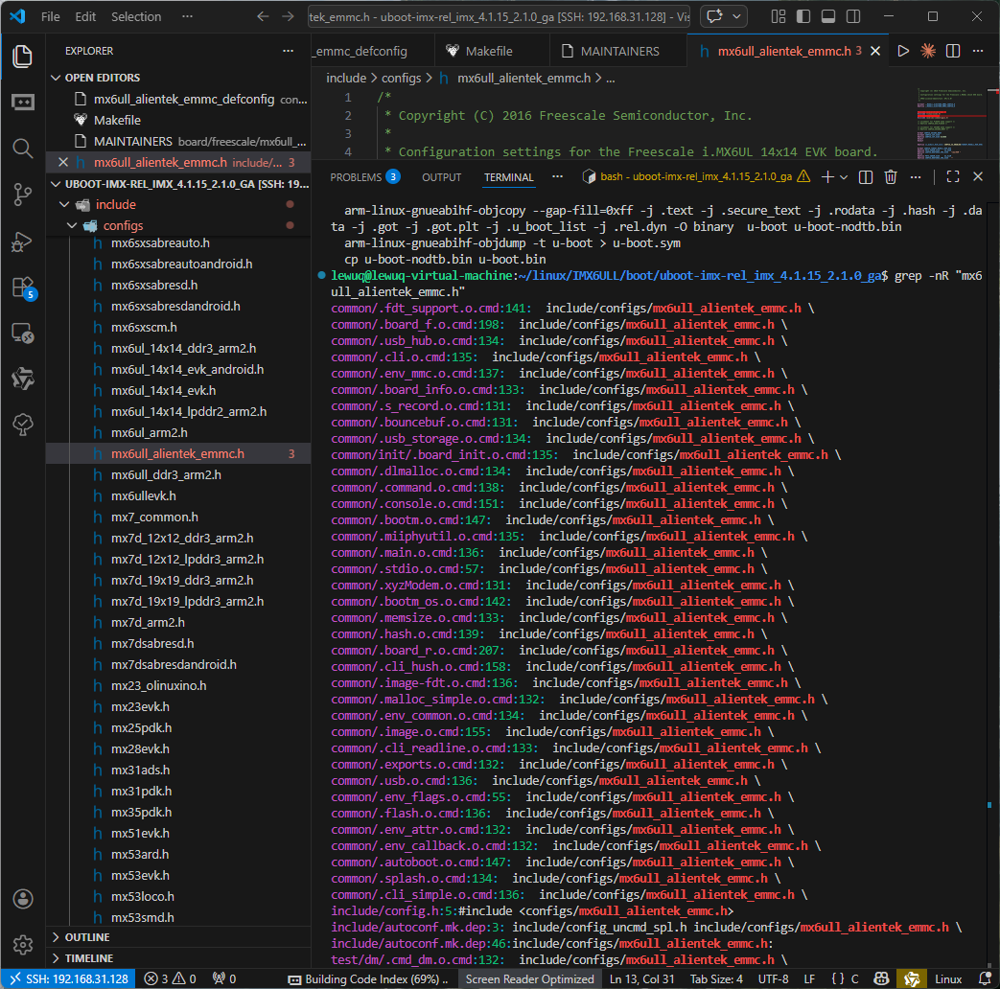
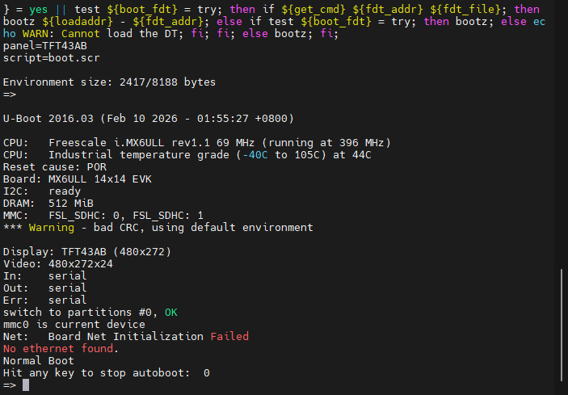
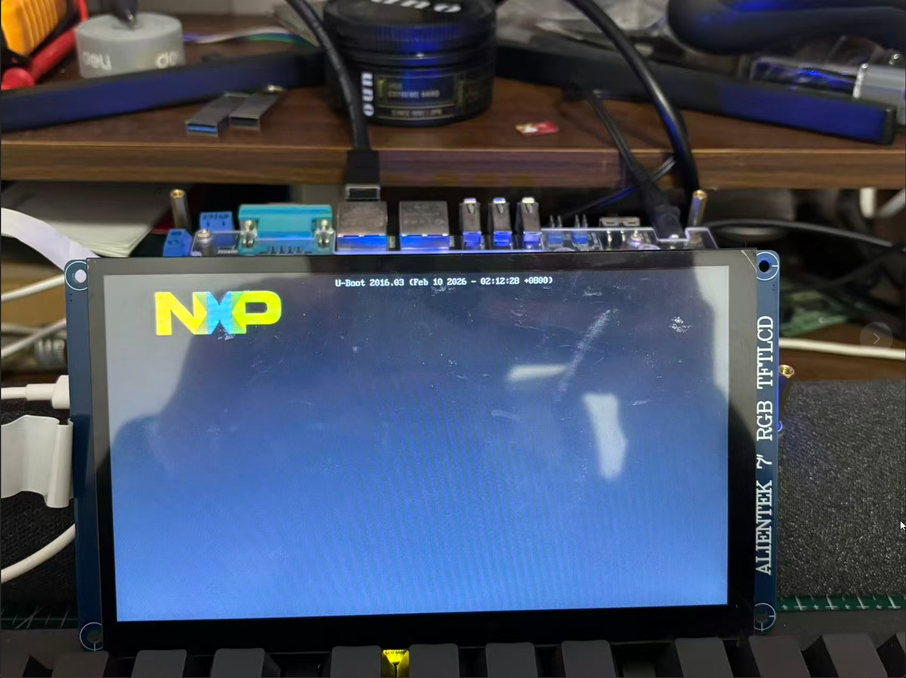
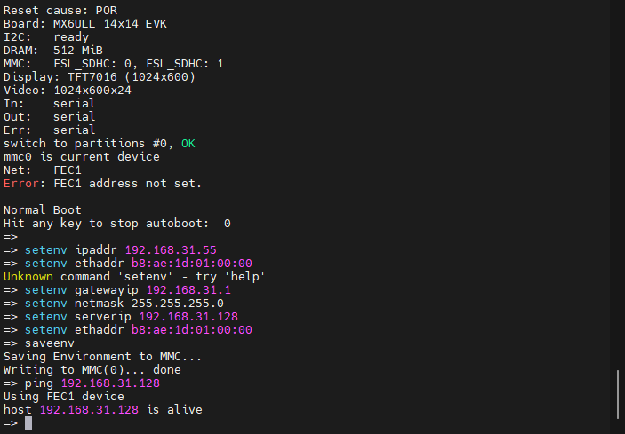

在此仅记录移植NXP官方的uboot以及修改为适配正点原子的IMX6ULL的版型和LCD屏幕和网路驱动移植


## 移植UBoot


1、将正点原子网盘下，例程源码中的压缩包通过MobaXterm上传到Ubuntu当中，然后解压





解压缩


```bash
tar -vxjf uboot-imx-rel_imx_4.1.15_2.1.0_ga.tar.bz2
```


2、通过VSCode的SSH远程打开所在目录，并打开终端





3、添加执行脚本进行 make


```bash
vi mx6ull_14x14_emmc.sh

# 在文件添加以下的内容
 
#!/bin/bash
make ARCH=arm CROSS_COMPILE=arm-linux-gnueabihf- distclean
make ARCH=arm CROSS_COMPILE=arm-linux-gnueabihf- mx6ull_14x14_evk_emmc_defconfig
make V=1 ARCH=arm CROSS_COMPILE=arm-linux-gnueabihf- -j12

#赋予可执行权限
sudo chmod 777 mx6ull_14x14_emmc.sh
```


或者修改 顶层 Makefile


```makefile
ARCH		?= arm
CROSS_COMPILE	?= arm-linux-gnueabihf-
```





编译完成结果





4、烧写到SD卡中


拷贝下载程序到当前目录下 (需要将SD卡提前彻底格式化)


```bash
cp ../alientek_uboot/imxdownload ./
```


下载程序到SD卡 （与前面的课程不同。不可烧录到sdb1中）


```bash
chmod 777 imxdownload 
./imxdownload u-boot.bin /dev/sdb
```


可以使用命令查询，


```bash
sudo fdisk -l
```





从SD卡启动可以发现，屏幕为 TFT43AB (480x272)，且无网络连接





接下来则需要修改 LCD驱动和网络驱动


## 修改开发板默认配置文件


内容很多需要注意，需要保持耐心和细心，不可粗心大意


### 添加新板子


1、将NXP原版的开发板默认配置文件复制一份作为使用的文件，然后进行修改重命名


```bash
cd configs
cp mx6ull_14x14_evk_emmc_defconfig mx6ull_alientek_emmc_defconfig
```


将其内容修改为


```bash
CONFIG_SYS_EXTRA_OPTIONS="IMX_CONFIG=board/freescale/mx6ull_alientek_
emmc/imximage.cfg,MX6ULL_EVK_EMMC_REWORK"
CONFIG_ARM=y
CONFIG_ARCH_MX6=y
CONFIG_TARGET_MX6ULL_ALIENTEK_EMMC=y
CONFIG_CMD_GPIO=y
```


2、修改头文件


```bash
cp include/configs/mx6ullevk.h include/configs/mx6ull_alientek_emmc.h
```


修改头文件的条件防止重定义


```c
/* #ifndef __MX6ULLEVK_CONFIG_H
 #define __MX6ULLEVK_CONFIG_H*/

#ifndef __MX6ULL_ALEITENK_EMMC_CONFIG_H
#define __MX6ULL_ALEITENK_EMMC_CONFIG_H
```


3、添加开发板对应的板级文件夹（即将 mx6ullevk  改为 mx6ull_alientek_emmc ）


```bash
cd board/freescale
cp mx6ullevk/ -r mx6ull_alientek_emmc

cd mx6ull_alientek_emmc
mv mx6ullevk.c mx6ull_alientek_emmc.c
```


3.1 修改 mx6ull_alientek_emmc 目录下的 Makefile 文件，修改文下列内容


```bash
# (C) Copyright 2015 Freescale Semiconductor, Inc.
#
# SPDX-License-Identifier:  GPL-2.0+
#

obj-y  := mx6ull_alientek_emmc.o

extra-$(CONFIG_USE_PLUGIN) :=  plugin.bin
$(obj)/plugin.bin: $(obj)/plugin.o
$(OBJCOPY) -O binary --gap-fill 0xff $< $@
```


3.2 修改 imximage.cfg 文件


```bash
# PLUGIN board/freescale/mx6ullevk/plugin.bin 0x00907000
PLUGIN  board/freescale/mx6ull_alientek_emmc/plugin.bin 0x00907000
```


3.3 修改 Kconfig 文件


```bash
if TARGET_MX6ULL_ALIENTEK_EMMC

config SYS_BOARD
default "mx6ull_alientek_emmc"

config SYS_VENDOR
default "freescale"

config SYS_SOC
default "mx6"

config SYS_CONFIG_NAME
default "mx6ull_alientek_emmc"

endif
#这里需要有一个换行符，否则会报错
```


3.4 修改 MAINTAINERS 文件


```bash
MX6ULLEVK BOARD
  M:  Peng Fan <peng.fan@nxp.com>
  S:  Maintained
  F:  board/freescale/mx6ull_alientek_emmc/
  F:  include/configs/mx6ull_alientek_emmc.h
```


3.5 修改图形界面配置文件


~arch/arm/cpu/armv7/mx6/Kconfig 207行加入


```bash
config TARGET_MX6ULL_ALIENTEK_EMMC
		bool "Support mx6ull_alientek_emmc"
		select MX6ULL
		select DM
		select DM_THERMAL
```


在最后#endif前加入路径


```bash
source "board/freescale/mx6ull_alientek_emmc/Kconfig"
```


4、新建执行脚本 mx6ull_alientek_emmc.sh


```bash
#!/bin/bash
make ARCH=arm CROSS_COMPILE=arm-linux-gnueabihf- distclean
make ARCH=arm CROSS_COMPILE=arm-linux-gnueabihf- mx6ull_alientek_emmc_defconfig
make V=1 ARCH=arm CROSS_COMPILE=arm-linux-gnueabihf- -j12
```


编译后验证


```bash
grep -nR "mx6ull_alientek_emmc.h"
```





添加新板子后通过串口监视器显示如下





## 修改 LCD 驱动


1、打开 mx6ull_alientek_emmc.c （~/board/freescale/mx6ull_alientek_emmc/mx6ull_alientek_emmc.c）


原内容


```c++
struct display_info_t const displays[] = {{
	.bus = MX6UL_LCDIF1_BASE_ADDR,
	.addr = 0,
	.pixfmt = 24,
	.detect = NULL,
	.enable	= do_enable_parallel_lcd,
	.mode	= {
		.name			= "TFT43AB",
		.xres           = 480,
		.yres           = 272,
		.pixclock       = 108695,
		.left_margin    = 8,
		.right_margin   = 4,
		.upper_margin   = 2,
		.lower_margin   = 4,
		.hsync_len      = 41,
		.vsync_len      = 10,
		.sync           = 0,
		.vmode          = FB_VMODE_NONINTERLACED
} } };
```


结构体 fb_videomode 的成员变量为 LCD 参数，说明如下：


**name：**LCD 名称，需与环境变量中的 panel 相同。


**xres、yres：**LCD 的 X 轴和 Y 轴像素数量。


**pixclock：**像素时钟周期长度,单位为皮秒。


**left_margin：**HBP,水平同步后肩。


**right_margin：**HFP,水平同步前肩。


**upper_margin：**VBP,垂直同步后肩。


**lower_margin：**VFP,垂直同步前肩。


**hsync_len：**HSPW,行同步脉宽。


**vsync_len：**VSPW,垂直同步脉宽。


**vmode：**通常使用 FB_VMODE_NONINTERLACED,即不使用隔行扫描。


pixclock=(1/51200000)*10^12=19531


修改为


```c++
struct display_info_t const displays[] = {{
	.bus = MX6UL_LCDIF1_BASE_ADDR,
	.addr = 0,
	.pixfmt = 24,
	.detect = NULL,
	.enable	= do_enable_parallel_lcd,
	.mode	= {
		.name			      = "TFT7016",
		.xres           = 1024,
		.yres           = 600,
		.pixclock       = 19531,
		.left_margin    = 140,
		.right_margin   = 160,
		.upper_margin   = 20,
		.lower_margin   = 12,
		.hsync_len      = 20,
		.vsync_len      = 3,
		.sync           = 0,
		.vmode          = FB_VMODE_NONINTERLACED
} } };
```


2、写入环境变量


```bash
setenv panel TFT7016
saveenv
```


3、重启并接入屏幕





## 修改网络驱动


观察板载网络驱动芯片的丝印，发现为 **SR8201F， 即 2.4 以后版本**


打开 mx6ull_alientek_emmc.h（~/include/configs/mx6ull_alientek_emmc.h）


1、找到以下代码


```c
#ifdef CONFIG_CMD_NET
#define CONFIG_CMD_PING
#define CONFIG_CMD_DHCP
#define CONFIG_CMD_MII
#define CONFIG_FEC_MXC
#define CONFIG_MII
#define CONFIG_FEC_ENET_DEV		1

#if (CONFIG_FEC_ENET_DEV == 0)
#define IMX_FEC_BASE			ENET_BASE_ADDR
#define CONFIG_FEC_MXC_PHYADDR          0x2
#define CONFIG_FEC_XCV_TYPE             RMII
#elif (CONFIG_FEC_ENET_DEV == 1)
#define IMX_FEC_BASE			ENET2_BASE_ADDR
#define CONFIG_FEC_MXC_PHYADDR		0x1
#define CONFIG_FEC_XCV_TYPE		RMII
#endif
#define CONFIG_ETHPRIME			"FEC"

#define CONFIG_PHYLIB
#define CONFIG_PHY_MICREL
#endif
```


修改为


```c
#ifdef CONFIG_CMD_NET
#define CONFIG_CMD_PING
#define CONFIG_CMD_DHCP
#define CONFIG_CMD_MII
#define CONFIG_FEC_MXC
#define CONFIG_MII
#define CONFIG_FEC_ENET_DEV 1

#if (CONFIG_FEC_ENET_DEV == 0)
#define IMX_FEC_BASE ENET_BASE_ADDR
#define CONFIG_FEC_MXC_PHYADDR 0x2
#define CONFIG_FEC_XCV_TYPE RMII
#elif (CONFIG_FEC_ENET_DEV == 1)
#define IMX_FEC_BASE ENET2_BASE_ADDR
#define CONFIG_FEC_MXC_PHYADDR 0x1
#define CONFIG_FEC_XCV_TYPE RMII
#endif
#define CONFIG_ETHPRIME "FEC"

#define CONFIG_PHYLIB
#define CONFIG_PHY_REALTEK
#endif
```


2、删除 uboot 中 74LV595 的驱动代码


打开 mx6ull_alientek_emmc.c （~/board/freescale/mx6ull_alientek_emmc/mx6ull_alientek_emmc.c）


找到


```c
#define IOX_SDI IMX_GPIO_NR(5, 10)
#define IOX_STCP IMX_GPIO_NR(5, 7)
#define IOX_SHCP IMX_GPIO_NR(5, 11)
#define IOX_OE IMX_GPIO_NR(5, 8)
```


替换为


```c
#define ENET1_RESET IMX_GPIO_NR(5, 7)
#define ENET2_RESET IMX_GPIO_NR(5, 8)
```


2、找到下面的内容，并将其结构体参数删除


```c
static iomux_v3_cfg_t const iox_pads[] = {
	/* IOX_SDI */
	MX6_PAD_BOOT_MODE0__GPIO5_IO10 | MUX_PAD_CTRL(NO_PAD_CTRL),
	/* IOX_SHCP */
	MX6_PAD_BOOT_MODE1__GPIO5_IO11 | MUX_PAD_CTRL(NO_PAD_CTRL),
	/* IOX_STCP */
	MX6_PAD_SNVS_TAMPER7__GPIO5_IO07 | MUX_PAD_CTRL(NO_PAD_CTRL),
	/* IOX_nOE */
	MX6_PAD_SNVS_TAMPER8__GPIO5_IO08 | MUX_PAD_CTRL(NO_PAD_CTRL),
};
```


3、找到 iox74lv_init 和 iox74lv_set 函数并删除


4、找到 board_init()并删除调用的 imx_iomux_v3_setup_multiple_pads 和 iox74lv_init 函数


5、添加驱动引脚


在 static iomux_v3_cfg_t const fec1_pads[] 的末尾 添加


```c
MX6_PAD_SNVS_TAMPER7__GPIO5_IO07 | MUX_PAD_CTRL(NO_PAD_CTRL),
```


在 static iomux_v3_cfg_t const fec2_pads[] 的末尾 添加


```c
MX6_PAD_SNVS_TAMPER8__GPIO5_IO08 | MUX_PAD_CTRL(NO_PAD_CTRL),
```


6、修改网络IO函数


找到 setup_iomux_fec，将其内容替换为


```c
static void setup_iomux_fec(int fec_id)
{
if (fec_id == 0)
{

imx_iomux_v3_setup_multiple_pads(fec1_pads,
ARRAY_SIZE(fec1_pads));

gpio_direction_output(ENET1_RESET, 1);
gpio_set_value(ENET1_RESET, 0);
mdelay(20);
gpio_set_value(ENET1_RESET, 1);
}
else
{
imx_iomux_v3_setup_multiple_pads(fec2_pads,
	ARRAY_SIZE(fec2_pads));
gpio_direction_output(ENET2_RESET, 1);
gpio_set_value(ENET2_RESET, 0);
mdelay(20);
gpio_set_value(ENET2_RESET, 1);
}
mdelay(150); /* 复位结束后至少延时 150ms 才能正常使用*/
}
```


修改网络环境变量


```c
setenv ipaddr 192.168.31.55 //开发板 IP 地址
setenv ethaddr b8:ae:1d:01:00:00 //开发板网卡 MAC 地址
setenv gatewayip 192.168.31.1 //开发板默认网关
setenv netmask 255.255.255.0 //开发板子网掩码
setenv serverip 192.168.31.128 //服务器地址，也就是 Ubuntu 地址
saveenv


setenv ipaddr 192.168.24.55 //开发板 IP 地址
setenv ethaddr b8:ae:1d:01:00:00 //开发板网卡 MAC 地址
setenv gatewayip 192.168.24.28//开发板默认网关
setenv netmask 255.255.255.0 //开发板子网掩码
setenv serverip 192.168.24.119 //服务器地址，也就是 Ubuntu 地址
saveenv
```


观察是否ping通


```c
ping 192.168.31.128
```


修改成功如下





## 启动测试


测试时需要放置 imx6ull-alientek-emmc.dtb 这个设备树文件，不然会失败


1、从 EMMC 启动 Linux 系统


设置 bootargs 和 bootcmd


```c
setenv bootargs 'console=ttymxc0,115200 root=/dev/mmcblk1p2 rootwait rw'
setenv bootcmd 'mmc dev 1; fatload mmc 1:1 80800000 zImage; fatload mmc 1:1 83000
000 imx6ull-alientek-emmc.dtb; bootz 80800000 - 83000000;'
saveenv
```


然后输入 boot 重启


2、从网络启动 Linux 系统


```c
setenv bootargs 'console=ttymxc0,115200 root=/dev/mmcblk1p2 rootwait rw'
setenv bootcmd 'tftp 80800000 zImage; tftp 83000000 imx6ull-alientek-emmc.dtb; bootz 8
0800000 - 83000000'
saveenv
```


下载完成自然会启动


```c
tftp zImage
```

