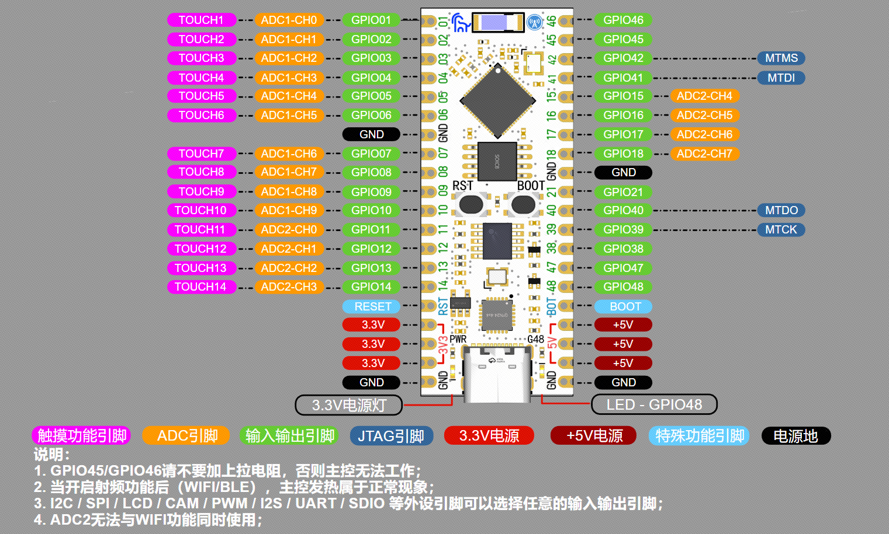
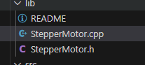
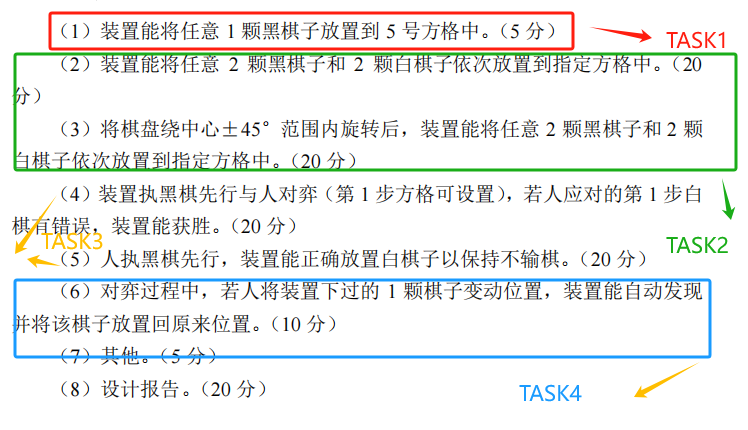

开发工具：vscode+platform io


下位机：立创esp32-s3-8n8


视觉方案：立创K230


# 引脚分配图





## 串口引脚


usart1


rx  - - io9


tx  - - io10


在arduino中，ESP32的串口0为**Serial**，串口1为**Serial1**，串口2为**Serial2**；


```groovy
int RXPIN = 9;
int TXPIN = 10;
//初始化串口1，波特率115200，SERIAL_8N1=8数据位无校验位1停止位 RX引脚为9 TX引脚为10
Serial1.begin(115200, SERIAL_8N1, RXPIN, TXPIN);
```


## IIC使用


在 ESP32S3 开发板上，可以使用 Arduino IDE 编写程序并通过修改调用 analogWrite()函数的方式，来控制 PWM 信号输出的频率、占空比和分辨率等。 使用Arduino 自带的 `analogWrite(pin, value)` 函数方式： 其中的两个参数：

- `pin`：要写入的 GPIO 引脚。允许的数据类型：int，支持任意的GPIO引脚
- `value`：占空比：介于 0（始终关闭）和 255（始终开启）之间。允许的数据类型：int. 按照 **PWM介绍** 章节的例子写个代码案例，实现灯的渐亮渐灭：

在Platfrom IO上新建函数模块需要放lib文件夹下，后缀为.c/.cpp以及.h 


否则容易报错





移植陶晶驰串口屏


参考链接：[http://wiki.tjc1688.com/debug/arduino/esp32s3.html#id3](http://wiki.tjc1688.com/debug/arduino/esp32s3.html#id3)


## 任务划分


将需求划分成4个任务，通过串口2获取上位机坐标数据包进行解析，利用串口屏发送对应格式数据帧执行对应任务，驱动步进电机将棋子移入棋盘中





忘记还有控制棋子颜色了，所以这个得作废


### ！！！裸机跑发现两个X轴步进电机是先后执行的，一种方案是用一根线控制两个步进电机模块，另一种是使用RTOS系统，然后发现双X轴的步进电机方向不一样，再根据最近在深度学习FreeRTOS系统，所以采用FreeTTOS系统来制作下一步的任务


使用freertos的队列和信号量进行操作

