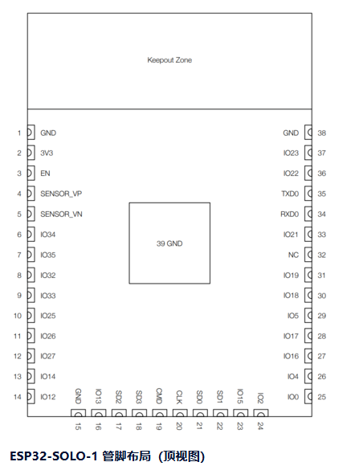

# 基于ESP32-RGBL驱动步进电机

# 主控是乐鑫的esp32

ESP32-SOLO-1 引脚分布图（下面是链接）

[https://wiki.diustou.com/cn/ESP32-SOLO-1](https://wiki.diustou.com/cn/ESP32-SOLO-1)

ESP32-SOLO-1 引脚分配表：

| 引脚编号   | 功能描述   | 连接设备        | 备注         |
| ------ | ------ | ----------- | ---------- |
| GPIO32 | 脉冲信号输出 | 步进电机驱动器STEP | PWM输出      |
| GPIO33 | 方向控制   | 步进电机驱动器DIR  | 高低电平控制     |
| GPIO25 | 使能控制   | 步进电机驱动器EN   | 低电平有效      |
| GPIO26 | 限位开关输入 | 限位开关        | 上拉输入       |
| GPIO27 | 编码器A相  | 编码器         | 正交解码       |
| GPIO14 | 编码器B相  | 编码器         | 正交解码       |
| 3.3V   | 电源输出   | 传感器供电       | 最大输出电流40mA |
| GND    | 地      | 公共地         | 信号地        |

刷机不成功，找一块相同引脚的ESP32改板子

